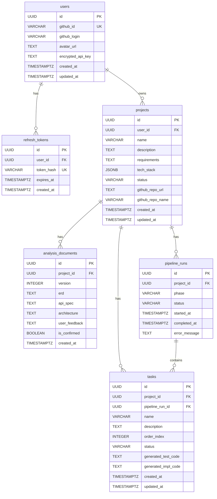

# ERD — AI 기반 자동화 MVP 빌더

---

## 엔티티 목록

### users

| 컬럼명 | 타입 | 제약 | 설명 |
|--------|------|------|------|
| id | UUID | PK, DEFAULT gen_random_uuid() | 사용자 ID |
| github_id | VARCHAR(100) | UNIQUE, NOT NULL | GitHub 사용자 고유 ID |
| github_login | VARCHAR(100) | NOT NULL | GitHub 로그인명 |
| avatar_url | TEXT | NULL | GitHub 프로필 이미지 URL |
| encrypted_api_key | TEXT | NULL | AES-256-GCM 암호화된 Claude API Key |
| created_at | TIMESTAMPTZ | NOT NULL, DEFAULT now() | 생성일시 |
| updated_at | TIMESTAMPTZ | NOT NULL, DEFAULT now() | 수정일시 |

### refresh_tokens

| 컬럼명 | 타입 | 제약 | 설명 |
|--------|------|------|------|
| id | UUID | PK | 토큰 ID |
| user_id | UUID | FK → users.id, NOT NULL | 사용자 |
| token_hash | VARCHAR(255) | UNIQUE, NOT NULL | Refresh Token 해시값 (bcrypt) |
| expires_at | TIMESTAMPTZ | NOT NULL | 만료 일시 |
| created_at | TIMESTAMPTZ | NOT NULL, DEFAULT now() | 생성일시 |

### projects

| 컬럼명 | 타입 | 제약 | 설명 |
|--------|------|------|------|
| id | UUID | PK | 프로젝트 ID |
| user_id | UUID | FK → users.id, NOT NULL | 소유 사용자 |
| name | VARCHAR(200) | NOT NULL | 프로젝트명 |
| description | TEXT | NULL | 간단한 설명 |
| requirements | TEXT | NOT NULL | 사용자 입력 요구사항 원문 |
| tech_stack | JSONB | NOT NULL | 기술 스택 선택 (frontend, backend, database) |
| status | VARCHAR(30) | NOT NULL, CHECK(...) | 프로젝트 상태 |
| github_repo_url | TEXT | NULL | 생성된 GitHub 저장소 URL |
| github_repo_name | VARCHAR(200) | NULL | 저장소명 |
| created_at | TIMESTAMPTZ | NOT NULL, DEFAULT now() | 생성일시 |
| updated_at | TIMESTAMPTZ | NOT NULL, DEFAULT now() | 수정일시 |

**status CHECK**: `CHECK (status IN ('CREATED', 'ANALYZING', 'AWAITING_REVIEW', 'GENERATING', 'COMPLETED', 'FAILED'))`

### analysis_documents

> ⚠️ 확인 필요: ERD, API 스펙, 아키텍처 본문(erd, api_spec, architecture 컬럼)은 사용자 프로젝트 요구사항을 포함한다. C-SEC-02 기준으로 암호화 필요성을 추후 검토한다. MVP에서는 DB 접근 권한 제어(사용자별 row-level 격리)로 대체한다.

| 컬럼명 | 타입 | 제약 | 설명 |
|--------|------|------|------|
| id | UUID | PK | 문서 ID |
| project_id | UUID | FK → projects.id, NOT NULL | 소속 프로젝트 |
| version | INTEGER | NOT NULL, DEFAULT 1 | 버전 (피드백 후 재생성 시 증가) |
| erd | TEXT | NOT NULL | ERD 마크다운 |
| api_spec | TEXT | NOT NULL | API 스펙 마크다운 |
| architecture | TEXT | NOT NULL | 아키텍처 마크다운 |
| user_feedback | TEXT | NULL | 사용자 수정 요청 내용 |
| is_confirmed | BOOLEAN | NOT NULL, DEFAULT false | 사용자 확정 여부 |
| created_at | TIMESTAMPTZ | NOT NULL, DEFAULT now() | 생성일시 |

### pipeline_runs

| 컬럼명 | 타입 | 제약 | 설명 |
|--------|------|------|------|
| id | UUID | PK | 파이프라인 실행 ID |
| project_id | UUID | FK → projects.id, NOT NULL | 소속 프로젝트 |
| phase | VARCHAR(20) | NOT NULL, CHECK(...) | 현재 단계 |
| status | VARCHAR(20) | NOT NULL, CHECK(...) | 실행 상태 |
| started_at | TIMESTAMPTZ | NOT NULL, DEFAULT now() | 시작 일시 |
| completed_at | TIMESTAMPTZ | NULL | 완료 일시 |
| error_message | TEXT | NULL | 실패 시 에러 메시지 |

**phase CHECK**: `CHECK (phase IN ('PHASE_1', 'PHASE_2', 'PHASE_3'))`
**status CHECK**: `CHECK (status IN ('RUNNING', 'COMPLETED', 'FAILED'))`

### tasks

| 컬럼명 | 타입 | 제약 | 설명 |
|--------|------|------|------|
| id | UUID | PK | 태스크 ID |
| project_id | UUID | FK → projects.id, NOT NULL | 소속 프로젝트 |
| pipeline_run_id | UUID | FK → pipeline_runs.id, NOT NULL | 소속 파이프라인 실행 |
| name | VARCHAR(300) | NOT NULL | 태스크명 |
| description | TEXT | NOT NULL | 구현 내용 설명 |
| order_index | INTEGER | NOT NULL | 실행 순서 |
| status | VARCHAR(20) | NOT NULL, CHECK(...) | 태스크 상태 |
| generated_test_code | TEXT | NULL | 생성된 테스트 코드 |
| generated_impl_code | TEXT | NULL | 생성된 구현 코드 |
| created_at | TIMESTAMPTZ | NOT NULL, DEFAULT now() | 생성일시 |
| updated_at | TIMESTAMPTZ | NOT NULL, DEFAULT now() | 수정일시 |

**status CHECK**: `CHECK (status IN ('PENDING', 'IN_PROGRESS', 'COMPLETED', 'FAILED'))`

---

## ERD 다이어그램

---

## 주요 인덱스

| 테이블 | 인덱스 | 목적 |
|--------|--------|------|
| users | `UNIQUE (github_id)` | GitHub OAuth 로그인 시 사용자 조회 |
| refresh_tokens | `UNIQUE (token_hash)`, `INDEX (user_id)`, `INDEX (expires_at)` | 토큰 검증, 사용자별 조회, 만료 토큰 정리 |
| projects | `INDEX (user_id)`, `INDEX (status)` | 사용자별 프로젝트 목록, 상태별 조회 |
| analysis_documents | `INDEX (project_id, version DESC)` | 최신 버전 문서 빠른 조회 |
| pipeline_runs | `INDEX (project_id, started_at DESC)` | 프로젝트별 최근 실행 조회 |
| tasks | `INDEX (pipeline_run_id, order_index)` | 파이프라인 실행별 순서대로 태스크 조회 |

---

## 제약 조건 요약

- `users.encrypted_api_key`: NULL 허용 (API Key 미등록 상태 가능)
- `projects.github_repo_url`: NULL 허용 (코드 생성 완료 전)
- `analysis_documents`: 프로젝트당 여러 버전 존재 가능 (피드백 루프)
- `tasks.generated_test_code`: NULL 허용 (태스크 생성 후 코드 생성 전)
- 소프트 삭제(soft delete) 미적용 — MVP에서는 물리 삭제
