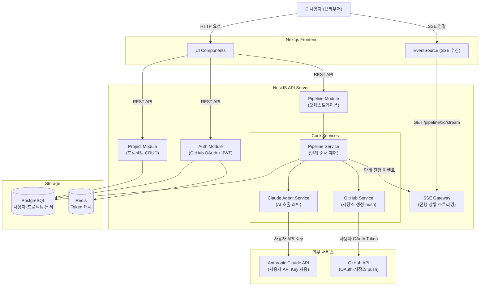

# 시스템 아키텍처 — AI 기반 자동화 MVP 빌더

---

## 컴포넌트 목록

| 컴포넌트 | 역할 |
|----------|------|
| **Next.js Frontend** | 사용자 UI, 요구사항 입력, 분석 문서 검토, SSE 수신 및 진행 상황 표시 |
| **NestJS API Server** | 비즈니스 로직, 인증(GitHub OAuth + JWT), 파이프라인 오케스트레이션 |
| **Pipeline Service** | 분석 문서 생성 → 태스크 분해 → 코드 생성 단계를 순서대로 실행 |
| **Claude Agent Service** | Claude Agent SDK를 래핑하여 각 파이프라인 단계에서 AI 호출 담당 |
| **GitHub Service** | GitHub OAuth 토큰 관리, 저장소 생성, 코드 push |
| **PostgreSQL** | 사용자, 프로젝트, 파이프라인 단계, 분석 문서, 생성 코드 이력 저장 |
| **Redis** | JWT Refresh Token 저장, GitHub Access Token 캐시 |

---

## 아키텍처 다이어그램



---

## 파이프라인 데이터 흐름

### Phase 1: 분석 문서 생성

```
사용자 입력 (요구사항 + 기술 스택)
    → POST /projects (프로젝트 생성, DB 저장)
    → POST /pipeline/:id/start
    → PipelineService: PHASE_1 시작
    → ClaudeService: 요구사항 분석 → ERD/API 스펙/아키텍처 생성 (스트리밍)
    → SSEGateway: 생성 진행 이벤트 → 클라이언트 실시간 노출
    → 완료: 분석 문서 DB 저장, 사용자에게 검토 요청
```

### Phase 2: 사용자 확인 및 태스크 분해

```
사용자: 문서 검토 → 수정 요청 또는 확정
    → PATCH /pipeline/:id/feedback (수정 요청 시 Phase 1 재실행)
    → POST /pipeline/:id/confirm (확정 시)
    → PipelineService: PHASE_2 시작
    → ClaudeService: 확정 문서 기반 태스크 분해
    → 태스크 목록 DB 저장
```

### Phase 3: TDD 기반 코드 생성 및 GitHub 업로드

```
    → PipelineService: PHASE_3 시작 (태스크 순서 반복)
    → 각 태스크:
        1. ClaudeService: 테스트 코드 생성
        2. ClaudeService: 구현 코드 생성
        3. ClaudeService: 리팩터링
        4. SSEGateway: 태스크 완료 이벤트 전송
    → 전체 코드베이스 완성
    → GitHubService: 사용자 저장소 생성 + 코드 push
    → SSEGateway: 완료 이벤트 + 저장소 URL 전송
```

---

## 보안 고려사항

| 항목 | 구현 방식 |
|------|-----------|
| **C-SEC-01** 인증/인가 | GitHub OAuth → JWT (Access 15분, Refresh 7일). 모든 API 엔드포인트 JWT 검증 필수 |
| **C-SEC-02** Claude API Key | AES-256-GCM 암호화 후 PostgreSQL 저장. 복호화는 서버 내부에서만 수행 |
| **C-SEC-02** GitHub Access Token | Redis 저장 (TTL = 토큰 만료 시간). AES 암호화 |
| **C-SEC-03** 입력 검증 | NestJS DTO + class-validator로 모든 요청 서버 측 검증 |
| **C-SEC-03** 코드 실행 격리 | 생성된 코드는 사용자 GitHub로만 전달. 플랫폼 서버에서 실행하지 않음 |
| **C-SEC-04** 비밀 정보 | .env 파일 Git 제외, 운영 환경은 AWS Secrets Manager |
