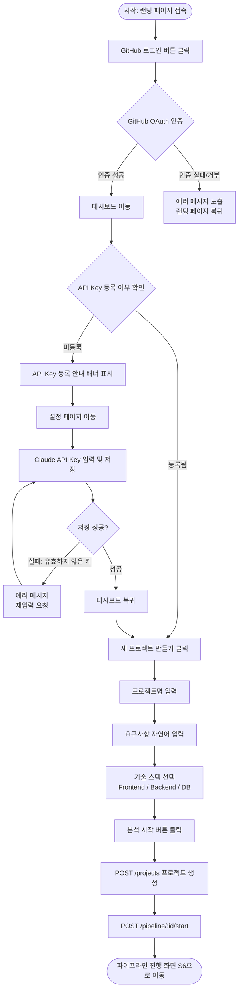
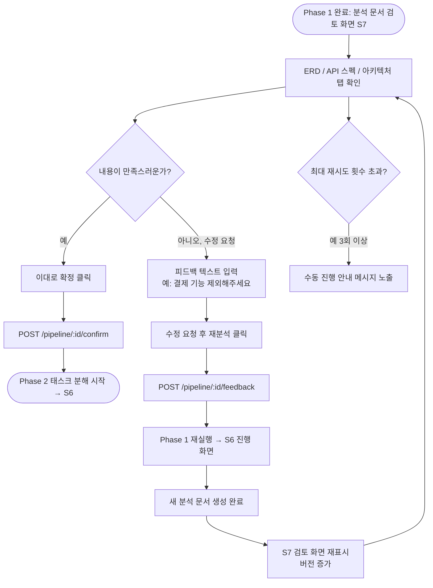
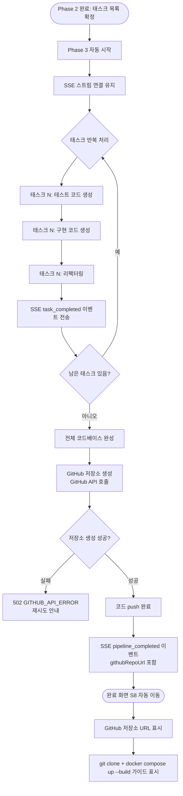
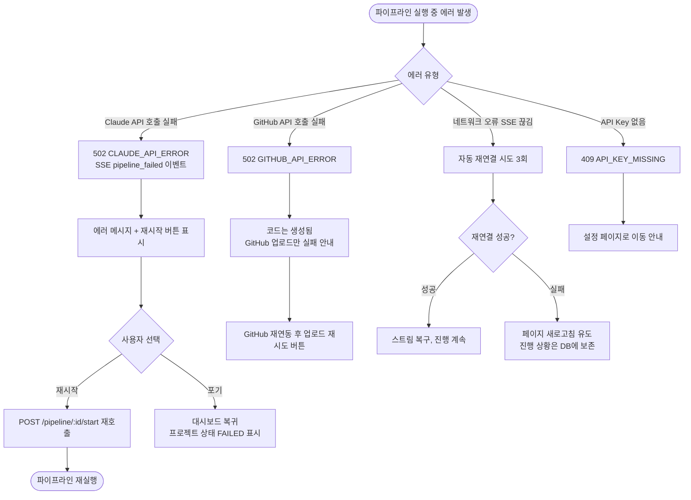
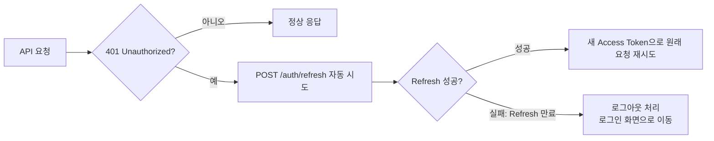

# 사용자 플로우 다이어그램 — AI 기반 자동화 MVP 빌더

---

## 시나리오 목록

| # | 제목 | 대상 페르소나 |
|---|------|--------------|
| SC-01 | 신규 사용자 온보딩 및 첫 프로젝트 생성 | 박민준 (개발자), 이수연 (비개발자) |
| SC-02 | 분석 문서 검토 → 피드백 → 재확정 | 이수연 (비개발자) |
| SC-03 | Phase 3 코드 생성 및 GitHub 전달 | 박민준 (개발자), 김태원 (1인 개발자) |
| SC-04 | 에러 발생 시 복구 흐름 | 전체 |

---

## SC-01: 신규 사용자 온보딩 및 첫 프로젝트 생성

---

## SC-02: 분석 문서 검토 → 피드백 → 재확정

---

## SC-03: Phase 3 코드 생성 및 GitHub 전달

---

## SC-04: 에러 발생 시 복구 흐름

---

## 공통 플로우

### 인증 만료 처리

