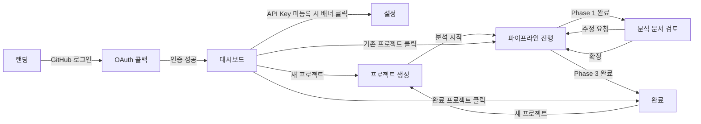

# 와이어프레임 및 화면 목록 — AI 기반 자동화 MVP 빌더

---

## 화면 목록

| ID | 화면명 | URL | 진입 경로 | 주요 목적 |
|----|--------|-----|-----------|-----------|
| S1 | 랜딩 페이지 | `/` | 직접 접속 | 서비스 소개, GitHub 로그인 유도 |
| S2 | GitHub OAuth 콜백 | `/auth/callback` | GitHub 인증 완료 후 리다이렉트 | 토큰 처리, 대시보드로 이동 |
| S3 | 대시보드 | `/dashboard` | 로그인 후, S2 완료 후 | 내 프로젝트 목록, 새 프로젝트 생성 |
| S4 | 설정 (API Key) | `/settings` | 대시보드 헤더 메뉴 | Claude API Key 등록/수정/삭제 |
| S5 | 프로젝트 생성 | `/projects/new` | S3에서 "새 프로젝트" 클릭 | 요구사항 입력, 기술 스택 선택 |
| S6 | 파이프라인 진행 | `/projects/:id/pipeline` | S5 생성 완료 후 자동 이동 | Phase 1~3 진행 상황 실시간 표시 |
| S7 | 분석 문서 검토 | `/projects/:id/review` | Phase 1 완료 후 자동 이동 | ERD/API/아키텍처 확인, 피드백 또는 확정 |
| S8 | 완료 화면 | `/projects/:id/complete` | Phase 3 완료 후 자동 이동 | GitHub 저장소 URL, 실행 가이드 |

---

## 화면별 와이어프레임

### S1: 랜딩 페이지

```
┌─────────────────────────────────────────────────────────────┐
│  [로고] MVP Builder                          [GitHub 로그인] │
├─────────────────────────────────────────────────────────────┤
│                                                             │
│            AI 기반 자동화 MVP 빌더                          │
│   자연어 입력 → 실행 가능한 코드베이스 → 내 GitHub         │
│                                                             │
│   ┌─────────────────────────────────┐                       │
│   │   [GitHub로 로그인하기 버튼]    │                       │
│   └─────────────────────────────────┘                       │
│                                                             │
│  ┌───────────┐  ┌───────────┐  ┌───────────┐               │
│  │ ✍️ 요구사항│  │ 📄 문서화 │  │ 🚀 GitHub │               │
│  │  자연어   │→ │  자동생성 │→ │  자동전달 │               │
│  └───────────┘  └───────────┘  └───────────┘               │
│                                                             │
│  비용 투명성 · 코드 소유권 · Docker 실행 보장               │
│                                                             │
└─────────────────────────────────────────────────────────────┘
```

---

### S3: 대시보드

```
┌─────────────────────────────────────────────────────────────┐
│  [로고] MVP Builder   [대시보드]   [설정]   [@username] ▾  │
├─────────────────────────────────────────────────────────────┤
│                                                             │
│  내 프로젝트                  [+ 새 프로젝트 만들기 버튼]  │
│  ─────────────────────────────────────────────             │
│                                                             │
│  ┌─────────────────────────────────────────────────────┐   │
│  │ 📁 내 SaaS 프로젝트              ✅ COMPLETED       │   │
│  │ 2026-04-10                                           │   │
│  │ [GitHub 저장소 보기 ↗]                              │   │
│  └─────────────────────────────────────────────────────┘   │
│                                                             │
│  ┌─────────────────────────────────────────────────────┐   │
│  │ 📁 구독 플랫폼                   ⏳ ANALYZING      │   │
│  │ 2026-04-10                                           │   │
│  │ [진행 상황 보기 →]                                  │   │
│  └─────────────────────────────────────────────────────┘   │
│                                                             │
└─────────────────────────────────────────────────────────────┘
```

---

### S4: 설정 (API Key)

```
┌─────────────────────────────────────────────────────────────┐
│  [← 대시보드]  설정                                        │
├─────────────────────────────────────────────────────────────┤
│                                                             │
│  Claude API Key                                             │
│  ─────────────────────────────────────                      │
│  현재 상태: ✅ 등록됨 (sk-ant-...*****)                    │
│                                                             │
│  ┌────────────────────────────────────────┐                │
│  │ sk-ant-api03-...                       │                │
│  └────────────────────────────────────────┘                │
│  [저장]  [삭제]                                             │
│                                                             │
│  ℹ️ API Key는 AES-256 암호화되어 저장됩니다.               │
│     사용 비용은 Anthropic 콘솔에서 직접 확인하세요.        │
│                                                             │
└─────────────────────────────────────────────────────────────┘
```

---

### S5: 프로젝트 생성

```
┌─────────────────────────────────────────────────────────────┐
│  [← 대시보드]  새 프로젝트 만들기                          │
├─────────────────────────────────────────────────────────────┤
│                                                             │
│  프로젝트명                                                 │
│  ┌────────────────────────────────────────────────────┐    │
│  │ 내 SaaS 프로젝트                                    │    │
│  └────────────────────────────────────────────────────┘    │
│                                                             │
│  요구사항 (자연어로 자유롭게 입력)                         │
│  ┌────────────────────────────────────────────────────┐    │
│  │ 사용자가 월정액을 내고 콘텐츠를 구독하는 서비스.   │    │
│  │ 관리자가 콘텐츠를 업로드하고, 구독자만 열람 가능.  │    │
│  │ 결제는 MVP에서 제외.                                │    │
│  └────────────────────────────────────────────────────┘    │
│                                                             │
│  기술 스택                                                  │
│  Frontend:  [Next.js ▾]   Backend: [NestJS ▾]              │
│  Database:  [PostgreSQL ▾]                                  │
│                                                             │
│              [← 취소]  [분석 시작 →]                       │
│                                                             │
└─────────────────────────────────────────────────────────────┘
```

---

### S6: 파이프라인 진행

```
┌─────────────────────────────────────────────────────────────┐
│  [← 대시보드]  내 SaaS 프로젝트 — 생성 중                  │
├─────────────────────────────────────────────────────────────┤
│                                                             │
│  [Phase 1: 분석] ━━━━━━━━━━ [Phase 2: 태스크] ─ [Phase 3: 코드]
│      ✅ 완료                     🔄 진행 중           ⬜ 대기 │
│                                                             │
│  ┌─────────────────────────────────────────────────────┐   │
│  │  📋 태스크 분해 중...                               │   │
│  │                                                     │   │
│  │  ✅ 요구사항 분석 완료                              │   │
│  │  ✅ ERD 설계 완료                                   │   │
│  │  ✅ API 스펙 완료                                   │   │
│  │  ✅ 아키텍처 설계 완료                              │   │
│  │  🔄 태스크 목록 생성 중...                          │   │
│  │                                                     │   │
│  └─────────────────────────────────────────────────────┘   │
│                                                             │
│  ℹ️ Claude API를 통해 실시간으로 처리 중입니다.            │
│                                                             │
└─────────────────────────────────────────────────────────────┘
```

---

### S7: 분석 문서 검토

```
┌─────────────────────────────────────────────────────────────┐
│  [← 대시보드]  내 SaaS 프로젝트 — 분석 문서 검토          │
├─────────────────────────────────────────────────────────────┤
│                                                             │
│  [ERD] [API 스펙] [아키텍처]  ← 탭 선택                   │
│  ─────────────────────────────────────                      │
│                                                             │
│  ┌─────────────────────────────────────────────────────┐   │
│  │  ## ERD                                             │   │
│  │                                                     │   │
│  │  users: id, email, role, created_at                 │   │
│  │  contents: id, title, body, author_id               │   │
│  │  subscriptions: id, user_id, started_at             │   │
│  │                                                     │   │
│  │  [Mermaid 다이어그램 렌더링]                        │   │
│  └─────────────────────────────────────────────────────┘   │
│                                                             │
│  ┌────────────────────────────────────────────────────┐    │
│  │ 수정 요청 (선택사항):                               │    │
│  │ "subscription 테이블에 plan_type 컬럼 추가해주세요" │    │
│  └────────────────────────────────────────────────────┘    │
│                                                             │
│     [수정 요청 후 재분석]          [이대로 확정 →]         │
│                                                             │
└─────────────────────────────────────────────────────────────┘
```

---

### S8: 완료 화면

```
┌─────────────────────────────────────────────────────────────┐
│                                                             │
│                  🎉 MVP 생성 완료!                         │
│                                                             │
│  GitHub 저장소가 생성되었습니다.                           │
│                                                             │
│  ┌────────────────────────────────────────────────────┐    │
│  │  https://github.com/username/my-saas-project  [복사] │   │
│  └────────────────────────────────────────────────────┘    │
│                                                             │
│  시작하는 방법:                                             │
│  ┌────────────────────────────────────────────────────┐    │
│  │  git clone https://github.com/username/my-saas     │    │
│  │  cd my-saas                                        │    │
│  │  docker compose up --build                         │    │
│  └────────────────────────────────────────────────────┘    │
│                                                             │
│  [GitHub에서 보기 ↗]          [새 프로젝트 만들기 →]      │
│                                                             │
└─────────────────────────────────────────────────────────────┘
```

---

## 화면 간 이동 관계



---

## 재사용 주요 UI 컴포넌트

| 컴포넌트명 | 사용 화면 | 설명 |
|-----------|----------|------|
| `Header` | S3~S8 | 로고, 내비게이션, 사용자 메뉴 |
| `ProjectCard` | S3 | 프로젝트 목록 카드 (상태 배지 포함) |
| `StatusBadge` | S3, S6 | `CREATED` / `ANALYZING` / `COMPLETED` 등 시각화 |
| `PipelineProgress` | S6 | 3단계 진행 상황 스텝 UI |
| `StreamingLog` | S6 | SSE 이벤트를 실시간으로 텍스트 로그로 표시 |
| `MarkdownViewer` | S7 | ERD/API 스펙/아키텍처 마크다운 렌더링 |
| `CodeBlock` | S8 | 복사 가능한 코드 블록 |
