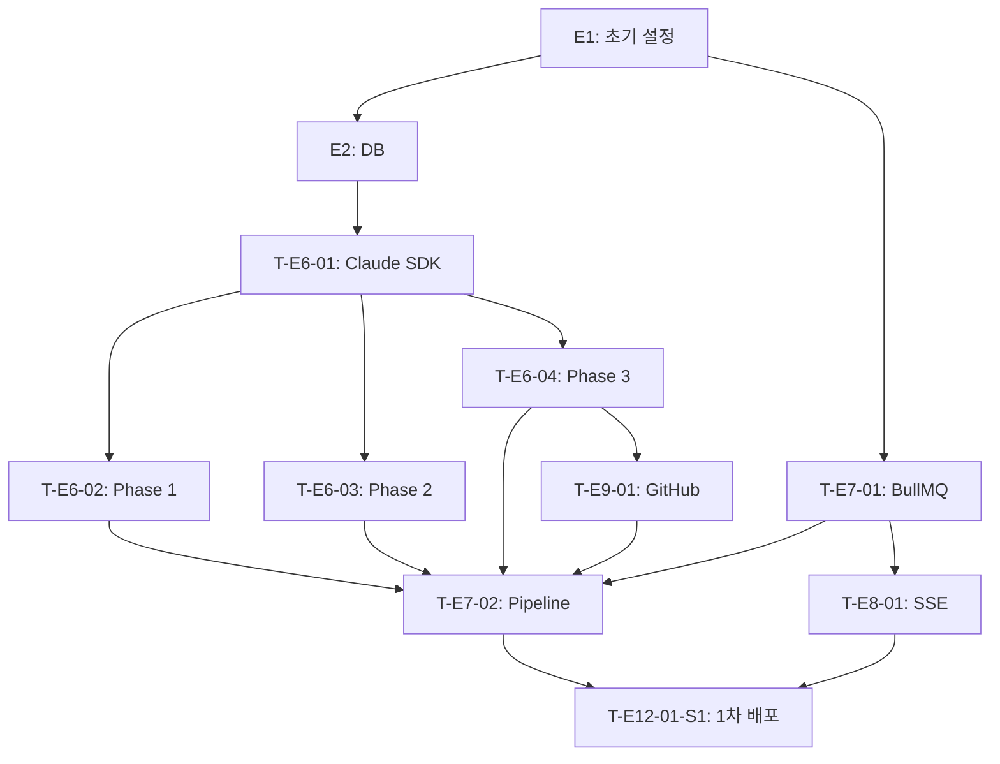

# Sprint 1 — 파이프라인 핵심

> **목표**: Claude API Key와 GitHub Token을 `.env`에 하드코딩하여 인증 없이 파이프라인 Phase 1→2→3 end-to-end 동작을 확인하고, 운영 환경(EC2)에 1차 배포한다.
> **기간**: 4일
> **제외**: 인증(E3), 사용자 관리(E4), 프로젝트 CRUD(E5), 프론트엔드(E10), 테스트 자동화(E11)

> **[Sprint 1 API 인증 정책]** `docs/03/api-spec.md`의 모든 엔드포인트는 `[인증 필수]`로 정의되어 있으나, Sprint 1에서는 인증을 제외하므로 전체 엔드포인트를 `[공개]`로 운영한다. Sprint 2(E3 인증 구현) 완료 후 원복 예정.

---

## 에픽 목록

| 에픽 ID | 에픽명 | 설명 |
|---------|--------|------|
| E1 | 프로젝트 초기 설정 | 모노레포 구조, Docker Compose |
| E2 | 데이터베이스 | Prisma 스키마 (파이프라인 관련 4개 테이블) |
| E6 | Claude Agent 서비스 | `@anthropic-ai/sdk` 래퍼, Phase 1/2/3 프롬프트 |
| E7 | 파이프라인 오케스트레이션 | BullMQ, 상태 머신, resume 전략 |
| E8 | SSE 실시간 스트리밍 | SSE Gateway |
| E9 | GitHub 연동 서비스 | 저장소 생성, S3 코드 push |
| E12 (1차) | 1차 CI/CD | main 머지 시 EC2 자동 배포, 운영 환경 파이프라인 동작 확인 |

---

## 태스크

---

### E1: 프로젝트 초기 설정

#### T-E1-01: 모노레포 디렉토리 구조 생성 ✅
- **유형**: 설정
- **설명**: `apps/backend` (NestJS), `packages/` (공유 타입) 구조 초기화
- **완료 기준**:
  - [x] `apps/backend`: NestJS 10 초기화, TypeScript strict 설정
  - [x] ESLint + Prettier 설정
  - [x] `.env.example` 파일 생성
  - [x] `.gitignore`에 `.env` 추가

#### T-E1-02: Docker Compose 환경 구성 ✅
- **유형**: 설정
- **선행 태스크**: T-E1-01
- **완료 기준**:
  - [x] `docker compose up` 실행 시 전체 서비스 기동
  - [x] PostgreSQL: 포트 5432, Redis: 포트 6379, LocalStack: 포트 4566
  - [x] 볼륨 마운트로 핫 리로드 지원
  - [x] `GET /v1/health` 응답 200

---

### E2: 데이터베이스

#### T-E2-01: Prisma 스키마 정의 (파이프라인 테이블) ✅
- **유형**: 개발
- **설명**: 파이프라인 실행에 필요한 3개 테이블 정의. 사용자·인증 테이블은 Sprint 2에서 추가
- **선행 태스크**: T-E1-02
- **완료 기준**:
  - [x] `analysis_documents` 모델 정의 — `directory_structure` JSONB 컬럼 포함
  - [x] `pipeline_runs` 모델 정의
  - [x] `tasks` 모델 정의 — `status` 필드 (PENDING/IN_PROGRESS/DONE/FAILED) 포함
  - [x] INDEX 정의
  - [x] `prisma migrate dev` 성공

---

### E6: Claude Agent 서비스

#### T-E6-01: `@anthropic-ai/sdk` 래퍼 구현 ✅
- **유형**: 개발
- **설명**: `ClaudeAgentService` 클래스. `.env`의 `CLAUDE_API_KEY` 직접 사용. tool use로 에이전트·스킬 정의
- **선행 태스크**: T-E2-01
- **완료 기준**:
  - [x] `.env`의 `CLAUDE_API_KEY`로 Anthropic 클라이언트 초기화
  - [x] tool use 스키마 정의 및 tool_use 블록 핸들링 로직 구현
  - [x] 스트리밍 응답을 AsyncIterator로 노출
  - [x] 타임아웃(`CLAUDE_API_TIMEOUT`) 및 재시도(`CLAUDE_API_MAX_RETRIES`) 적용
  - [x] Unit Test: Claude API mock으로 정상/실패 케이스

#### T-E6-02: Phase 1 분석 문서 생성 프롬프트
- **유형**: 개발
- **설명**: 요구사항 + 기술 스택 → ERD, API 스펙, 아키텍처 마크다운 + 디렉토리 구조 JSON 생성
- **선행 태스크**: T-E6-01
- **완료 기준**:
  - [ ] 출력: ERD(mermaid), API 스펙, 아키텍처 마크다운 섹션
  - [ ] 기술 스택에 맞는 디렉토리 구조를 `[{path, role, dependencies}]` JSON으로 출력
  - [ ] 분석 문서 + 디렉토리 구조 DB 저장
  - [ ] Unit Test: 프롬프트 → 파싱 로직

#### T-E6-03: Phase 2 태스크 분해 프롬프트
- **유형**: 개발
- **설명**: 확정된 분석 문서 → 태스크 목록 JSON 생성
- **선행 태스크**: T-E6-01
- **완료 기준**:
  - [ ] 출력: `[{name, description, order_index}]` JSON 배열
  - [ ] 태스크 DB 저장
  - [ ] Unit Test: 파싱 로직

#### T-E6-04: Phase 3 TDD 코드 생성 프롬프트
- **유형**: 개발
- **설명**: Phase 1 확정 디렉토리 구조 프롬프트 주입 → 태스크별 테스트 코드 → 구현 코드 → 리팩터링
- **선행 태스크**: T-E6-01
- **완료 기준**:
  - [ ] DB에서 디렉토리 구조 조회 → `파일 경로 + 역할 + 의존성` 프롬프트 주입
  - [ ] 테스트 코드 → 구현 코드 순서 보장
  - [ ] 생성된 코드 S3 업로드 (`generated/{projectId}/{path}`) — 디렉토리 구조 그대로 유지
  - [ ] Unit Test: 파싱 및 S3 업로드 로직

---

### E7: 파이프라인 오케스트레이션

#### T-E7-01: BullMQ 세팅 및 Pipeline Worker 구현 ✅
- **유형**: 개발
- **설명**: `bullmq` + `@nestjs/bullmq` 설치, Pipeline Queue, Pipeline Worker(Consumer)
- **선행 태스크**: T-E1-02
- **완료 기준**:
  - [x] `POST /v1/pipeline/start` → BullMQ 잡 등록 → 202 즉시 응답
  - [x] Pipeline Worker가 잡을 소비하여 PipelineService 실행
  - [x] BullMQ retry 설정 (attempts: 3, exponential backoff delay: 2000ms)
  - [x] Unit Test: 잡 등록 및 Worker 소비 흐름 (3 cases)

#### T-E7-02: PipelineService 상태 머신 및 resume 전략 구현
- **유형**: 개발
- **설명**: Phase 전환 로직, 상태 관리, Phase 3 resume (status=DONE skip)
- **선행 태스크**: T-E7-01, T-E6-02, T-E6-03, T-E6-04
- **완료 기준**:
  - [ ] `POST /v1/pipeline/confirm` → Phase 2→3 순서 실행
  - [ ] `POST /v1/pipeline/feedback` → Phase 1 재실행
  - [ ] Phase 3 retry 시 `status=DONE` 태스크 skip, 미완료부터 재시작
  - [ ] 각 태스크 완료 시 DB `status=DONE` 저장
  - [ ] 중복 실행 시 409 PIPELINE_ALREADY_RUNNING 반환

---

### E8: SSE 실시간 스트리밍

#### T-E8-01: SSE Gateway 구현
- **유형**: 개발
- **설명**: `GET /v1/pipeline/stream` SSE 엔드포인트, 7종 이벤트 전송
- **선행 태스크**: T-E7-01
- **완료 기준**:
  - [ ] `phase_started`, `progress`, `phase_completed`, `task_started`, `task_completed`, `pipeline_completed`, `pipeline_failed` 이벤트 전송
  - [ ] SSE 연결 끊김 시 자동 재연결 처리

---

### E9: GitHub 연동 서비스

#### T-E9-01: GitHubService 구현
- **유형**: 개발
- **설명**: GitHub API 연동 — 저장소 생성, S3에서 코드 읽어 push. `.env`의 `GITHUB_PAT` 사용
- **선행 태스크**: T-E6-04
- **완료 기준**:
  - [ ] `.env`의 `GITHUB_PAT`으로 GitHub API 인증
  - [ ] DB에서 S3 key 목록 조회 → S3 다운로드 → GitHub push
  - [ ] 저장소 이름 중복 시 suffix 추가 (-1, -2 등)
  - [ ] `docker-compose.yml` 생성 코드에 포함
  - [ ] 502 GITHUB_API_ERROR 시 재시도 1회 후 실패 처리
  - [ ] Unit Test: GitHub API mock으로 저장소 생성 및 push 로직

---

### E12 (1차): 1차 CI/CD

#### T-E12-01-S1: Docker 이미지 빌드 및 EC2 1차 배포
- **유형**: 설정
- **설명**: main 머지 시 Docker 이미지 빌드 → ECR push → EC2 자동 배포. PR 검증이나 테스트 자동화 없이 배포만 수행
- **선행 태스크**: T-E7-02, T-E9-01
- **완료 기준**:
  - [ ] GitHub Actions: main 머지 시 Docker 이미지 빌드 → ECR push
  - [ ] EC2 `docker compose pull && docker compose up -d` 자동 실행
  - [ ] 배포 후 `GET /v1/health` 200 확인
  - [ ] 운영 환경에서 파이프라인 Phase 1→2→3 end-to-end 동작 확인

---

## 의존 관계

---

## 마일스톤

### Day 1 — 기반 세팅
| 태스크 | 상태 |
|--------|------|
| T-E1-01 모노레포 구조 생성 | ✅ |
| T-E1-02 Docker Compose | ✅ |
| T-E2-01 Prisma 스키마 (파이프라인 4개 테이블) | ✅ |
| T-E7-01 BullMQ 세팅 + Pipeline Worker | ✅ |

**완료 기준**: `docker compose up` + `POST /v1/pipeline/start` → 202 응답 확인

### Day 2 — Claude + SSE
| 태스크 | 상태 |
|--------|------|
| T-E6-01 `@anthropic-ai/sdk` 래퍼 | ✅ |
| T-E6-02 Phase 1 프롬프트 | ⬜ |
| T-E6-03 Phase 2 프롬프트 | ⬜ |
| T-E8-01 SSE Gateway | ⬜ |

**완료 기준**: Phase 1 문서 생성 + SSE 스트리밍 동작 확인

### Day 3 — 파이프라인 완성 + GitHub
| 태스크 | 상태 |
|--------|------|
| T-E6-04 Phase 3 코드 생성 + S3 | ⬜ |
| T-E7-02 PipelineService + resume | ⬜ |
| T-E9-01 GitHub Service | ⬜ |

**완료 기준**: Phase 1→2→3 end-to-end 동작, GitHub 저장소 생성 + push 확인

### Day 4 — 통합 검증 + 1차 배포
| 태스크 | 상태 |
|--------|------|
| Phase 3 resume 시나리오 검증 | ⬜ |
| 전체 파이프라인 반복 실행 안정성 검증 | ⬜ |
| 에러 케이스 처리 (Claude API 실패, GitHub API 실패) | ⬜ |
| T-E12-01-S1 GitHub Actions 배포 파이프라인 + EC2 1차 배포 | ⬜ |

**완료 기준**: 운영 환경(EC2)에서 파이프라인 Phase 1→2→3 end-to-end 동작 확인
