# Sprint 2 — 인증·사용자 관리·프론트·배포

> **목표**: Sprint 1에서 하드코딩으로 대체했던 인증/사용자 관리를 완성하고, 프론트엔드 UI와 CI/CD 배포 파이프라인을 구축한다.
> **선행 조건**: Sprint 1 완료 (파이프라인 end-to-end 동작 확인)

---

## 에픽 목록

| 에픽 ID | 에픽명 | 설명 |
|---------|--------|------|
| E2 추가 | 데이터베이스 추가 마이그레이션 | `users`, `refresh_tokens`, `projects` 테이블 추가 |
| E3 | 인증 (GitHub OAuth + JWT) | GitHub OAuth 로그인, JWT 발급/갱신/무효화 |
| E4 | 사용자 관리 API | 프로필 조회, Claude API Key 암호화 저장/삭제 |
| E5 | 프로젝트 CRUD API | 프로젝트 생성/목록/상세 조회 |
| E6 수정 | Claude Agent 서비스 수정 | `.env` 하드코딩 → 사용자별 API Key 복호화로 교체 |
| E9 수정 | GitHub 연동 서비스 수정 | `.env` PAT → 사용자별 OAuth Token으로 교체 |
| E10 | 프론트엔드 UI | S1~S8 화면 구현, Zustand 상태 관리 |
| E11 | 테스트 | Unit + Integration Test |
| E12 | 배포 / CI/CD | GitHub Actions, Docker 이미지 빌드, AWS EC2 배포 |

---

## 태스크

---

### E2 추가: 데이터베이스 추가 마이그레이션

#### T-E2-02: 사용자·인증·프로젝트 테이블 추가
- **유형**: 개발
- **설명**: Sprint 1 스키마에 `users`, `refresh_tokens`, `projects` 테이블 추가 마이그레이션
- **완료 기준**:
  - [ ] `users` 모델 추가 — `encrypted_api_key`, `encrypted_github_token` 컬럼 포함
  - [ ] `refresh_tokens` 모델 추가
  - [ ] `projects` 모델 추가
  - [ ] `analysis_documents`, `pipeline_runs`, `tasks`에 `project_id` FK 연결
  - [ ] `prisma migrate dev` 성공

---

### E3: 인증 (GitHub OAuth + JWT)

#### T-E3-01: GitHub OAuth 전략 구현
- **유형**: 개발
- **설명**: Passport.js GitHub OAuth 전략, `GET /v1/auth/github`, `GET /v1/auth/github/callback`
- **선행 태스크**: T-E2-02
- **완료 기준**:
  - [ ] GitHub OAuth 로그인 → 콜백 → Access/Refresh Token 발급
  - [ ] 신규 사용자 자동 `users` 테이블 저장
  - [ ] GitHub Access Token AES-256-GCM 암호화 후 PostgreSQL 저장 (영속)
  - [ ] Redis는 GitHub Access Token 단기 캐시 용도로만 사용 (TTL, miss 시 DB에서 재캐시)
  - [ ] Integration Test: OAuth 콜백 → DB 저장 → 토큰 발급 흐름

#### T-E3-02: JWT 미들웨어 및 토큰 갱신 구현
- **유형**: 개발
- **설명**: `POST /v1/auth/refresh`, `DELETE /v1/auth/logout`, JWT Guard
- **선행 태스크**: T-E3-01
- **완료 기준**:
  - [ ] Access Token 만료 시 Refresh Token으로 갱신
  - [ ] 로그아웃 시 Refresh Token DB 삭제
  - [ ] JWT Guard: 인증 필요 엔드포인트에 적용
  - [ ] Integration Test: 토큰 갱신 및 무효화 흐름

---

### E4: 사용자 관리 API

#### T-E4-01: 프로필 조회 및 API Key CRUD 구현
- **유형**: 개발
- **설명**: `GET /v1/users/me`, `PUT /v1/users/me/api-key` (AES-256-GCM), `DELETE /v1/users/me/api-key`
- **선행 태스크**: T-E3-02
- **완료 기준**:
  - [ ] API Key 저장 시 AES-256-GCM 암호화 적용
  - [ ] API Key 응답에 평문 미포함
  - [ ] `hasApiKey` 필드로 등록 여부만 노출
  - [ ] Unit Test: 암호화/복호화 로직
  - [ ] Integration Test: API Key 저장 → 조회 → 삭제 흐름

---

### E5: 프로젝트 CRUD API

#### T-E5-01: 프로젝트 생성 및 조회 API 구현
- **유형**: 개발
- **설명**: `POST /v1/projects`, `GET /v1/projects`, `GET /v1/projects/:id`
- **선행 태스크**: T-E3-02
- **완료 기준**:
  - [ ] DTO class-validator: name(1~200자), requirements(10~10000자)
  - [ ] 타 사용자 프로젝트 접근 시 403 반환
  - [ ] Integration Test: 생성→목록조회→상세조회→403 검증

---

### E6 수정: Claude Agent 서비스 수정

#### T-E6-01-S2: 사용자별 API Key 복호화로 교체
- **유형**: 개발
- **설명**: Sprint 1의 `.env` 하드코딩을 사용자별 DB 저장 API Key 복호화로 교체
- **선행 태스크**: T-E4-01
- **완료 기준**:
  - [ ] `ClaudeAgentService`가 `userId`를 받아 DB에서 API Key 복호화 후 클라이언트 초기화
  - [ ] API Key 미등록 사용자 409 API_KEY_MISSING 반환
  - [ ] Unit Test: 복호화 → 클라이언트 초기화 흐름

---

#### T-E6-04-S2: Phase 3 샌드박스 테스트 실행 및 재생성 루프
- **유형**: 개발
- **설명**: Phase 3에서 생성된 코드를 Docker 샌드박스에서 실행해 테스트 통과 여부 확인. 실패 시 에러를 Claude에 전달해 재생성 루프 수행
- **선행 태스크**: T-E6-04
- **완료 기준**:
  - [ ] S3에서 생성 코드 다운로드 → 임시 Docker 컨테이너에서 `npm install && npx jest` 실행
  - [ ] 테스트 실패 시 에러 로그를 Claude에 전달 → 해당 파일 재생성 → 재실행
  - [ ] 최대 재시도 횟수(3회) 초과 시 태스크 FAILED 처리
  - [ ] 테스트 전체 통과 시 태스크 DONE 처리 후 S3 최종본 확정
  - [ ] Unit Test: 재생성 루프 로직 (mock Docker 실행 환경)

---

### E9 수정: GitHub 연동 서비스 수정

#### T-E9-01-S2: 사용자별 OAuth Token으로 교체
- **유형**: 개발
- **설명**: Sprint 1의 `.env` PAT을 사용자별 DB 저장 GitHub OAuth Token 복호화로 교체
- **선행 태스크**: T-E3-01
- **완료 기준**:
  - [ ] `GitHubService`가 `userId`를 받아 DB에서 OAuth Token 복호화 후 사용
  - [ ] Redis 캐시 miss 시 DB에서 복호화하여 재캐시
  - [ ] Unit Test: 토큰 복호화 → GitHub API 호출 흐름

---

### E10: 프론트엔드 UI

#### T-E10-01: 공통 레이아웃 및 인증 처리
- **유형**: 개발
- **설명**: Header, JWT 자동 갱신 인터셉터, 인증 가드
- **선행 태스크**: T-E3-02
- **완료 기준**:
  - [ ] 401 응답 시 자동 토큰 갱신 후 재시도
  - [ ] Refresh Token 만료 시 로그인 페이지 이동

#### T-E10-02: S1 랜딩 + S3 대시보드
- **유형**: 개발
- **선행 태스크**: T-E10-01, T-E5-01
- **완료 기준**:
  - [ ] `GET /v1/projects` 응답으로 카드 렌더링
  - [ ] status별 StatusBadge 색상 구분
  - [ ] 로그인 후 대시보드 자동 이동

#### T-E10-03: S4 설정 + S5 프로젝트 생성
- **유형**: 개발
- **선행 태스크**: T-E10-01, T-E4-01, T-E5-01
- **완료 기준**:
  - [ ] API Key 저장 성공 시 마스킹된 키 표시
  - [ ] 요구사항 입력 폼 유효성 검사 (10자 이상)
  - [ ] 기술 스택 드롭다운 선택

#### T-E10-04: S6 파이프라인 진행 + S8 완료 화면
- **유형**: 개발
- **선행 태스크**: T-E8-01, T-E10-02
- **완료 기준**:
  - [ ] SSE 이벤트 수신 시 로그 항목 실시간 추가
  - [ ] `pipeline_completed` 이벤트 수신 시 S8 자동 이동
  - [ ] GitHub 저장소 URL + 실행 가이드 표시

#### T-E10-05: S7 분석 문서 검토 화면
- **유형**: 개발
- **선행 태스크**: T-E7-02, T-E10-04
- **완료 기준**:
  - [ ] ERD/API/아키텍처 탭 전환, Mermaid 렌더링
  - [ ] 피드백 제출 → Phase 1 재실행
  - [ ] 확정 → Phase 2/3 시작

---

### E11: 테스트

#### T-E11-01: Integration Test 전체 작성
- **유형**: 테스트
- **설명**: 실제 PostgreSQL 기반, Claude API + GitHub API mock
- **선행 태스크**: E3~E9 완료
- **완료 기준**:
  - [ ] 파이프라인 Phase 1→2→3 전체 흐름 통과
  - [ ] 인증 흐름 (OAuth→JWT→갱신→로그아웃) 통과
  - [ ] API Key 암호화 저장/복호화 통과
  - [ ] Phase 3 resume: status=DONE skip 동작 통과
  - [ ] 403/409 에러 케이스 통과

---

### E12 (2차): 2차 CI/CD

#### T-E12-01-S2: GitHub Actions CI 파이프라인 (PR 검증)
- **유형**: 설정
- **설명**: Sprint 1의 배포 전용 파이프라인에 PR 자동 검증 추가
- **선행 태스크**: T-E11-01
- **완료 기준**:
  - [ ] PR 오픈 시 lint + type-check + test 자동 실행
  - [ ] 테스트 실패 시 머지 차단

#### T-E12-02-S2: 2차 배포 (전체 기능 + 롤백)
- **유형**: 설정
- **설명**: Sprint 2 기능 포함 전체 재배포. 롤백 전략 추가
- **선행 태스크**: T-E12-01-S2
- **완료 기준**:
  - [ ] main 머지 → Docker 이미지 빌드 → ECR push → EC2 자동 배포
  - [ ] 배포 후 `GET /v1/health` 200 확인
  - [ ] 실패 시 이전 이미지 태그로 자동 롤백
  - [ ] 운영 환경에서 인증 → 파이프라인 → GitHub push 전체 흐름 확인

---

## 의존 관계

```mermaid
flowchart TD
    S1["Sprint 1 완료"] --> E2_add["E2 추가: 사용자·인증 테이블"]
    E2_add --> E3["E3: 인증"]
    E3 --> E4["E4: 사용자 관리"]
    E3 --> E5["E5: 프로젝트 CRUD"]
    E4 --> E6_mod["E6 수정: 사용자별 API Key"]
    E3 --> E9_mod["E9 수정: 사용자별 OAuth Token"]
    E3 --> E10["E10: 프론트엔드"]
    E4 --> E10
    E5 --> E10
    E3 --> E11["E11: 테스트"]
    E4 --> E11
    E5 --> E11
    E6_mod --> E6_04_s2["T-E6-04-S2: 샌드박스 테스트 루프"]
    E6_04_s2 --> E11
    E9_mod --> E11
    E11 --> E12["E12: 배포/CI·CD"]
```

