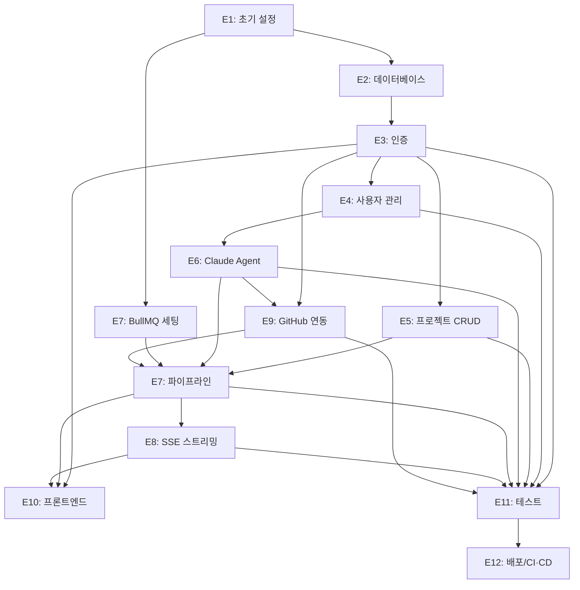

# 개발 태스크 분해서 — AI 기반 자동화 MVP 빌더

> 참조: `docs/06/consistency-report.md` 회차 2 — 이슈 0건 (완료) 확인 후 작성

---

## 에픽 목록

| 에픽 ID | 에픽명 | 설명 | 관련 문서 |
|---------|--------|------|-----------|
| E1 | 프로젝트 초기 설정 | 모노레포 구조, Docker Compose, 기본 환경 설정 | docs/00/constitution.md, docs/03/tech-stack.md |
| E2 | 데이터베이스 | Prisma 스키마, 마이그레이션, 시드 데이터 | docs/03/erd.md |
| E3 | 인증 (GitHub OAuth + JWT) | GitHub OAuth 로그인, JWT 발급/갱신/무효화 | docs/03/api-spec.md, docs/03/system-architecture.md |
| E4 | 사용자 관리 API | 프로필 조회, Claude API Key 암호화 저장/삭제 | docs/03/api-spec.md, docs/03/erd.md |
| E5 | 프로젝트 CRUD API | 프로젝트 생성/목록/상세 조회 | docs/03/api-spec.md, docs/03/erd.md |
| E6 | Claude Agent 서비스 | `@anthropic-ai/sdk` 래퍼, tool use 기반 에이전트·스킬 정의, Phase 1/2/3 프롬프트 설계 | docs/03/system-architecture.md, docs/01/PRD.md |
| E7 | 파이프라인 오케스트레이션 | BullMQ 비동기 처리, Phase 1→2→3 순서 제어, 피드백 루프, 태스크 resume 전략 | docs/03/api-spec.md, docs/03/system-architecture.md |
| E8 | SSE 실시간 스트리밍 | SSE Gateway, 클라이언트 EventSource 연동 | docs/03/api-spec.md, docs/04/user-flow.md |
| E9 | GitHub 연동 서비스 | 저장소 생성, S3에서 코드 읽어 push, OAuth Token 관리 | docs/03/system-architecture.md, docs/01/PRD.md |
| E10 | 프론트엔드 UI | S1~S8 화면 구현, Zustand 상태 관리 | docs/04/wireframe.md, docs/04/user-flow.md |
| E11 | 테스트 | Unit + Integration Test 전체 작성 | docs/00/constitution.md, docs/03/api-spec.md |
| E12 | 배포 / CI/CD | GitHub Actions, Docker 이미지 빌드, AWS EC2 배포 | docs/00/constitution.md, docs/03/tech-stack.md |

---

## 에픽별 스토리 및 태스크

---

### E1: 프로젝트 초기 설정

**스토리**: 개발자가 `docker compose up`으로 로컬 개발 환경을 즉시 실행할 수 있다.

#### T-E1-01: 모노레포 디렉토리 구조 생성
- **유형**: 설정
- **설명**: `apps/frontend` (Next.js), `apps/backend` (NestJS), `packages/` (공유 타입) 구조 초기화
- **참조 문서**: `docs/03/tech-stack.md` 전체 기술 스택
- **선행 태스크**: 없음
- **완료 기준**:
  - [ ] `apps/frontend`: Next.js 14 App Router 초기화, TypeScript strict 설정
  - [ ] `apps/backend`: NestJS 10 초기화, TypeScript strict 설정
  - [ ] ESLint + Prettier 공통 설정
  - [ ] `.env.example` 파일 생성 (실제 값 제외)
  - [ ] `.gitignore`에 `.env` 추가

#### T-E1-02: Docker Compose 환경 구성
- **유형**: 설정
- **설명**: 로컬 개발용 `docker-compose.yml` 작성 (backend, postgres, redis, localstack)
- **참조 문서**: `docs/03/tech-stack.md` 인프라/배포 섹션
- **선행 태스크**: T-E1-01
- **완료 기준**:
  - [ ] `docker compose up` 실행 시 전체 서비스 기동
  - [ ] backend: `http://localhost:3001`
  - [ ] PostgreSQL: 포트 5432, Redis: 포트 6379
  - [ ] LocalStack: 포트 4566 (S3 로컬 에뮬레이션)
  - [ ] 볼륨 마운트로 핫 리로드 지원
  - [ ] `GET /health` 엔드포인트 응답 200

---

### E2: 데이터베이스

**스토리**: 개발자가 Prisma CLI로 DB 스키마를 생성하고 마이그레이션을 관리할 수 있다.

#### T-E2-01: Prisma 스키마 정의
- **유형**: 개발
- **설명**: `docs/03/erd.md`의 테이블을 Prisma schema.prisma로 작성
- **참조 문서**: `docs/03/erd.md` 전체
- **선행 태스크**: T-E1-02
- **완료 기준**:
  - [ ] `users`, `refresh_tokens`, `projects`, `analysis_documents`, `pipeline_runs`, `tasks`, `generated_files` 모델 정의
  - [ ] `tasks` 모델에 `status` 필드 포함 (pending/done/failed) — Phase 3 resume 판단 기준
  - [ ] `generated_files` 모델: `path`, `s3_key` 컬럼 — 코드 파일 원본은 S3, 경로만 DB 저장
  - [ ] CHECK constraint, INDEX 정의 (Prisma 지원 범위 내)
  - [ ] `prisma migrate dev` 성공

#### T-E2-02: 개발용 시드 데이터 작성
- **유형**: 개발
- **설명**: 테스트용 사용자, 프로젝트, 분석 문서 시드 스크립트
- **참조 문서**: `docs/03/erd.md`
- **선행 태스크**: T-E2-01
- **완료 기준**:
  - [ ] `prisma db seed` 실행 시 테스트 데이터 삽입 성공

---

### E3: 인증 (GitHub OAuth + JWT)

**스토리**: 사용자가 GitHub 계정으로 로그인하고 JWT로 API를 호출할 수 있다.

#### T-E3-01: GitHub OAuth 전략 구현
- **유형**: 개발
- **설명**: Passport.js GitHub OAuth 전략, `GET /v1/auth/github`, `GET /v1/auth/github/callback`
- **참조 문서**: `docs/03/api-spec.md` Auth 섹션, `docs/03/system-architecture.md` AuthModule
- **선행 태스크**: T-E2-01
- **완료 기준**:
  - [ ] GitHub OAuth 로그인 → 콜백 → Access/Refresh Token 발급 동작
  - [ ] 신규 사용자 자동 `users` 테이블 저장
  - [ ] GitHub Access Token AES-256-GCM 암호화 후 PostgreSQL 저장 (영속)
  - [ ] Redis는 GitHub Access Token 단기 캐시 용도로만 사용 (TTL 설정, miss 시 DB에서 복호화하여 재캐시)
  - [ ] Integration Test: OAuth 콜백 → DB 저장 → 토큰 발급 흐름

#### T-E3-02: JWT 미들웨어 및 토큰 갱신 구현
- **유형**: 개발
- **설명**: `POST /v1/auth/refresh`, `DELETE /v1/auth/logout`, JWT Guard
- **참조 문서**: `docs/03/api-spec.md` Auth 섹션
- **선행 태스크**: T-E3-01
- **완료 기준**:
  - [ ] Access Token 만료 시 Refresh Token으로 갱신 성공
  - [ ] 로그아웃 시 Refresh Token DB 삭제
  - [ ] JWT Guard: 인증 필요 엔드포인트에 적용
  - [ ] Integration Test: 토큰 갱신 및 무효화 흐름

---

### E4: 사용자 관리 API

**스토리**: 사용자가 Claude API Key를 안전하게 등록하고 삭제할 수 있다.

#### T-E4-01: 프로필 조회 및 API Key CRUD 구현
- **유형**: 개발
- **설명**: `GET /v1/users/me`, `PUT /v1/users/me/api-key` (AES-256-GCM 암호화), `DELETE /v1/users/me/api-key`
- **참조 문서**: `docs/03/api-spec.md` Users 섹션, `docs/00/constitution.md` C-SEC-02
- **선행 태스크**: T-E3-02
- **완료 기준**:
  - [ ] API Key 저장 시 AES-256-GCM 암호화 적용
  - [ ] API Key 응답에 평문 절대 미포함
  - [ ] `hasApiKey` 필드로 등록 여부만 노출
  - [ ] Unit Test: 암호화/복호화 로직
  - [ ] Integration Test: API Key 저장 → 조회 → 삭제 흐름

---

### E5: 프로젝트 CRUD API

**스토리**: 사용자가 프로젝트를 생성하고 목록/상세를 조회할 수 있다.

#### T-E5-01: 프로젝트 생성 및 조회 API 구현
- **유형**: 개발
- **설명**: `POST /v1/projects`, `GET /v1/projects`, `GET /v1/projects/:id`
- **참조 문서**: `docs/03/api-spec.md` Projects 섹션, `docs/03/erd.md` projects 테이블
- **선행 태스크**: T-E3-02
- **완료 기준**:
  - [ ] DTO class-validator: name(1~200자), requirements(10~10000자) 검증
  - [ ] 타 사용자 프로젝트 접근 시 403 반환
  - [ ] status 필드가 ERD CHECK constraint 값으로만 설정
  - [ ] Integration Test: 생성→목록조회→상세조회→403 검증

---

### E6: Claude Agent 서비스

**스토리**: 파이프라인 각 단계에서 Claude AI가 분석 문서와 코드를 생성할 수 있다.

#### T-E6-01: `@anthropic-ai/sdk` 래퍼 구현
- **유형**: 개발
- **설명**: `ClaudeAgentService` 클래스. 사용자 API Key 복호화 후 `@anthropic-ai/sdk` 초기화. tool use로 에이전트·스킬을 코드로 직접 정의
- **참조 문서**: `docs/03/system-architecture.md` Claude Agent Service
- **선행 태스크**: T-E4-01
- **완료 기준**:
  - [ ] 사용자 API Key 복호화 → `@anthropic-ai/sdk` Anthropic 클라이언트 초기화 → 호출
  - [ ] tool use 스키마 정의 및 tool_use 블록 핸들링 로직 구현
  - [ ] 스트리밍 응답을 AsyncIterator로 노출
  - [ ] 타임아웃(`CLAUDE_API_TIMEOUT`) 및 재시도(`CLAUDE_API_MAX_RETRIES`) 적용
  - [ ] Unit Test: Claude API mock으로 정상/실패 케이스

#### T-E6-02: Phase 1 분석 문서 생성 프롬프트
- **유형**: 개발
- **설명**: 요구사항 + 기술 스택 입력 → ERD, API 스펙, 아키텍처 마크다운 생성 + 디렉토리 구조 JSON 확정
- **참조 문서**: `docs/03/system-architecture.md` Phase 1 데이터 흐름
- **선행 태스크**: T-E6-01
- **완료 기준**:
  - [ ] 출력 형식: ERD(mermaid), API 스펙, 아키텍처 각각 마크다운 섹션
  - [ ] 기술 스택에 맞는 디렉토리 구조를 `[{path, role, dependencies}]` JSON으로 함께 출력
  - [ ] 분석 문서 + 디렉토리 구조 DB 저장
  - [ ] Unit Test: 프롬프트 입력 → 파싱 로직 검증

#### T-E6-03: Phase 2 태스크 분해 프롬프트
- **유형**: 개발
- **설명**: 확정된 분석 문서 → 태스크 목록 JSON 생성 프롬프트
- **참조 문서**: `docs/03/system-architecture.md` Phase 2
- **선행 태스크**: T-E6-01
- **완료 기준**:
  - [ ] 출력 형식: `[{name, description, order_index}]` JSON 배열
  - [ ] Unit Test: 파싱 및 태스크 DB 저장 로직

#### T-E6-04: Phase 3 TDD 코드 생성 프롬프트
- **유형**: 개발
- **설명**: Phase 1 확정 디렉토리 구조를 프롬프트에 주입 → 태스크별 테스트 코드 → 구현 코드 → 리팩터링 3단계
- **참조 문서**: `docs/03/system-architecture.md` Phase 3, `docs/01/PRD.md` F-05
- **선행 태스크**: T-E6-01
- **완료 기준**:
  - [ ] DB에서 Phase 1 확정 디렉토리 구조 조회 → `파일 경로 + 역할 + 의존성` 프롬프트 주입
  - [ ] 테스트 코드 생성 → 구현 코드 생성 순서 보장
  - [ ] 생성 코드가 선택된 기술 스택(NestJS, Next.js 등)에 맞는 형태
  - [ ] 생성된 코드 S3 업로드 (`generated/{projectId}/{path}`), S3 key만 PostgreSQL에 저장
  - [ ] Unit Test: 코드 생성 프롬프트 → 파싱 및 S3 업로드 로직

---

### E7: 파이프라인 오케스트레이션

**스토리**: Phase 1→2→3이 BullMQ 비동기 큐로 처리되고, 실패 시 태스크 단위로 resume된다.

#### T-E7-01: BullMQ 세팅 및 Pipeline Worker 구현
- **유형**: 개발
- **설명**: `bullmq` + `@nestjs/bullmq` 설치, Pipeline Queue 등록, Pipeline Worker(Consumer) 구현
- **참조 문서**: `docs/03/system-architecture.md` BullMQ 섹션
- **선행 태스크**: T-E1-02
- **완료 기준**:
  - [ ] `POST /pipeline/:id/start` → BullMQ에 잡 등록 → 202 즉시 응답
  - [ ] Pipeline Worker가 큐에서 잡을 소비하여 PipelineService 실행
  - [ ] BullMQ retry 설정 (최대 재시도 횟수, backoff 전략)
  - [ ] Unit Test: 잡 등록 및 Worker 소비 흐름

#### T-E7-02: PipelineService 상태 머신 및 resume 전략 구현
- **유형**: 개발
- **설명**: Phase 전환 로직, 상태 관리, Phase 3 태스크 resume (status=done skip)
- **참조 문서**: `docs/03/system-architecture.md` Pipeline Service, `docs/03/api-spec.md` Pipeline 섹션
- **선행 태스크**: T-E7-01, T-E6-02, T-E6-03, T-E6-04
- **완료 기준**:
  - [ ] `POST /pipeline/:id/confirm` → Phase 2, 3 순서 실행
  - [ ] `POST /pipeline/:id/feedback` → Phase 1 재실행
  - [ ] Phase 3 retry 시 DB에서 태스크 status 조회 → `done`이면 skip, 미완료 태스크부터 재시작
  - [ ] 각 태스크 완료 시 DB에 `status=done` 저장
  - [ ] 중복 실행 시 409 PIPELINE_ALREADY_RUNNING 반환
  - [ ] API Key 없을 시 409 API_KEY_MISSING 반환
  - [ ] Integration Test: 전체 파이프라인 흐름 (Claude API mock)

---

### E8: SSE 실시간 스트리밍

**스토리**: 사용자가 AI 생성 진행 상황을 실시간으로 확인할 수 있다.

#### T-E8-01: SSE Gateway 구현
- **유형**: 개발
- **설명**: `GET /v1/pipeline/:id/stream` SSE 엔드포인트, 7종 이벤트 전송
- **참조 문서**: `docs/03/api-spec.md` SSE 이벤트 타입 목록
- **선행 태스크**: T-E7-02
- **완료 기준**:
  - [ ] `phase_started`, `progress`, `phase_completed`, `task_started`, `task_completed`, `pipeline_completed`, `pipeline_failed` 이벤트 전송
  - [ ] SSE 연결 끊김 시 자동 재연결 처리
  - [ ] Integration Test: SSE 스트림 수신 및 이벤트 파싱

---

### E9: GitHub 연동 서비스

**스토리**: 파이프라인 완료 시 사용자 GitHub 저장소가 자동 생성되고 코드가 push된다.

#### T-E9-01: GitHubService 구현
- **유형**: 개발
- **설명**: GitHub API 연동 — 저장소 생성, S3에서 코드 읽어 push, OAuth Token 복호화 사용
- **참조 문서**: `docs/03/system-architecture.md` GitHub Service, `docs/01/PRD.md` F-06
- **선행 태스크**: T-E3-01, T-E6-04
- **완료 기준**:
  - [ ] DB에서 생성 파일 S3 key 목록 조회 → S3에서 코드 다운로드 → GitHub push
  - [ ] 저장소 이름 중복 시 suffix 추가(-1, -2 등)
  - [ ] `docker-compose.yml`이 생성 코드에 반드시 포함
  - [ ] 502 GITHUB_API_ERROR 시 재시도 1회 후 실패 처리
  - [ ] 개발 시 GitHub Personal Access Token(PAT)으로 테스트 가능 (OAuth는 E3에서 교체)
  - [ ] Unit Test: GitHub API mock으로 저장소 생성 및 push 로직

---

### E10: 프론트엔드 UI

**스토리**: 사용자가 S1~S8 화면을 통해 전체 파이프라인을 조작할 수 있다.

#### T-E10-01: 공통 레이아웃 및 인증 처리
- **유형**: 개발
- **설명**: Header 컴포넌트, JWT 자동 갱신 인터셉터, 인증 가드 (미로그인 시 S1 리다이렉트)
- **참조 문서**: `docs/04/wireframe.md` Header 컴포넌트, `docs/04/user-flow.md` 공통 플로우
- **선행 태스크**: T-E3-02
- **완료 기준**:
  - [ ] 401 응답 시 자동 토큰 갱신 후 재시도
  - [ ] Refresh Token 만료 시 로그인 페이지 이동

#### T-E10-02: S1 랜딩 + S3 대시보드 구현
- **유형**: 개발
- **설명**: 랜딩 페이지, GitHub 로그인 버튼, 프로젝트 카드 목록, StatusBadge
- **참조 문서**: `docs/04/wireframe.md` S1, S3
- **선행 태스크**: T-E10-01, T-E5-01
- **완료 기준**:
  - [ ] `GET /v1/projects` 응답으로 카드 렌더링
  - [ ] status별 StatusBadge 색상 구분
  - [ ] 로그인 후 대시보드 자동 이동

#### T-E10-03: S4 설정 + S5 프로젝트 생성 구현
- **유형**: 개발
- **설명**: API Key 입력/저장, 프로젝트명/요구사항/기술스택 입력 폼
- **참조 문서**: `docs/04/wireframe.md` S4, S5
- **선행 태스크**: T-E10-01, T-E4-01, T-E5-01
- **완료 기준**:
  - [ ] API Key 저장 성공 시 마스킹된 키 표시
  - [ ] 요구사항 입력 폼 유효성 검사 (10자 이상)
  - [ ] 기술 스택 드롭다운 선택

#### T-E10-04: S6 파이프라인 진행 + S8 완료 화면 구현
- **유형**: 개발
- **설명**: SSE 연결 및 StreamingLog 렌더링, PipelineProgress 3단계 UI, 완료 화면
- **참조 문서**: `docs/04/wireframe.md` S6, S8, `docs/04/user-flow.md` SC-03
- **선행 태스크**: T-E8-01, T-E10-02
- **완료 기준**:
  - [ ] SSE 이벤트 수신 시 로그 항목 실시간 추가
  - [ ] `pipeline_completed` 이벤트 수신 시 S8 자동 이동
  - [ ] GitHub 저장소 URL + 실행 가이드 코드블록 표시

#### T-E10-05: S7 분석 문서 검토 화면 구현
- **유형**: 개발
- **설명**: ERD/API/아키텍처 탭 전환, MarkdownViewer, 피드백 입력, 확정 버튼
- **참조 문서**: `docs/04/wireframe.md` S7, `docs/04/user-flow.md` SC-02
- **선행 태스크**: T-E7-02, T-E10-04
- **완료 기준**:
  - [ ] Mermaid 다이어그램 렌더링
  - [ ] 피드백 제출 → Phase 1 재실행 → S6 화면 전환
  - [ ] 확정 → Phase 2/3 시작 → S6 화면 전환

---

### E11: 테스트

**스토리**: 핵심 파이프라인 흐름 및 API 엔드포인트가 자동화 테스트로 검증된다.

#### T-E11-01: Integration Test 전체 작성
- **유형**: 테스트
- **설명**: 실제 PostgreSQL 인스턴스 기반, Claude API + GitHub API mock 적용
- **참조 문서**: `docs/00/constitution.md` C-TEST-01~03
- **선행 태스크**: E3~E9 완료
- **완료 기준**:
  - [ ] 파이프라인 Phase 1→2→3 전체 흐름 Integration Test 통과
  - [ ] 인증 흐름(OAuth→JWT→갱신→로그아웃) 테스트 통과
  - [ ] API Key 암호화 저장/복호화 테스트 통과
  - [ ] Phase 3 resume: 태스크 status=done skip 동작 테스트 통과
  - [ ] 403/409 에러 케이스 테스트 통과

---

### E12: 배포 / CI/CD

**스토리**: PR 머지 시 자동 테스트, main 머지 시 AWS EC2 자동 배포된다.

#### T-E12-01: GitHub Actions CI 파이프라인
- **유형**: 설정
- **설명**: PR 오픈 시 lint + type-check + unit test + integration test 자동 실행
- **참조 문서**: `docs/00/constitution.md` C-INFRA-02, `docs/05/operations-guide.md` 배포 절차
- **선행 태스크**: T-E11-01
- **완료 기준**:
  - [ ] PR 오픈 시 GitHub Actions 워크플로우 자동 실행
  - [ ] 테스트 실패 시 머지 차단

#### T-E12-02: Docker 이미지 빌드 및 EC2 배포
- **유형**: 설정
- **설명**: main 머지 시 Docker 이미지 빌드 → ECR push → EC2 자동 배포
- **참조 문서**: `docs/05/operations-guide.md` 배포 프로세스
- **선행 태스크**: T-E12-01
- **완료 기준**:
  - [ ] main 머지 → Docker 이미지 빌드 성공
  - [ ] EC2에서 `docker compose pull && docker compose up -d` 자동 실행
  - [ ] 배포 후 `GET /health` 200 확인
  - [ ] 실패 시 이전 이미지 태그로 자동 롤백

---

## 의존 관계

---

## 마일스톤 (4일 플랜)

### Day 1 — 기반 + Phase 1
- T-E1-01, T-E1-02 (Docker, LocalStack 포함)
- T-E2-01, T-E2-02 (Prisma 스키마 — generated_files, task status 포함)
- T-E4-01 (Claude API Key 암호화 저장)
- T-E5-01 (프로젝트 CRUD)
- T-E7-01 (BullMQ 세팅)
- T-E6-01, T-E6-02 (Claude Agent Service + Phase 1 문서 생성)
- 목표: `POST /pipeline/:id/start` → Phase 1 분석 문서 생성 동작 확인

### Day 2 — Phase 2~3 + BullMQ
- T-E6-03, T-E6-04 (Phase 2 태스크 분해, Phase 3 코드 생성 + S3 업로드)
- T-E7-02 (PipelineService 상태 머신 + resume 전략)
- T-E8-01 (SSE Gateway)
- T-E9-01 (GitHub Service — PAT 하드코딩으로 테스트)
- 목표: Postman으로 Phase 1→2→3 전체 파이프라인 동작 확인, GitHub 저장소 push 확인

### Day 3 — GitHub OAuth 교체 + 통합 테스트
- T-E3-01, T-E3-02 (GitHub OAuth + JWT)
- PAT → OAuth Token으로 교체
- T-E11-01 (Integration Test)
- 목표: GitHub 로그인 → 파이프라인 실행 → 저장소 push 전체 흐름 end-to-end 검증

### Day 4 — 버그 수정 + 엣지 케이스
- Phase 3 resume 시나리오 검증 (의도적 실패 후 재시작)
- 에러 응답 코드 검증 (403, 409 등)
- 전체 파이프라인 안정화
