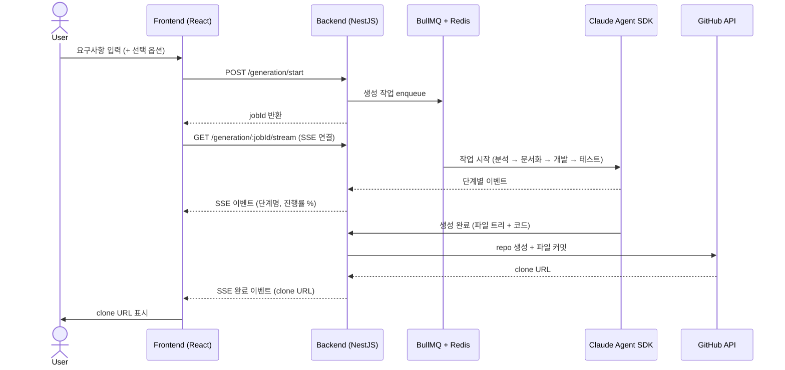
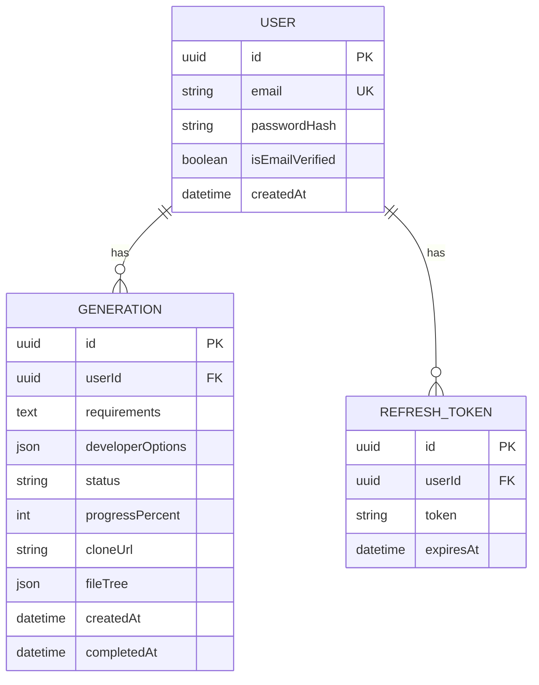

# PRD — Product Requirements Document
# mvp-builder

> 작성일: 2026-03-17
> 작성자: PM Agent (1단계)
> 기반 원칙: `docs/constitution.md`

---

## 1. 제품 개요

### 한 줄 요약

자연어 요구사항 하나로 즉시 실행 가능한 MVP를 GitHub 저장소로 자동 생성해주는 서비스.

### 존재 이유

아이디어를 가진 비개발자와 빠른 프로토타이핑이 필요한 개발자 모두, 초기 코드베이스 구축에 드는 반복적인 설정 비용(보일러플레이트, 테스트 세팅, CI/CD 등)을 제거한다.

### 해결하는 문제

| 대상 | 문제 | 솔루션 |
|------|------|--------|
| 비개발자 | 아이디어를 코드로 옮기는 진입 장벽이 너무 높다 | 자연어만으로 실행 가능한 저장소 제공 |
| 주니어 개발자 | 프로젝트 초기 아키텍처 결정과 설정에 시간이 소요된다 | 선택 옵션 기반 커스터마이징 자동화 |
| 시니어 개발자 | PoC/MVP 검증을 위한 반복적인 보일러플레이트 작성이 비효율적이다 | 기술 스택 직접 지정 후 즉시 생성 |

---

## 2. 핵심 기능 목록

### Must-have (MVP에 반드시 포함)

| ID | 기능명 | 설명 |
|----|--------|------|
| F-01 | 자연어 요구사항 입력 | 최대 10,000자 자유 형식 텍스트 입력 |
| F-02 | MVP 프로젝트 자동 생성 | Claude Agent SDK를 통한 코드 생성 파이프라인 실행 |
| F-03 | 실시간 생성 진행률 표시 | SSE로 단계별 상태(분석 → 문서화 → 개발 → 테스트) 및 퍼센테이지 표시 |
| F-04 | GitHub repo 자동 생성 및 업로드 | 생성 결과물을 GitHub에 자동 커밋. repo명: `mvp-{keyword}-{username}` |
| F-05 | clone URL 제공 | 완료 후 즉시 사용 가능한 git clone URL 반환 |
| F-06 | 이메일 회원가입/로그인 | 이메일 인증 포함, JWT 기반 인증 |
| F-07 | 생성 이력 조회 | 사용자가 이전 생성 결과물 목록 및 clone URL 재확인 |
| F-08 | 개발자 옵션 (선택 입력) | 기술 스택, 아키텍처, 배포 방식 지정 (Progressive Disclosure). UI는 combobox 패턴 (선택지 + 자유 입력 혼합). |

> [이슈 1-1 수정] F-08(개발자 옵션)을 Should-have에서 Must-have로 격상함. MVP-scope.md In-scope(F-01~F-08)와 일치시킨 결정.

### Should-have (없어도 출시 가능하나 핵심 가치를 높임)

| ID | 기능명 | 설명 |
|----|--------|------|
| F-09 | 생성 중 취소 기능 | 진행 중인 생성 작업 사용자 취소 |
| F-10 | 생성 결과 파일 트리 미리보기 | 생성된 파일 구조 UI에서 확인 |

### Nice-to-have (이후 버전 고려)

| ID | 기능명 | 설명 |
|----|--------|------|
| F-11 | 생성 결과 재생성/수정 요청 | 동일 요구사항으로 재생성 또는 추가 수정 요청 |
| F-12 | 공개/비공개 저장소 선택 | GitHub repo 가시성 설정 |
| F-13 | 소셜 로그인 (Google/GitHub OAuth) | 이메일 외 간편 로그인 |
| F-14 | 팀 공유 기능 | 생성 결과물을 팀원과 공유 |
| F-15 | 생성 템플릿 저장 | 자주 사용하는 옵션 조합 저장 |

---

## 3. 사용자 스토리

### 인증

- As a **신규 방문자**, I want to **이메일과 비밀번호로 회원가입하고 이메일 인증을 완료**할 수 있기를 원한다, So that **서비스를 이용할 수 있는 계정을 갖게 된다**.
- As a **가입 사용자**, I want to **이메일과 비밀번호로 로그인**할 수 있기를 원한다, So that **내 생성 이력과 결과물에 접근할 수 있다**.
- As a **로그인한 사용자**, I want to **로그아웃하고 세션을 종료**할 수 있기를 원한다, So that **내 계정을 안전하게 보호할 수 있다**.

### MVP 생성 (비개발자)

- As a **비개발자**, I want to **자연어로 내 서비스 아이디어를 설명**할 수 있기를 원한다, So that **개발 지식 없이도 MVP를 만들 수 있다**.
- As a **비개발자**, I want to **생성 진행 상황을 단계별로 실시간 확인**할 수 있기를 원한다, So that **AI가 무슨 작업을 하고 있는지 알 수 있다**.
- As a **비개발자**, I want to **완성된 git clone URL을 받아 바로 사용**할 수 있기를 원한다, So that **로컬에서 즉시 실행해볼 수 있다**.

### MVP 생성 (개발자)

- As a **개발자**, I want to **기술 스택(언어, 프레임워크), 아키텍처, 배포 방식을 직접 지정**할 수 있기를 원한다, So that **내 프로젝트 요구사항에 맞는 코드베이스를 받을 수 있다**.
- As a **개발자**, I want to **생성된 파일 트리를 미리 확인**할 수 있기를 원한다, So that **clone 전 결과물 구조를 파악할 수 있다**.

### 생성 이력

- As a **로그인한 사용자**, I want to **과거에 생성한 프로젝트 목록과 각 clone URL을 다시 확인**할 수 있기를 원한다, So that **브라우저를 닫아도 결과물을 잃지 않는다**.

---

## 4. 비기능 요구사항

### 성능 목표

| 항목 | 목표 |
|------|------|
| 초기 페이지 로드 LCP | 2.5초 이하 |
| 사용자 입력 UI 반응 | 100ms 이내 |
| 생성 시작 후 첫 SSE 이벤트 도달 | 3초 이내 |
| MVP 생성 전체 소요 시간 | 평균 3분 이내 (목표), time limit는 운영 중 측정 후 결정 |

> 가정: MVP 생성 전체 소요 시간은 Claude Agent SDK 처리 시간에 크게 의존한다. 초기 목표는 평균 3분이며, 구체적인 time limit는 운영 데이터를 수집한 후 결정한다.

[결정] 생성 타임아웃 처리: time limit 초과 시 사용자에게 SSE로 타임아웃 알림 전달 및 "요구사항을 간소화한 후 재시도해주세요" 메시지 표시. 작업은 자동 취소.

### 보안 요구사항

| 항목 | 요구사항 |
|------|---------|
| 인증 방식 | JWT (Access Token 15분, Refresh Token 7일) |
| 비밀번호 저장 | bcrypt (salt rounds: 12) |
| HTTPS | 프로덕션 전 환경 강제 적용 |
| 민감 정보 | 환경 변수 관리, 로그 마스킹, `.env.example`만 저장소 커밋 |
| 입력 검증 | NestJS `ValidationPipe` + `class-validator`, 자연어 입력 최대 10,000자 |
| 코드 실행 격리 | 생성된 코드를 서버에서 실행하지 않음 (C-SEC-11) |
| Claude API key | 운영자 소유, 환경 변수로만 관리, 사용자에게 노출 안 됨 |
| Rate Limiting | MVP 초기 미적용, 추후 사용량 기반 결정 |

### 확장성 고려사항

| 항목 | 전략 |
|------|------|
| 생성 요청 처리 | BullMQ + Redis 큐, 사용자당 동시 생성 1건 제한. 이미 진행 중인 작업이 있을 경우 대기 안내 표시, time limit 초과 시 대기 중 작업 자동 취소 |
| 수평 확장 | Docker 컨테이너 기반, AWS 환경에서 인스턴스 수 증가 가능 |
| DB 확장 | 초기 단일 인스턴스, 트래픽 증가 시 Read Replica 도입 검토 |
| 모니터링 | 초기 CloudWatch Logs, 이후 Datadog/Grafana 도입 검토 |

### 지원 플랫폼 및 환경

| 항목 | 스펙 |
|------|------|
| 주요 환경 | 데스크톱 브라우저 (Desktop First) |
| 최소 뷰포트 | 1280px (데스크톱), 375px (모바일) |
| 지원 브라우저 | Chrome, Firefox, Safari, Edge 최신 2개 버전 |
| 접근성 기준 | WCAG 2.1 Level AA |
| 배포 환경 | AWS + Docker (local / staging / production 3단계 분리) |

### 기술 스택 요약

```
Backend   : Node.js + NestJS (TypeScript strict)
Frontend  : React (TypeScript strict)
AI        : Claude Agent SDK (Anthropic)
실시간     : SSE (Server-Sent Events)
Queue     : BullMQ + Redis
외부 연동  : GitHub API
인증      : JWT (이메일 기반), 이메일 발송: Nodemailer + Gmail SMTP
배포      : AWS + Docker (multi-stage build)
CI/CD     : GitHub Actions
테스트     : Jest + Supertest (Backend), Vitest + Playwright (Frontend/E2E)
```

---

## 5. 생성 파이프라인 흐름



---

## 6. 데이터 모델 (핵심)



---

## 7. 데이터 정책

### 생성 이력 보존 정책

[결정] 생성 이력(GENERATION 레코드 및 GitHub repo)은 계정이 존재하는 한 무기한 보존한다. 계정 삭제 시 또는 사용자가 직접 삭제 요청 시에만 삭제한다.

| 대상 | 보존 기간 | 삭제 트리거 |
|------|----------|-----------|
| 생성 이력 (DB) | 무기한 | 계정 삭제 또는 사용자 명시적 삭제 요청 |
| GitHub repo | 무기한 (GitHub 측 보존) | 사용자가 직접 GitHub에서 삭제 |
| Refresh Token | 7일 (만료 자동 소멸) | 만료 또는 로그아웃 시 무효화 |

### GitHub repo 네이밍 규칙

[결정] 생성되는 GitHub repo명은 `mvp-{keyword}-{username}` 형식을 따른다. (이전 결정 `mvp-{keyword}-{userEmail}`에서 변경. 이메일 주소의 `@`, `.` 등 특수문자가 GitHub repo명에 사용 불가하여 username으로 변경)
- `{keyword}`: 요구사항에서 추출한 핵심 키워드 (소문자, 하이픈 구분)
- `{username}`: 사용자의 서비스 username (예: `john-doe`)
- 예시: `mvp-todo-app-john-doe`
