# ERD — 데이터 모델
# mvp-builder

> 작성일: 2026-03-17
> 작성자: Architecture Agent (3단계)
> 기반 문서: `docs/PRD.md`, `docs/MVP-scope.md`, `docs/api-spec.md`, `docs/tech-stack.md`
> MVP In-scope 기능(F-01~F-08) 기준으로 설계한다.

---

## 1. 엔티티 목록

### 1.1 `users` — 사용자

| 컬럼명 | 타입 | 제약 | 설명 |
|--------|------|------|------|
| `id` | UUID | PK, NOT NULL, DEFAULT gen_random_uuid() | 사용자 고유 식별자 |
| `email` | VARCHAR(255) | NOT NULL, UNIQUE | 로그인 이메일. 인증 메일 수신 주소. |
| `username` | VARCHAR(30) | NOT NULL, UNIQUE | GitHub repo명에 사용되는 식별자. 영문/숫자/하이픈. |
| `password_hash` | VARCHAR(255) | NOT NULL | bcrypt 해싱된 비밀번호 (salt rounds: 12) |
| `is_email_verified` | BOOLEAN | NOT NULL, DEFAULT false | 이메일 인증 완료 여부 |
| `created_at` | TIMESTAMPTZ | NOT NULL, DEFAULT NOW() | 계정 생성 시각 |
| `updated_at` | TIMESTAMPTZ | NOT NULL, DEFAULT NOW() | 마지막 수정 시각 |

### 1.2 `email_verification_tokens` — 이메일 인증 토큰

| 컬럼명 | 타입 | 제약 | 설명 |
|--------|------|------|------|
| `id` | UUID | PK, NOT NULL, DEFAULT gen_random_uuid() | 토큰 고유 식별자 |
| `user_id` | UUID | NOT NULL, FK → users.id | 토큰 소유 사용자 |
| `token` | VARCHAR(255) | NOT NULL, UNIQUE | 인증 링크에 포함될 UUID 토큰 |
| `expires_at` | TIMESTAMPTZ | NOT NULL | 토큰 만료 시각 (발급 후 24시간) |
| `used_at` | TIMESTAMPTZ | NULL | 토큰 사용 시각. NULL이면 미사용. |
| `created_at` | TIMESTAMPTZ | NOT NULL, DEFAULT NOW() | 토큰 생성 시각 |

### 1.3 `refresh_tokens` — Refresh Token

| 컬럼명 | 타입 | 제약 | 설명 |
|--------|------|------|------|
| `id` | UUID | PK, NOT NULL, DEFAULT gen_random_uuid() | 토큰 고유 식별자 |
| `user_id` | UUID | NOT NULL, FK → users.id | 토큰 소유 사용자 |
| `token_hash` | VARCHAR(255) | NOT NULL, UNIQUE | 발급된 Refresh Token의 해시값 (SHA-256) |
| `expires_at` | TIMESTAMPTZ | NOT NULL | 만료 시각 (발급 후 7일) |
| `revoked_at` | TIMESTAMPTZ | NULL | 무효화 시각. NULL이면 유효. |
| `created_at` | TIMESTAMPTZ | NOT NULL, DEFAULT NOW() | 토큰 발급 시각 |

> 가정: Refresh Token 원문은 쿠키로만 전달하며 DB에는 SHA-256 해시값을 저장한다. 검증 시 쿠키 값을 해싱해서 비교한다.

### 1.4 `generations` — MVP 생성 이력

| 컬럼명 | 타입 | 제약 | 설명 |
|--------|------|------|------|
| `id` | UUID | PK, NOT NULL, DEFAULT gen_random_uuid() | 생성 작업 고유 식별자 (= BullMQ jobId) |
| `user_id` | UUID | NOT NULL, FK → users.id | 생성 요청 사용자 |
| `requirements` | TEXT | NOT NULL | 사용자가 입력한 자연어 요구사항 (최대 10,000자) |
| `developer_options` | JSONB | NULL | 개발자 옵션 입력값 `{ techStack, architecture, deployment }` |
| `status` | VARCHAR(20) | NOT NULL, DEFAULT 'pending' | 생성 상태: `pending` \| `processing` \| `completed` \| `failed` \| `timeout` |
| `progress_percent` | SMALLINT | NOT NULL, DEFAULT 0 | 현재 진행률 (0~100) |
| `current_stage` | VARCHAR(30) | NULL | 현재 실행 단계: `analyzing` \| `documenting` \| `developing` \| `testing` \| `uploading` |
| `clone_url` | VARCHAR(500) | NULL | 완료 후 GitHub clone URL. 완료 전 NULL. |
| `repo_name` | VARCHAR(255) | NULL | 생성된 GitHub repo명. `mvp-{keyword}-{username}` 형식. |
| `file_tree` | JSONB | NULL | 생성된 파일 트리 구조. 완료 후 저장. |
| `error_message` | TEXT | NULL | 실패 시 에러 메시지. |
| `created_at` | TIMESTAMPTZ | NOT NULL, DEFAULT NOW() | 생성 요청 시각 |
| `completed_at` | TIMESTAMPTZ | NULL | 생성 완료(또는 실패) 시각 |

**status 값 정의**

| 값 | 설명 |
|----|------|
| `pending` | 큐에 대기 중 |
| `processing` | Claude Agent SDK 실행 중 |
| `completed` | 성공적으로 완료, GitHub repo 생성됨 |
| `failed` | 오류로 인한 실패 |
| `timeout` | 타임아웃으로 인한 자동 취소 |

**file_tree JSONB 스키마 예시**

```json
{
  "root": "mvp-todo-app",
  "files": [
    { "path": "src/app.tsx", "size": 1024 },
    { "path": "src/components/TodoList.tsx", "size": 2048 },
    { "path": "package.json", "size": 512 }
  ],
  "totalFiles": 15
}
```

---

## 2. ERD 다이어그램

```mermaid
erDiagram
    users {
        uuid id PK
        varchar email UK
        varchar username UK
        varchar password_hash
        boolean is_email_verified
        timestamptz created_at
        timestamptz updated_at
    }

    email_verification_tokens {
        uuid id PK
        uuid user_id FK
        varchar token UK
        timestamptz expires_at
        timestamptz used_at
        timestamptz created_at
    }

    refresh_tokens {
        uuid id PK
        uuid user_id FK
        varchar token_hash UK
        timestamptz expires_at
        timestamptz revoked_at
        timestamptz created_at
    }

    generations {
        uuid id PK
        uuid user_id FK
        text requirements
        jsonb developer_options
        varchar status
        smallint progress_percent
        varchar current_stage
        varchar clone_url
        varchar repo_name
        jsonb file_tree
        text error_message
        timestamptz created_at
        timestamptz completed_at
    }

    users ||--o{ email_verification_tokens : "has"
    users ||--o{ refresh_tokens : "has"
    users ||--o{ generations : "requests"
```



---

## 3. 테이블 간 관계

| 관계 | 설명 |
|------|------|
| `users` 1:N `email_verification_tokens` | 한 사용자는 여러 인증 토큰을 가질 수 있다. (재발송 시 새 토큰 생성) |
| `users` 1:N `refresh_tokens` | 한 사용자는 여러 Refresh Token 이력을 가진다. (Rotation으로 매 갱신마다 신규 생성) |
| `users` 1:N `generations` | 한 사용자는 여러 MVP 생성 이력을 가진다. |

---

## 4. 주요 인덱스

```sql
-- users
CREATE UNIQUE INDEX idx_users_email ON users (email);
CREATE UNIQUE INDEX idx_users_username ON users (username);

-- email_verification_tokens
CREATE UNIQUE INDEX idx_email_verification_tokens_token ON email_verification_tokens (token);
CREATE INDEX idx_email_verification_tokens_user_id ON email_verification_tokens (user_id);
-- 만료된 미사용 토큰 조회 (재발송 시 기존 토큰 무효화)
CREATE INDEX idx_email_verification_tokens_user_expires ON email_verification_tokens (user_id, expires_at)
    WHERE used_at IS NULL;

-- refresh_tokens
CREATE UNIQUE INDEX idx_refresh_tokens_token_hash ON refresh_tokens (token_hash);
CREATE INDEX idx_refresh_tokens_user_id ON refresh_tokens (user_id);
-- 유효한 토큰 조회
CREATE INDEX idx_refresh_tokens_user_valid ON refresh_tokens (user_id, expires_at)
    WHERE revoked_at IS NULL;

-- generations
CREATE INDEX idx_generations_user_id ON generations (user_id);
-- 생성 이력 목록 조회 (사용자별 최신순)
CREATE INDEX idx_generations_user_created ON generations (user_id, created_at DESC);
-- 진행 중인 작업 조회 (사용자당 동시 1건 제한 체크)
CREATE INDEX idx_generations_user_status ON generations (user_id, status)
    WHERE status IN ('pending', 'processing');
```

---

## 5. 제약 조건

### 5.1 `users`

```sql
CONSTRAINT users_email_format CHECK (email ~* '^[A-Za-z0-9._%+-]+@[A-Za-z0-9.-]+\.[A-Za-z]{2,}$'),
CONSTRAINT users_username_format CHECK (username ~* '^[a-zA-Z][a-zA-Z0-9\-]{2,29}$')
```

### 5.2 `generations`

```sql
CONSTRAINT generations_status_check CHECK (
    status IN ('pending', 'processing', 'completed', 'failed', 'timeout')
),
CONSTRAINT generations_progress_range CHECK (
    progress_percent >= 0 AND progress_percent <= 100
),
CONSTRAINT generations_current_stage_check CHECK (
    current_stage IS NULL OR
    current_stage IN ('analyzing', 'documenting', 'developing', 'testing', 'uploading')
),
-- 완료 시 clone_url 필수 (completed 상태)
CONSTRAINT generations_completed_url CHECK (
    status != 'completed' OR clone_url IS NOT NULL
)
```

### 5.3 `email_verification_tokens`

```sql
-- 만료 시각은 생성 시각 이후여야 함
CONSTRAINT evtoken_expires_after_created CHECK (expires_at > created_at),
-- 사용 시각은 생성 시각 이후여야 함
CONSTRAINT evtoken_used_after_created CHECK (used_at IS NULL OR used_at >= created_at)
```

### 5.4 `refresh_tokens`

```sql
-- 만료 시각은 생성 시각 이후여야 함
CONSTRAINT rtoken_expires_after_created CHECK (expires_at > created_at),
-- 무효화 시각은 생성 시각 이후여야 함
CONSTRAINT rtoken_revoked_after_created CHECK (revoked_at IS NULL OR revoked_at >= created_at)
```

---

## 6. Prisma 스키마 (참고)

```prisma
// packages/shared 또는 apps/backend/prisma/schema.prisma

generator client {
  provider = "prisma-client-js"
}

datasource db {
  provider = "postgresql"
  url      = env("DATABASE_URL")
}

model User {
  id                      String                     @id @default(uuid())
  email                   String                     @unique
  username                String                     @unique
  passwordHash            String
  isEmailVerified         Boolean                    @default(false)
  createdAt               DateTime                   @default(now())
  updatedAt               DateTime                   @updatedAt

  emailVerificationTokens EmailVerificationToken[]
  refreshTokens           RefreshToken[]
  generations             Generation[]

  @@map("users")
}

model EmailVerificationToken {
  id        String    @id @default(uuid())
  userId    String
  token     String    @unique
  expiresAt DateTime
  usedAt    DateTime?
  createdAt DateTime  @default(now())

  user      User      @relation(fields: [userId], references: [id], onDelete: Cascade)

  @@index([userId])
  @@map("email_verification_tokens")
}

model RefreshToken {
  id        String    @id @default(uuid())
  userId    String
  tokenHash String    @unique
  expiresAt DateTime
  revokedAt DateTime?
  createdAt DateTime  @default(now())

  user      User      @relation(fields: [userId], references: [id], onDelete: Cascade)

  @@index([userId])
  @@map("refresh_tokens")
}

model Generation {
  id               String    @id @default(uuid())
  userId           String
  requirements     String    @db.Text
  developerOptions Json?
  status           String    @default("pending")
  progressPercent  Int       @default(0)
  currentStage     String?
  cloneUrl         String?
  repoName         String?
  fileTree         Json?
  errorMessage     String?   @db.Text
  createdAt        DateTime  @default(now())
  completedAt      DateTime?

  user             User      @relation(fields: [userId], references: [id], onDelete: Cascade)

  @@index([userId])
  @@index([userId, createdAt(sort: Desc)])
  @@map("generations")
}
```

---

## 7. 데이터 생명주기

| 테이블 | 보존 기간 | 삭제 트리거 |
|--------|----------|------------|
| `users` | 무기한 | 사용자 명시적 계정 삭제 요청 (v1.1 구현 예정) |
| `email_verification_tokens` | 만료 후 배치 정리 | `expires_at` 경과 후 주기적 배치 삭제 (7일 주기) |
| `refresh_tokens` | 만료 후 배치 정리 | `expires_at` 경과 또는 로그아웃 시 `revoked_at` 설정. 만료+무효화된 레코드 주기적 삭제 (7일 주기) |
| `generations` | 무기한 | 계정 삭제 시 CASCADE 삭제 또는 사용자 명시적 삭제 (v1.1 구현 예정) |

> 가정: 배치 정리 작업은 BullMQ `cron` 기능을 사용하여 매일 새벽 3시(UTC)에 실행한다.
