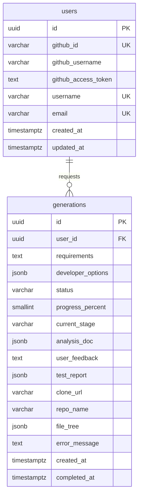

# ERD — 데이터 모델
# mvp-builder

> 작성일: 2026-03-17 (수정: 2026-03-26)
> 작성자: Architecture Agent (3단계)
> 기반 문서: `docs/PRD.md`, `docs/MVP-scope.md`, `docs/api-spec.md`, `docs/tech-stack.md`
> MVP In-scope 기능(F-01~F-08, F-02a~F-02c) 기준으로 설계한다.

---

## 1. 엔티티 목록

### 1.1 `users` — 사용자

| 컬럼명 | 타입 | 제약 | 설명 |
|--------|------|------|------|
| `id` | UUID | PK, NOT NULL, DEFAULT gen_random_uuid() | 사용자 고유 식별자 |
| `github_id` | VARCHAR(50) | NOT NULL, UNIQUE | GitHub 사용자 고유 ID |
| `github_username` | VARCHAR(100) | NOT NULL | GitHub 사용자명. repo 생성 시 사용. |
| `github_access_token` | TEXT | NOT NULL | GitHub OAuth access token (AES-256 암호화 저장) |
| `username` | VARCHAR(30) | NOT NULL, UNIQUE | 서비스 내 식별자. GitHub repo명에 사용. 영문/숫자/하이픈. |
| `email` | VARCHAR(255) | NULL, UNIQUE | GitHub에서 가져온 이메일. 미공개 계정의 경우 NULL 가능. |
| `created_at` | TIMESTAMPTZ | NOT NULL, DEFAULT NOW() | 계정 생성 시각 |
| `updated_at` | TIMESTAMPTZ | NOT NULL, DEFAULT NOW() | 마지막 수정 시각 |

### 1.2 `generations` — MVP 생성 이력

| 컬럼명 | 타입 | 제약 | 설명 |
|--------|------|------|------|
| `id` | UUID | PK, NOT NULL, DEFAULT gen_random_uuid() | 생성 작업 고유 식별자 (= BullMQ jobId) |
| `user_id` | UUID | NOT NULL, FK → users.id | 생성 요청 사용자 |
| `requirements` | TEXT | NOT NULL | 사용자가 입력한 자연어 요구사항 (최대 10,000자) |
| `developer_options` | JSONB | NULL | 개발자 옵션 입력값 `{ techStack, architecture, deployment }` |
| `status` | VARCHAR(30) | NOT NULL, DEFAULT 'pending' | 생성 상태 (아래 status 값 정의 참고) |
| `progress_percent` | SMALLINT | NOT NULL, DEFAULT 0 | 현재 진행률 (0~100) |
| `current_stage` | VARCHAR(30) | NULL | 현재 실행 단계 (아래 stage 값 정의 참고) |
| `analysis_doc` | JSONB | NULL | analyzing 완료 후 생성된 분석 문서 `{ erd, apiDesign, architecture }` |
| `user_feedback` | TEXT | NULL | 사용자가 제출한 피드백 내용 |
| `test_report` | JSONB | NULL | testing 완료 후 테스트 실행 결과 `{ passed, failed, total, coverage, summary }` |
| `clone_url` | VARCHAR(500) | NULL | 완료 후 GitHub clone URL. 완료 전 NULL. |
| `repo_name` | VARCHAR(255) | NULL | 생성된 GitHub repo명. `mvp-{keyword}-{username}` 형식. |
| `file_tree` | JSONB | NULL | 생성된 파일 트리 구조. 완료 후 저장. |
| `error_message` | TEXT | NULL | 실패 시 에러 메시지. |
| `created_at` | TIMESTAMPTZ | NOT NULL, DEFAULT NOW() | 생성 요청 시각 |
| `completed_at` | TIMESTAMPTZ | NULL | 생성 완료(또는 실패) 시각 |

**status 값 정의**

| 값 | 설명 |
|----|------|
| `pending` | 큐에 대기 중 |
| `analyzing` | 요구사항 분석 및 문서 생성 중 |
| `awaiting_feedback` | 분석 완료, 사용자 피드백 대기 중 |
| `developing` | 코드 파일 생성 중 (피드백 반영) |
| `testing` | 테스트 실행 및 리포트 생성 중 |
| `uploading` | GitHub repo 생성 및 파일 업로드 중 |
| `completed` | 성공적으로 완료, GitHub repo 생성됨 |
| `failed` | 오류로 인한 실패 |
| `timeout` | 타임아웃으로 인한 자동 취소 |

**current_stage 값 정의**

| 값 | 설명 |
|----|------|
| `analyzing` | 요구사항 분석 중 |
| `awaiting_feedback` | 사용자 피드백 대기 |
| `developing` | 코드 생성 중 |
| `testing` | 테스트 실행 중 |
| `uploading` | GitHub 업로드 중 |

**analysis_doc JSONB 스키마 예시**

```json
{
  "erd": "## ERD\n\n```mermaid\nerDiagram\n...\n```",
  "apiDesign": "## API 설계\n\n### POST /todos\n...",
  "architecture": "## 아키텍처\n\n- Frontend: Next.js\n- Backend: Node.js + Express\n..."
}
```

**test_report JSONB 스키마 예시**

```json
{
  "passed": 12,
  "failed": 0,
  "total": 12,
  "coverage": 78,
  "summary": "전체 12개 테스트 통과. 커버리지 78%."
}
```

**file_tree JSONB 스키마 예시**

```json
{
  "root": "mvp-todo-app",
  "files": [
    { "path": "src/app.tsx", "size": 1024 },
    { "path": "src/components/TodoList.tsx", "size": 2048 },
    { "path": "package.json", "size": 512 }
  ],
  "totalFiles": 15
}
```

---

## 2. ERD 다이어그램



---

## 3. 테이블 간 관계

| 관계 | 설명 |
|------|------|
| `users` 1:N `generations` | 한 사용자는 여러 MVP 생성 이력을 가진다. |

---

## 4. 주요 인덱스

```sql
-- users
CREATE UNIQUE INDEX idx_users_github_id ON users (github_id);
CREATE UNIQUE INDEX idx_users_username ON users (username);
CREATE UNIQUE INDEX idx_users_email ON users (email) WHERE email IS NOT NULL;

-- generations
CREATE INDEX idx_generations_user_id ON generations (user_id);
-- 생성 이력 목록 조회 (사용자별 최신순)
CREATE INDEX idx_generations_user_created ON generations (user_id, created_at DESC);
-- 진행 중인 작업 조회 (사용자당 동시 1건 제한 체크)
CREATE INDEX idx_generations_user_status ON generations (user_id, status)
    WHERE status IN ('pending', 'analyzing', 'awaiting_feedback', 'developing', 'testing', 'uploading');
```

---

## 5. 제약 조건

### 5.1 `users`

```sql
CONSTRAINT users_username_format CHECK (username ~* '^[a-zA-Z][a-zA-Z0-9\-]{2,29}$')
```

### 5.2 `generations`

```sql
CONSTRAINT generations_status_check CHECK (
    status IN ('pending', 'analyzing', 'awaiting_feedback', 'developing', 'testing', 'uploading', 'completed', 'failed', 'timeout')
),
CONSTRAINT generations_progress_range CHECK (
    progress_percent >= 0 AND progress_percent <= 100
),
CONSTRAINT generations_current_stage_check CHECK (
    current_stage IS NULL OR
    current_stage IN ('analyzing', 'awaiting_feedback', 'developing', 'testing', 'uploading')
),
-- 완료 시 clone_url 필수
CONSTRAINT generations_completed_url CHECK (
    status != 'completed' OR clone_url IS NOT NULL
)
```

---

## 6. Prisma 스키마 (참고)

```prisma
generator client {
  provider = "prisma-client-js"
}

datasource db {
  provider = "postgresql"
  url      = env("DATABASE_URL")
}

model User {
  id                  String       @id @default(uuid())
  githubId            String       @unique
  githubUsername      String
  githubAccessToken   String       // AES-256 암호화 저장
  username            String       @unique
  email               String?      @unique
  createdAt           DateTime     @default(now())
  updatedAt           DateTime     @updatedAt

  generations         Generation[]

  @@map("users")
}

model Generation {
  id               String    @id @default(uuid())
  userId           String
  requirements     String    @db.Text
  developerOptions Json?
  status           String    @default("pending")
  progressPercent  Int       @default(0)
  currentStage     String?
  analysisDoc      Json?
  userFeedback     String?   @db.Text
  testReport       Json?
  cloneUrl         String?
  repoName         String?
  fileTree         Json?
  errorMessage     String?   @db.Text
  createdAt        DateTime  @default(now())
  completedAt      DateTime?

  user             User      @relation(fields: [userId], references: [id], onDelete: Cascade)

  @@index([userId])
  @@index([userId, createdAt(sort: Desc)])
  @@map("generations")
}
```

---

## 7. 데이터 생명주기

| 테이블 | 보존 기간 | 삭제 트리거 |
|--------|----------|------------|
| `users` | 무기한 | 사용자 명시적 계정 삭제 요청 (v1.1 구현 예정) |
| `generations` | 무기한 | 계정 삭제 시 CASCADE 삭제 또는 사용자 명시적 삭제 (v1.1 구현 예정) |

> 가정: awaiting_feedback 상태에서 24시간 내 피드백 미제출 시 BullMQ cron 작업이 status를 `timeout`으로 업데이트한다.
