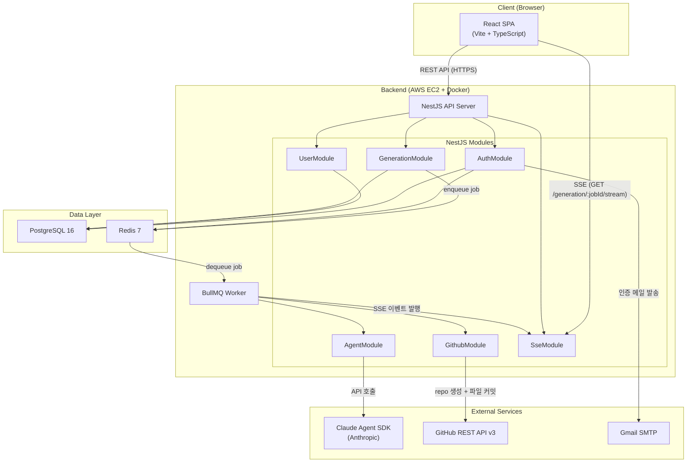
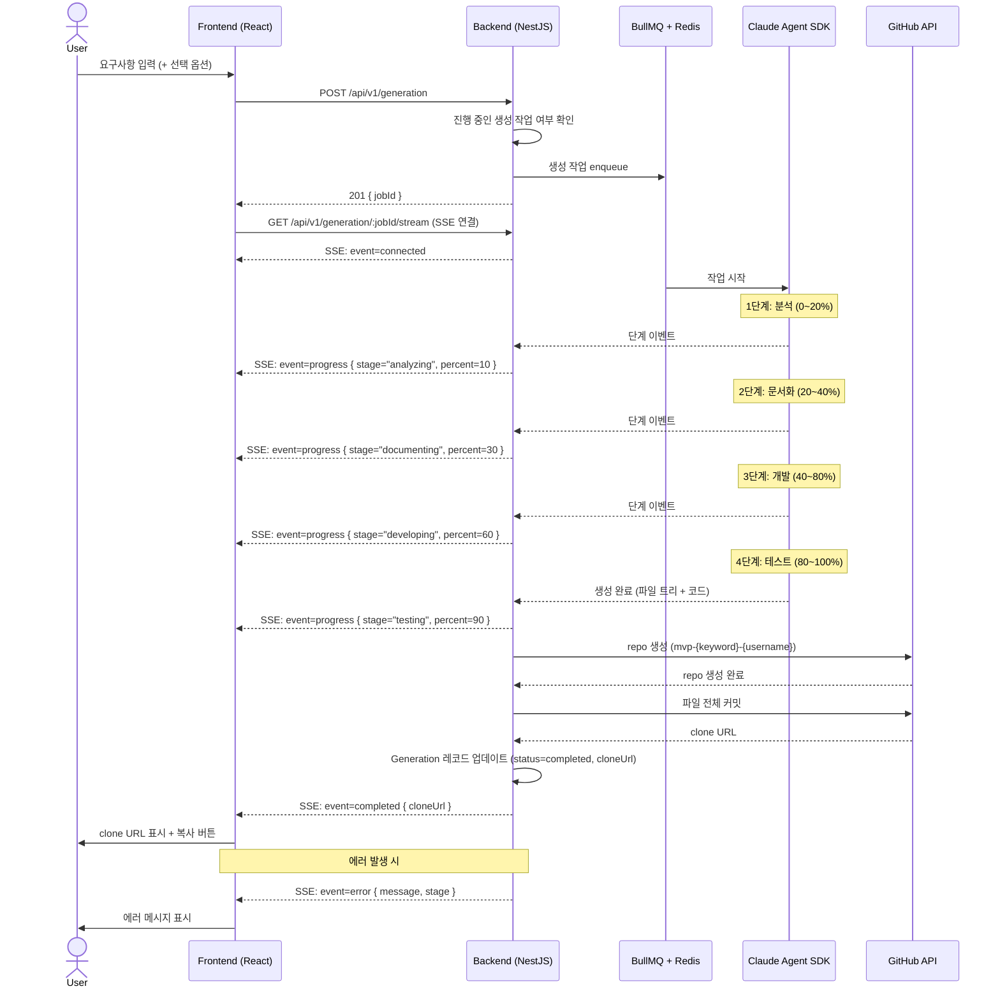
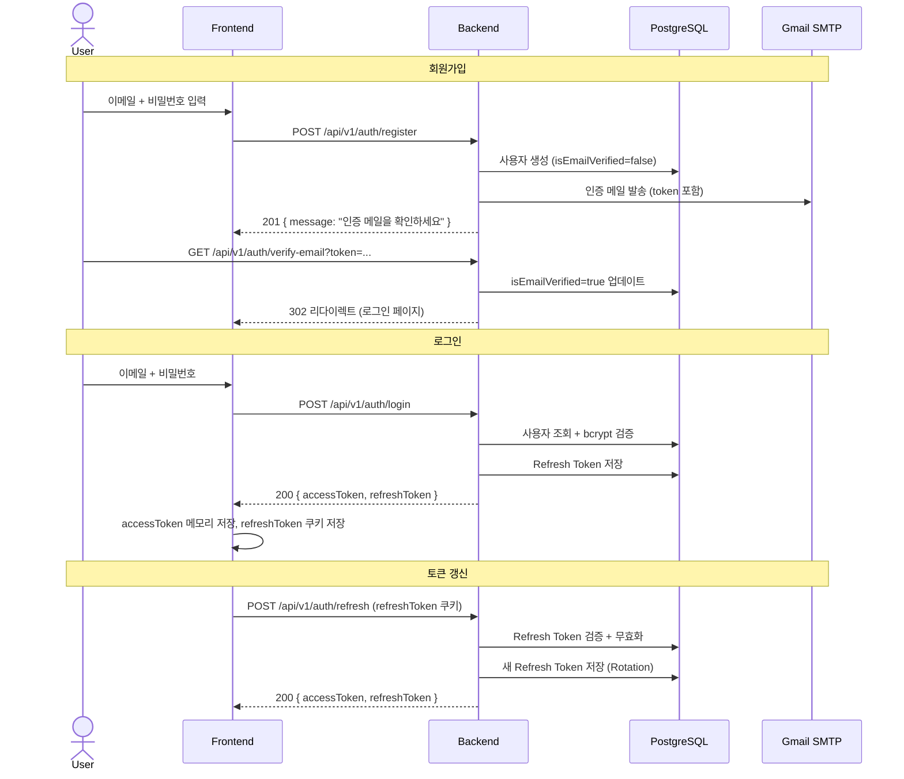
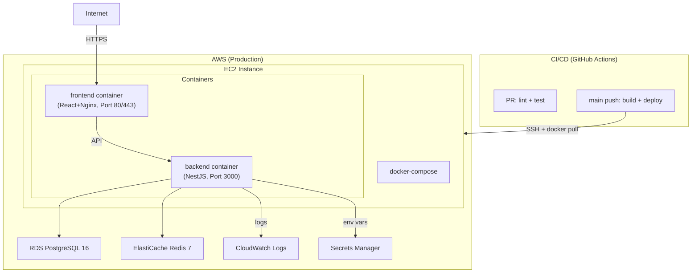

# 시스템 아키텍처
# mvp-builder

> 작성일: 2026-03-17
> 작성자: Architecture Agent (3단계)
> 기반 문서: `docs/constitution.md`, `docs/PRD.md`, `docs/MVP-scope.md`, `docs/tech-stack.md`

---

## 1. 아키텍처 개요

mvp-builder는 다음 세 영역으로 구성된다.

| 영역 | 역할 |
|------|------|
| **Frontend (React SPA)** | 사용자 인터페이스. 요구사항 입력, 생성 진행 상황 실시간 표시, 이력 조회. |
| **Backend (NestJS API)** | 비즈니스 로직 처리. 인증, 생성 요청 큐잉, SSE 스트리밍, GitHub 연동 조율. |
| **외부 서비스** | Claude Agent SDK(AI 생성), GitHub API(repo 생성), Gmail SMTP(이메일 인증). |

---

## 2. 컴포넌트 목록

### 2.1 Frontend 컴포넌트

| 컴포넌트 | 역할 | 주요 라이브러리 |
|----------|------|----------------|
| Auth Pages | 회원가입, 로그인, 이메일 인증 완료 페이지 | React Hook Form, zod |
| Generation Form | 요구사항 입력 + 개발자 옵션(Progressive Disclosure) | Zustand, shadcn/ui |
| Progress Monitor | SSE 수신 및 단계별 진행률 실시간 표시 | native EventSource |
| Result Display | clone URL 표시, 복사 버튼 | shadcn/ui |
| History List | 생성 이력 목록, 상태 필터, clone URL 재확인 | TanStack Query |
| Auth Store | 로그인 상태, Access Token 관리 | Zustand |

### 2.2 Backend 모듈 (NestJS)

| 모듈 | 역할 | 주요 의존성 |
|------|------|-------------|
| `AuthModule` | 회원가입, 로그인, 이메일 인증, JWT 발급, Refresh Token rotation | @nestjs/jwt, bcrypt, Nodemailer |
| `UserModule` | 사용자 조회, 프로필 관리 | Prisma |
| `GenerationModule` | 생성 요청 접수, BullMQ 큐잉, 생성 이력 저장/조회 | BullMQ, Prisma |
| `AgentModule` | Claude Agent SDK 호출, 파이프라인 실행(분석→문서화→개발→테스트) | @anthropic-ai/sdk |
| `GithubModule` | GitHub repo 생성, 파일 트리 커밋, clone URL 반환 | @octokit/rest |
| `SseModule` | SSE 연결 관리, 이벤트 발행, 연결 해제 처리 | NestJS built-in SSE |
| `PrismaModule` | DB 연결 및 ORM 제공 (전역 모듈) | Prisma Client |

### 2.3 인프라 컴포넌트

| 컴포넌트 | 역할 |
|----------|------|
| PostgreSQL 16 | 메인 데이터 저장소 (USER, GENERATION, REFRESH_TOKEN) |
| Redis 7 | BullMQ 큐 브로커. Refresh Token 블랙리스트 처리 옵션. |
| BullMQ | 생성 작업 큐 관리. 사용자당 동시 1건 제한. 재시도(최대 3회, exponential backoff). |
| AWS EC2 | 컨테이너 호스팅 (초기 구성) |
| AWS CloudWatch Logs | 구조화된 JSON 로그 수집 |

---

## 3. 아키텍처 다이어그램

### 3.1 전체 시스템 컴포넌트



### 3.2 생성 파이프라인 시퀀스



### 3.3 인증 흐름



---

## 4. 데이터 흐름

### 4.1 핵심 시나리오별 데이터 흐름

#### 시나리오 1: MVP 생성 (정상 경로)

```
사용자 요구사항 입력
  → FE Zustand store에 임시 저장
  → POST /api/v1/generation (requirements, developerOptions?)
  → GenerationModule: Generation 레코드 생성 (status=pending)
  → BullMQ: job enqueue (jobId = generationId)
  → FE: SSE 연결 (/api/v1/generation/:jobId/stream)
  → AgentModule: Claude SDK 호출 (4단계 파이프라인)
  → SSE 이벤트 발행 (progress 0~100%)
  → GithubModule: repo 생성 + 파일 커밋
  → Generation 레코드 업데이트 (status=completed, cloneUrl, fileTree)
  → SSE completed 이벤트
  → FE: clone URL 표시
```

#### 시나리오 2: 생성 이력 조회

```
GET /api/v1/generation (Authorization: Bearer accessToken)
  → AuthGuard: JWT 검증
  → GenerationModule: userId 기준 목록 조회 (최신순)
  → Response: 생성 이력 배열 (id, status, requirements 요약, cloneUrl, createdAt)
```

#### 시나리오 3: 토큰 만료 처리 (FE 자동 갱신)

```
API 호출 → 401 Unauthorized
  → FE TanStack Query: 401 인터셉터 감지
  → POST /api/v1/auth/refresh
  → 성공: 새 accessToken으로 원래 요청 재시도
  → 실패: 로그인 페이지 리다이렉트
```

---

## 5. 보안 고려사항

### 5.1 인증/인가

| 항목 | 구현 방식 | 근거 |
|------|----------|------|
| Access Token | JWT. 만료 15분. 메모리(Zustand store)에만 저장. LocalStorage 미사용. | C-SEC-01, C-SEC-02 |
| Refresh Token | httpOnly + Secure 쿠키로 전달. DB 저장. 7일 만료. Rotation 적용. | C-SEC-01, C-SEC-03 |
| 이메일 인증 미완료 계정 | 로그인 시 `403 Forbidden` 반환. 인증 메일 재발송 옵션 제공. | C-SEC-01 |
| 모든 인증 필요 API | NestJS `@UseGuards(JwtAuthGuard)` 데코레이터로 보호. | C-SEC-04 |
| 비밀번호 | bcrypt(salt rounds: 12) 해싱. 평문 저장 및 응답 포함 금지. | C-SEC-05 |

### 5.2 민감 데이터 처리

| 데이터 | 처리 방식 | 근거 |
|--------|----------|------|
| Claude API key | 서버 환경 변수. 클라이언트 노출 불가. 로그 마스킹. | C-SEC-06, C-SEC-12, C-SEC-14 |
| GitHub token | 서버 환경 변수(운영자 소유). 클라이언트 노출 불가. 로그 마스킹. DB 미저장. | C-SEC-06, C-SEC-08, C-SEC-12, C-SEC-14 |
| 사용자 비밀번호 | bcrypt 해싱 저장. API 응답에서 제외(DTO 명시 제외). | C-SEC-05, C-SEC-07 |
| Refresh Token | DB 저장 시 SHA-256 해시값으로 저장. 검증 시 쿠키 값을 해싱해서 비교. 유출 시 즉시 무효화 가능(Rotation). | C-SEC-03 |
| 비밀 정보 (JWT secret 등) | 코드 하드코딩 금지. 프로덕션은 AWS Secrets Manager 사용. | C-SEC-12, C-SEC-13, C-SEC-14 |

### 5.3 입력 검증

- 모든 API: NestJS `ValidationPipe` + `class-validator`로 서버 측 검증 (C-SEC-09)
- 자연어 요구사항: 최대 10,000자 제한 (C-SEC-10)
- 생성된 코드: 서버에서 실행하지 않음 (C-SEC-11)

### 5.4 CORS 및 전송 보안

- 프로덕션: HTTPS 강제 적용 (C-SEC-12 환경 분리 원칙 적용)
- CORS: FE 도메인만 허용 (wildcard `*` 금지) (C-SEC-04 인가 원칙 적용)
- SSE 엔드포인트: 인증된 사용자의 자신의 jobId에만 접근 허용 (C-SEC-04)
- Rate Limiting: 초기 MVP 미적용 (C-SEC-15)

---

## 6. 에러 처리 전략

### 6.1 표준 에러 응답 형식 (C-CODE-14)

```json
{
  "statusCode": 400,
  "message": "요구사항은 최대 10,000자까지 입력 가능합니다.",
  "error": "Bad Request",
  "timestamp": "2026-03-17T12:00:00.000Z",
  "path": "/api/v1/generation"
}
```

### 6.2 생성 파이프라인 에러 처리

| 에러 유형 | 처리 방식 |
|----------|----------|
| Claude API 호출 실패 | 최대 3회 재시도(exponential backoff). 전체 실패 시 SSE error 이벤트 발행. Generation 상태 `failed`로 업데이트. |
| GitHub API 호출 실패 | SSE error 이벤트 즉시 발행(C-CODE-16). Generation 상태 `failed`로 업데이트. |
| 타임아웃 초과 | SSE timeout 이벤트 발행. "요구사항을 간소화한 후 재시도해주세요" 메시지 표시. 작업 자동 취소. |
| 사용자 이미 생성 중 | `409 Conflict` 반환. 진행 중인 생성의 jobId 포함. |

---

## 7. 배포 아키텍처



### 7.1 로컬 개발 환경 (docker-compose)

```
docker-compose up
  → backend    (NestJS, :3000)
  → frontend   (Vite dev server, :5173)
  → postgres   (PostgreSQL 16, :5432)
  → redis      (Redis 7, :6379)
```
