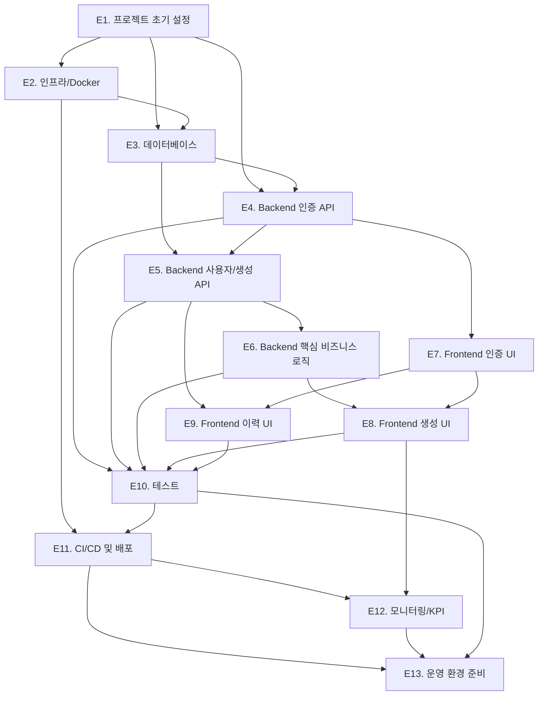
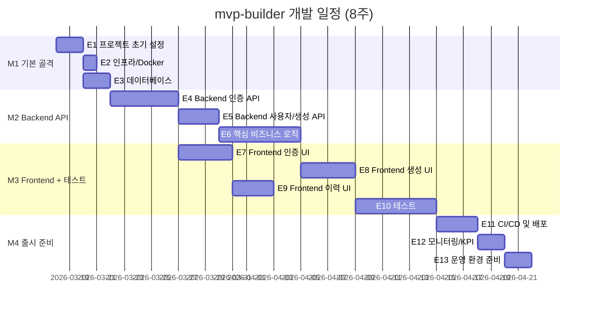

# 개발 태스크 분해서
# mvp-builder

> 작성일: 2026-03-17
> 작성자: PM/Tech Lead Agent (8단계)
> 기반 문서: 전체 docs/ 문서 (정합성 검증 회차 3 — 이슈 0건 완료 기준)
> MVP In-scope 기능(F-01~F-08) 기준으로 분해한다.

---

## 에픽 목록

| 에픽 ID | 에픽명 | 설명 | 관련 문서 |
|---------|--------|------|-----------|
| E1 | 프로젝트 초기 설정 | 모노레포 디렉토리 구조, 공통 설정(TypeScript, ESLint, Prettier), 공유 타입 패키지 초기화 | `constitution.md`, `tech-stack.md` |
| E2 | 인프라 / Docker 환경 | docker-compose 로컬 개발 환경(Backend, Frontend, PostgreSQL, Redis), Dockerfile 작성 | `system-architecture.md`, `tech-stack.md` |
| E3 | 데이터베이스 | Prisma 스키마 정의, 마이그레이션, 인덱스/제약 조건, 시드 데이터 | `erd.md` |
| E4 | Backend — 인증 API | 회원가입, 이메일 인증, 로그인, 토큰 갱신/로그아웃, 인증 메일 재발송 | `api-spec.md`, `system-architecture.md` |
| E5 | Backend — 사용자/생성 API | 프로필 조회, MVP 생성 요청, 생성 이력 목록/상세 조회 | `api-spec.md`, `system-architecture.md` |
| E6 | Backend — 핵심 비즈니스 로직 | Claude Agent SDK 파이프라인(4단계), BullMQ 큐 처리, GitHub API 연동, SSE 이벤트 발행 | `PRD.md`, `system-architecture.md`, `api-spec.md` |
| E7 | Frontend — 인증 UI | 랜딩 페이지, 회원가입, 이메일 인증 안내/완료, 로그인 화면 | `wireframe.md`, `user-flow.md`, `tech-stack.md` |
| E8 | Frontend — 생성 UI | 메인 생성 페이지(요구사항 입력 + 개발자 옵션), SSE 실시간 진행 화면, 완료 화면 | `wireframe.md`, `user-flow.md`, `tech-stack.md` |
| E9 | Frontend — 이력 UI | 생성 이력 목록, 상세 페이지, 공통 컴포넌트(라우팅, 인증 가드, 에러 처리) | `wireframe.md`, `user-flow.md`, `tech-stack.md` |
| E10 | 테스트 | Unit(서비스/컴포넌트), Integration(API 엔드포인트 100%), E2E(핵심 시나리오 3개) | `constitution.md`, `api-spec.md`, `tech-stack.md` |
| E11 | CI/CD 및 배포 | GitHub Actions 파이프라인(lint+test, 프로덕션 배포), AWS EC2 Docker 배포, Nginx 설정 | `constitution.md`, `tech-stack.md`, `operations-guide.md` |
| E12 | 모니터링 / KPI 측정 인프라 | CloudWatch 로그/메트릭, GA4 태깅, 알림 채널(Slack), 비즈니스 메트릭 대시보드 | `kpi.md`, `operations-guide.md` |
| E13 | 운영 환경 준비 | AWS Secrets Manager 시크릿 등록, Runbook 동작 확인, 배포 체크리스트 완수 | `operations-guide.md` |

---

## 스토리 목록

| 스토리 ID | 스토리 | 관련 에픽 | 관련 기능 |
|----------|--------|---------|---------|
| S-01 | 사용자가 이메일과 비밀번호로 회원가입하고 이메일 인증을 완료할 수 있다 | E4, E7 | F-06 |
| S-02 | 사용자가 이메일과 비밀번호로 로그인하고 JWT 토큰을 발급받을 수 있다 | E4, E7 | F-06 |
| S-03 | 사용자가 자연어로 요구사항을 입력하고 MVP 생성을 시작할 수 있다 | E5, E6, E8 | F-01, F-02 |
| S-04 | 사용자가 생성 진행 상황을 SSE로 실시간 확인할 수 있다 | E6, E8 | F-03 |
| S-05 | 사용자가 생성 완료 후 GitHub clone URL을 받아볼 수 있다 | E6, E8 | F-04, F-05 |
| S-06 | 개발자 사용자가 기술 스택/아키텍처/배포 방식을 선택하거나 직접 입력할 수 있다 | E5, E8 | F-08 |
| S-07 | 사용자가 과거 생성 이력과 clone URL을 다시 확인할 수 있다 | E5, E9 | F-07 |
| S-08 | 사용자가 생성 실패 또는 타임아웃 시 에러 메시지를 보고 재시도할 수 있다 | E6, E8 | F-02, F-03 |

---

## 태스크 상세

---

## E1 — 프로젝트 초기 설정

---

### T-E1-01: 모노레포 디렉토리 구조 초기화

- **에픽**: E1. 프로젝트 초기 설정
- **스토리**: (기반 인프라 — 사용자 스토리 없음)
- **유형**: 설정
- **설명**: `tech-stack.md` 5절 모노레포 구조 기준으로 `apps/backend`, `apps/frontend`, `packages/shared` 디렉토리를 생성하고 루트 `package.json`(workspaces 설정)을 초기화한다.
- **참조 문서**: `tech-stack.md` 5절 모노레포 구조
- **선행 태스크**: 없음
- **완료 기준**:
  - [ ] `apps/backend/` — NestJS 10 프로젝트 초기화 (`nest new`)
  - [ ] `apps/frontend/` — React 18 + Vite 프로젝트 초기화 (`npm create vite`)
  - [ ] `packages/shared/` — 공유 타입 패키지 디렉토리 생성 (`package.json` 포함)
  - [ ] 루트 `package.json`에 `workspaces: ["apps/*", "packages/*"]` 설정
  - [ ] 루트에서 `npm install` 실행 후 의존성 정상 설치 확인
- **예상 소요**: 0.5일

---

### T-E1-02: TypeScript strict 모드 설정

- **에픽**: E1. 프로젝트 초기 설정
- **스토리**: (기반 인프라)
- **유형**: 설정
- **설명**: `constitution.md` C-CODE-01, C-CODE-02 기준으로 Backend와 Frontend 모두 TypeScript 5 strict 모드를 적용한다.
- **참조 문서**: `constitution.md` C-CODE-01, C-CODE-02 / `tech-stack.md` 2.1, 2.2절
- **선행 태스크**: T-E1-01
- **완료 기준**:
  - [ ] `apps/backend/tsconfig.json`에 `"strict": true` 설정
  - [ ] `apps/frontend/tsconfig.json`에 `"strict": true` 설정
  - [ ] `packages/shared/tsconfig.json` 생성 및 strict 모드 설정
  - [ ] TypeScript 5.x 버전으로 통일
  - [ ] `any` 타입 사용 lint rule 추가 (`@typescript-eslint/no-explicit-any: error`)
- **예상 소요**: 0.25일

---

### T-E1-03: ESLint + Prettier 공통 설정

- **에픽**: E1. 프로젝트 초기 설정
- **스토리**: (기반 인프라)
- **유형**: 설정
- **설명**: `constitution.md` C-CODE-05~C-CODE-08 기준으로 루트 ESLint/Prettier 설정을 구성한다. Backend에는 `@nestjs/eslint-plugin`, Frontend에는 `eslint-plugin-react-hooks`, 공통으로 `eslint-plugin-import` 적용.
- **참조 문서**: `constitution.md` C-CODE-05~C-CODE-08
- **선행 태스크**: T-E1-02
- **완료 기준**:
  - [ ] 루트 `.eslintrc.json` 생성 (공통 규칙 포함)
  - [ ] `apps/backend/.eslintrc.json` — `@nestjs/eslint-plugin` 규칙 적용
  - [ ] `apps/frontend/.eslintrc.json` — `eslint-plugin-react-hooks` 규칙 적용
  - [ ] 루트 `.prettierrc` 생성
  - [ ] `eslint-plugin-import` import 정렬 규칙 적용 (node_modules → 내부 → 상대 경로)
  - [ ] `npm run lint` 명령으로 전체 린트 실행 확인
- **예상 소요**: 0.5일

---

### T-E1-04: 공유 타입 패키지 초기 구조 구성

- **에픽**: E1. 프로젝트 초기 설정
- **스토리**: (기반 인프라)
- **유형**: 설정
- **설명**: `api-spec.md` 6절 기준으로 `packages/shared/types/` 하위에 `auth.ts`, `user.ts`, `generation.ts` 타입 파일 골격을 생성한다. Backend와 Frontend에서 이 패키지를 참조할 수 있도록 workspace 패키지 참조를 설정한다.
- **참조 문서**: `api-spec.md` 6절 공유 타입 정의 위치 / `constitution.md` C-CODE-04
- **선행 태스크**: T-E1-01
- **완료 기준**:
  - [ ] `packages/shared/types/auth.ts` — 인증 관련 타입 파일 생성 (빈 파일 또는 기본 타입 정의)
  - [ ] `packages/shared/types/user.ts` — 사용자 관련 타입 파일 생성
  - [ ] `packages/shared/types/generation.ts` — 생성 관련 타입 파일 생성 (SSE payload 타입 포함)
  - [ ] `packages/shared/index.ts` — export 진입점 생성
  - [ ] `apps/backend/package.json`에서 `@mvp-builder/shared` 로컬 패키지 참조 설정
  - [ ] `apps/frontend/package.json`에서 `@mvp-builder/shared` 로컬 패키지 참조 설정
- **예상 소요**: 0.5일

---

### T-E1-05: 환경 변수 파일 구성 (.env.example)

- **에픽**: E1. 프로젝트 초기 설정
- **스토리**: (기반 인프라)
- **유형**: 설정
- **설명**: `operations-guide.md` 3.1, 3.2절 기준으로 `.env.example` 파일을 생성한다. 실제 값 없이 변수명과 형식만 포함. `.gitignore`에 `.env` 추가.
- **참조 문서**: `operations-guide.md` 3.1, 3.2절 환경 변수 목록 / `constitution.md` C-SEC-12, C-SEC-13
- **선행 태스크**: T-E1-01
- **완료 기준**:
  - [ ] `apps/backend/.env.example` — Backend 전체 환경 변수 목록 (형식만)
  - [ ] `apps/frontend/.env.example` — Frontend 환경 변수 목록 (`VITE_API_BASE_URL`, `VITE_GA4_MEASUREMENT_ID`)
  - [ ] 루트 `.gitignore`에 `*.env`, `.env` 패턴 추가 확인
  - [ ] `apps/backend/`에 `@nestjs/config` + `joi` 환경 변수 검증 모듈 기본 설정
  - [ ] 서버 시작 시 필수 환경 변수 누락 시 즉시 에러 발생 확인
- **예상 소요**: 0.5일

---

## E2 — 인프라 / Docker 환경

---

### T-E2-01: docker-compose 로컬 개발 환경 구성

- **에픽**: E2. 인프라 / Docker 환경
- **스토리**: (기반 인프라)
- **유형**: 설정
- **설명**: `system-architecture.md` 7.1절 기준으로 Backend(NestJS, :3000), Frontend(Vite dev, :5173), PostgreSQL 16(:5432), Redis 7(:6379) 전체 스택을 `docker-compose up` 한 번으로 실행할 수 있도록 설정한다.
- **참조 문서**: `system-architecture.md` 7.1절 로컬 개발 환경 / `constitution.md` C-INFRA-02 / `tech-stack.md` 2.6절
- **선행 태스크**: T-E1-01
- **완료 기준**:
  - [ ] 루트 `docker-compose.yml` 작성 (backend, frontend, postgres, redis 서비스 포함)
  - [ ] PostgreSQL 16 컨테이너 설정 (volume mount, healthcheck)
  - [ ] Redis 7 컨테이너 설정
  - [ ] `docker-compose up` 실행 후 4개 서비스 모두 정상 기동 확인
  - [ ] `localhost:3000` (Backend), `localhost:5173` (Frontend) 응답 확인
  - [ ] `localhost:5432` PostgreSQL 연결 확인 (Prisma 연결 테스트)
- **예상 소요**: 0.5일

---

### T-E2-02: Backend Dockerfile 작성 (multi-stage)

- **에픽**: E2. 인프라 / Docker 환경
- **스토리**: (기반 인프라)
- **유형**: 설정
- **설명**: `constitution.md` C-INFRA-03 기준으로 NestJS Backend의 multi-stage Dockerfile을 작성한다. builder 스테이지(빌드)와 production 스테이지(실행)로 분리하여 이미지 크기를 최소화한다.
- **참조 문서**: `constitution.md` C-INFRA-01, C-INFRA-03 / `tech-stack.md` 2.6절
- **선행 태스크**: T-E2-01
- **완료 기준**:
  - [ ] `apps/backend/Dockerfile` — multi-stage build 작성 (builder / production 스테이지)
  - [ ] Node.js 20 LTS Alpine 베이스 이미지 사용
  - [ ] production 스테이지에 `node_modules` 최소화 (devDependencies 제외)
  - [ ] `docker build -t mvp-builder-backend .` 빌드 성공 확인
  - [ ] 컨테이너 내 `npm run start:prod` 정상 실행 확인
- **예상 소요**: 0.5일

---

### T-E2-03: Frontend Dockerfile 작성 (multi-stage + Nginx)

- **에픽**: E2. 인프라 / Docker 환경
- **스토리**: (기반 인프라)
- **유형**: 설정
- **설명**: React + Vite Frontend의 multi-stage Dockerfile을 작성한다. builder 스테이지(Vite 빌드)와 nginx 스테이지(정적 파일 서빙)로 구성한다.
- **참조 문서**: `constitution.md` C-INFRA-01, C-INFRA-03 / `system-architecture.md` 7절
- **선행 태스크**: T-E2-01
- **완료 기준**:
  - [ ] `apps/frontend/Dockerfile` — multi-stage build 작성 (builder / nginx 스테이지)
  - [ ] Nginx 설정 파일 (`nginx.conf`) — SPA 라우팅을 위한 `try_files $uri /index.html` 포함
  - [ ] `docker build -t mvp-builder-frontend .` 빌드 성공 확인
  - [ ] 컨테이너에서 `localhost:80`으로 React 앱 접근 확인
  - [ ] `PORT 80/443` expose 설정
- **예상 소요**: 0.5일

---

## E3 — 데이터베이스

---

### T-E3-01: Prisma 초기 설정 및 DB 연결

- **에픽**: E3. 데이터베이스
- **스토리**: (기반 인프라)
- **유형**: 설정
- **설명**: `apps/backend`에 Prisma를 설치하고 PostgreSQL 16 연결을 설정한다. `erd.md` 6절 Prisma 스키마 참고.
- **참조 문서**: `erd.md` 6절 Prisma 스키마 / `tech-stack.md` 2.3절
- **선행 태스크**: T-E2-01
- **완료 기준**:
  - [ ] `prisma/schema.prisma` 파일 생성 (datasource 설정 포함)
  - [ ] `DATABASE_URL` 환경 변수로 PostgreSQL 연결 설정
  - [ ] `npx prisma db push` 또는 `migrate dev` 연결 성공 확인
  - [ ] `PrismaModule` NestJS 전역 모듈로 등록 (`apps/backend/src/prisma/`)
  - [ ] `PrismaService` — `onModuleInit`에서 `$connect()`, `onModuleDestroy`에서 `$disconnect()` 구현
- **예상 소요**: 0.5일

---

### T-E3-02: Prisma 스키마 정의 — 전체 엔티티

- **에픽**: E3. 데이터베이스
- **스토리**: (기반 인프라)
- **유형**: 개발
- **설명**: `erd.md` 1절~5절 기준으로 4개 엔티티(`users`, `email_verification_tokens`, `refresh_tokens`, `generations`)를 `schema.prisma`에 정의한다. 제약 조건, 인덱스, 관계를 모두 포함한다.
- **참조 문서**: `erd.md` 1~5절 엔티티/인덱스/제약 조건 / `erd.md` 6절 Prisma 스키마
- **선행 태스크**: T-E3-01
- **완료 기준**:
  - [ ] `User` 모델 — `email`, `username` unique, `password_hash`, `is_email_verified`, CHECK 제약 조건
  - [ ] `EmailVerificationToken` 모델 — `user_id` FK, `token` unique, `expires_at`, `used_at`
  - [ ] `RefreshToken` 모델 — `user_id` FK, `token_hash` unique (SHA-256), `expires_at`, `revoked_at`
  - [ ] `Generation` 모델 — `user_id` FK, `status` DEFAULT 'pending', `developer_options` Json, `file_tree` Json
  - [ ] `generations.status` — CHECK 제약 조건 5개 값 반영 (`pending|processing|completed|failed|timeout`)
  - [ ] 전체 인덱스 정의 (`erd.md` 4절 기준)
  - [ ] `onDelete: Cascade` 관계 설정 (user 삭제 시 연관 데이터 cascade)
- **예상 소요**: 0.5일

---

### T-E3-03: 초기 마이그레이션 생성 및 적용

- **에픽**: E3. 데이터베이스
- **스토리**: (기반 인프라)
- **유형**: 개발
- **설명**: Prisma 스키마 기반으로 초기 마이그레이션 파일을 생성하고 로컬 + CI 환경에서 적용한다.
- **참조 문서**: `erd.md` 전체 / `operations-guide.md` 5.2절 배포 프로세스
- **선행 태스크**: T-E3-02
- **완료 기준**:
  - [ ] `npx prisma migrate dev --name init` 실행 → `prisma/migrations/` 파일 생성
  - [ ] Docker 컨테이너 PostgreSQL에 마이그레이션 적용 확인
  - [ ] `npx prisma studio`로 테이블 구조 시각적 확인
  - [ ] `npx prisma migrate deploy` 명령으로 프로덕션 배포용 마이그레이션 적용 확인
- **예상 소요**: 0.25일

---

### T-E3-04: 배치 정리 스케줄러 — 만료 토큰 삭제

- **에픽**: E3. 데이터베이스
- **스토리**: (기반 인프라)
- **유형**: 개발
- **설명**: `erd.md` 7절 데이터 생명주기 기준으로 만료된 `email_verification_tokens`와 `refresh_tokens`를 매일 새벽 3시(UTC)에 삭제하는 BullMQ cron 작업을 구현한다.
- **참조 문서**: `erd.md` 7절 데이터 생명주기 / `constitution.md` C-AGENT-03 (BullMQ)
- **선행 태스크**: T-E3-03, T-E6-02
- **완료 기준**:
  - [ ] BullMQ cron 작업 등록 — `0 3 * * *` (UTC 03:00)
  - [ ] `email_verification_tokens` — `expires_at < NOW()` 조건 레코드 삭제
  - [ ] `refresh_tokens` — `expires_at < NOW() AND revoked_at IS NOT NULL` 조건 레코드 삭제
  - [ ] 삭제 건수 `INFO` 레벨 로그 기록
- **예상 소요**: 0.5일

---

## E4 — Backend 인증 API

---

### T-E4-01: NestJS 모듈 기반 도메인 구조 설정

- **에픽**: E4. Backend — 인증 API
- **스토리**: (기반 인프라)
- **유형**: 설정
- **설명**: `constitution.md` C-CODE-12 기준으로 NestJS 모듈 기반 도메인 구조를 설정한다. 초기 모듈 스캐폴딩.
- **참조 문서**: `constitution.md` C-CODE-12 / `system-architecture.md` 2.2절 Backend 모듈 목록
- **선행 태스크**: T-E1-01
- **완료 기준**:
  - [ ] `AuthModule` 모듈 디렉토리 구조 생성 (`auth/`)
  - [ ] `UserModule` 모듈 디렉토리 구조 생성 (`user/`)
  - [ ] `GenerationModule` 모듈 디렉토리 구조 생성 (`generation/`)
  - [ ] `AgentModule` 모듈 디렉토리 구조 생성 (`agent/`)
  - [ ] `GithubModule` 모듈 디렉토리 구조 생성 (`github/`)
  - [ ] `SseModule` 모듈 디렉토리 구조 생성 (`sse/`)
  - [ ] `AppModule`에 전체 모듈 임포트 확인
  - [ ] `ValidationPipe` 전역 설정 (`main.ts`)
  - [ ] 표준 에러 응답 형식 `ExceptionFilter` 전역 설정 (`constitution.md` C-CODE-13, C-CODE-14)
- **예상 소요**: 0.5일

---

### T-E4-02: 회원가입 API 구현 — POST /auth/register

- **에픽**: E4. Backend — 인증 API
- **스토리**: S-01 — 사용자가 이메일과 비밀번호로 회원가입하고 이메일 인증을 완료할 수 있다
- **유형**: 개발
- **설명**: `api-spec.md` `POST /auth/register` 엔드포인트를 구현한다. 이메일/username 중복 확인, bcrypt 해싱, 이메일 인증 토큰 발급, Nodemailer 인증 메일 발송.
- **참조 문서**: `api-spec.md` 4.1절 POST /auth/register / `erd.md` 1.1, 1.2절 / `constitution.md` C-SEC-05
- **선행 태스크**: T-E4-01, T-E3-03
- **완료 기준**:
  - [ ] `RegisterDto` 유효성 검사 — email 형식, password 복잡도(8자+대소문자+숫자+특수문자), username(3~30자/영문/숫자/하이픈)
  - [ ] 이메일/username 중복 시 `409 USER_001/USER_002` 반환
  - [ ] bcrypt(salt rounds: 12)로 비밀번호 해싱 후 `users` 테이블 저장
  - [ ] `email_verification_tokens` 테이블에 UUID 토큰 생성 (만료: 24시간)
  - [ ] Nodemailer + Gmail SMTP로 인증 메일 발송 (링크: `APP_URL/auth/verify-email?token=...`)
  - [ ] 응답 `201` — `{ message, email }` 반환
  - [ ] 비밀번호 해시 API 응답에서 제외 확인 (C-SEC-07)
- **예상 소요**: 1일

---

### T-E4-03: 이메일 인증 API 구현 — GET /auth/verify-email

- **에픽**: E4. Backend — 인증 API
- **스토리**: S-01
- **유형**: 개발
- **설명**: `api-spec.md` `GET /auth/verify-email` 엔드포인트를 구현한다. 토큰 유효성 검사(만료, 사용 여부), `is_email_verified` 업데이트.
- **참조 문서**: `api-spec.md` 4.1절 GET /auth/verify-email / `erd.md` 1.2절 / `api-spec.md` 에러 코드 EMAIL_001
- **선행 태스크**: T-E4-02
- **완료 기준**:
  - [ ] Query Parameter `token`으로 `email_verification_tokens` 조회
  - [ ] 토큰 만료(`expires_at < NOW()`) 또는 이미 사용(`used_at IS NOT NULL`) 시 `400 EMAIL_001` 반환
  - [ ] 검증 성공 시 `users.is_email_verified = true` 업데이트
  - [ ] `email_verification_tokens.used_at = NOW()` 업데이트
  - [ ] 응답 `200` — `{ message }` 반환
- **예상 소요**: 0.5일

---

### T-E4-04: 인증 메일 재발송 API 구현 — POST /auth/resend-verification

- **에픽**: E4. Backend — 인증 API
- **스토리**: S-01
- **유형**: 개발
- **설명**: `api-spec.md` `POST /auth/resend-verification` 엔드포인트를 구현한다. 기존 미사용 토큰 무효화, 새 토큰 발급, 1분 내 재요청 시 실제 발송 skip.
- **참조 문서**: `api-spec.md` 4.1절 POST /auth/resend-verification / `erd.md` 1.2절
- **선행 태스크**: T-E4-03
- **완료 기준**:
  - [ ] 이메일 기준 사용자 조회 (미가입 이메일은 동일 200 응답 반환 — 이메일 존재 여부 노출 방지)
  - [ ] 기존 미사용 인증 토큰 모두 `used_at = NOW()`로 무효화
  - [ ] 1분 내 재요청 감지 시 실제 발송 skip (200 반환)
  - [ ] 새 인증 토큰 생성 및 메일 발송
  - [ ] 응답 `200` — `{ message }` 반환
- **예상 소요**: 0.5일

---

### T-E4-05: 로그인 API 구현 — POST /auth/login

- **에픽**: E4. Backend — 인증 API
- **스토리**: S-02 — 사용자가 이메일과 비밀번호로 로그인하고 JWT 토큰을 발급받을 수 있다
- **유형**: 개발
- **설명**: `api-spec.md` `POST /auth/login` 엔드포인트를 구현한다. bcrypt 검증, 이메일 인증 확인, JWT Access/Refresh Token 발급, Refresh Token DB 저장(SHA-256 해시).
- **참조 문서**: `api-spec.md` 4.1절 POST /auth/login / `erd.md` 1.3절 refresh_tokens / `constitution.md` C-SEC-02, C-SEC-03 / `system-architecture.md` 5.1, 5.2절
- **선행 태스크**: T-E4-01, T-E3-03
- **완료 기준**:
  - [ ] 이메일/비밀번호 검증 실패 시 `401 AUTH_001` 반환
  - [ ] 이메일 미인증 계정 `403 AUTH_002` 반환
  - [ ] Access Token(JWT, 15분) 발급 — `@nestjs/jwt`
  - [ ] Refresh Token(UUID, 7일) 발급 — SHA-256 해시값을 `refresh_tokens` 테이블 저장
  - [ ] Refresh Token `httpOnly; Secure; SameSite=Strict` 쿠키로 응답 (`Path=/api/v1/auth/refresh`)
  - [ ] 응답 `200` — `{ accessToken, user: { id, email, username } }` 반환
  - [ ] 비밀번호 해시 응답 미포함 확인
- **예상 소요**: 1일

---

### T-E4-06: Refresh Token 갱신 API 구현 — POST /auth/refresh

- **에픽**: E4. Backend — 인증 API
- **스토리**: S-02
- **유형**: 개발
- **설명**: `api-spec.md` `POST /auth/refresh` 엔드포인트를 구현한다. Refresh Token Rotation — 기존 토큰 무효화 후 새 토큰 쌍 발급. 재사용 감지(이미 `revoked_at`이 있는 토큰).
- **참조 문서**: `api-spec.md` 4.1절 POST /auth/refresh / `system-architecture.md` 3.3절 인증 흐름 / `constitution.md` C-SEC-03
- **선행 태스크**: T-E4-05
- **완료 기준**:
  - [ ] 쿠키에서 Refresh Token 추출 → SHA-256 해시 → DB 조회
  - [ ] 토큰 만료 또는 유효하지 않은 경우 `401 AUTH_003` 반환
  - [ ] 이미 `revoked_at`이 설정된 토큰 재사용 시 `401 AUTH_004` 반환 (Rotation 보안)
  - [ ] 기존 토큰 `revoked_at = NOW()`로 무효화
  - [ ] 새 Access Token + Refresh Token 발급 (Rotation)
  - [ ] 새 Refresh Token 쿠키 설정 + 응답 `200` — `{ accessToken }` 반환
- **예상 소요**: 0.75일

---

### T-E4-07: 로그아웃 API 구현 — POST /auth/logout

- **에픽**: E4. Backend — 인증 API
- **스토리**: S-02
- **유형**: 개발
- **설명**: `api-spec.md` `POST /auth/logout` 엔드포인트를 구현한다. Bearer Token 인증 필요. Refresh Token 무효화 및 쿠키 삭제.
- **참조 문서**: `api-spec.md` 4.1절 POST /auth/logout / `constitution.md` C-SEC-04
- **선행 태스크**: T-E4-06
- **완료 기준**:
  - [ ] `JwtAuthGuard`로 Access Token 검증 (인증 없으면 `401`)
  - [ ] 현재 사용자의 활성 Refresh Token 모두 `revoked_at = NOW()` 처리
  - [ ] `Set-Cookie: refreshToken=; Max-Age=0` 쿠키 삭제 헤더 설정
  - [ ] 응답 `204 No Content` 반환
- **예상 소요**: 0.5일

---

### T-E4-08: JwtAuthGuard 및 인증 미들웨어 구현

- **에픽**: E4. Backend — 인증 API
- **스토리**: (기반 인프라)
- **유형**: 개발
- **설명**: `constitution.md` C-SEC-04 기준으로 NestJS `JwtAuthGuard`를 구현한다. 인증이 필요한 모든 API에 `@UseGuards(JwtAuthGuard)` 적용 기반 구성.
- **참조 문서**: `constitution.md` C-SEC-04 / `system-architecture.md` 5.1절 / `tech-stack.md` 2.4절
- **선행 태스크**: T-E4-05
- **완료 기준**:
  - [ ] `passport-jwt` 전략 구현 — `Authorization: Bearer <token>` 추출 및 검증
  - [ ] `JwtAuthGuard` 클래스 생성 — `@nestjs/passport` AuthGuard 기반
  - [ ] `GET /users/me` 등 인증 필요 엔드포인트에 Guard 적용 테스트
  - [ ] 토큰 없거나 만료 시 `401 Unauthorized` 응답 확인
  - [ ] `req.user`에 JWT payload 주입 확인 (`userId`, `email`, `username`)
- **예상 소요**: 0.5일

---

## E5 — Backend 사용자/생성 API

---

### T-E5-01: 내 프로필 조회 API 구현 — GET /users/me

- **에픽**: E5. Backend — 사용자/생성 API
- **스토리**: S-02
- **유형**: 개발
- **설명**: `api-spec.md` `GET /users/me` 엔드포인트를 구현한다. JWT 인증 후 사용자 프로필 반환.
- **참조 문서**: `api-spec.md` 4.2절 GET /users/me / `constitution.md` C-SEC-07
- **선행 태스크**: T-E4-08
- **완료 기준**:
  - [ ] `JwtAuthGuard` 적용
  - [ ] `req.user.userId`로 `users` 테이블 조회
  - [ ] 응답 `200` — `{ id, email, username, createdAt }` 반환 (비밀번호 해시 제외)
- **예상 소요**: 0.25일

---

### T-E5-02: MVP 생성 요청 API 구현 — POST /generation

- **에픽**: E5. Backend — 사용자/생성 API
- **스토리**: S-03 — 사용자가 자연어로 요구사항을 입력하고 MVP 생성을 시작할 수 있다
- **유형**: 개발
- **설명**: `api-spec.md` `POST /generation` 엔드포인트를 구현한다. 사용자당 동시 생성 1건 제한 체크, `generations` 레코드 생성(status=pending), BullMQ 큐 enqueue.
- **참조 문서**: `api-spec.md` 4.3절 POST /generation / `erd.md` 1.4절 / `system-architecture.md` 3.2절 생성 파이프라인 시퀀스 / `constitution.md` C-AGENT-03
- **선행 태스크**: T-E4-08, T-E3-03, T-E6-01
- **완료 기준**:
  - [ ] `GenerationCreateDto` 유효성 검사 — `requirements` 1~10,000자, `developerOptions` 선택 필드
  - [ ] 사용자 기준 `status IN ('pending', 'processing')` 진행 중 작업 여부 조회
  - [ ] 이미 진행 중인 작업이 있으면 `409 GEN_001` + `{ jobId }` 반환
  - [ ] `generations` 레코드 생성 (id = UUID, status = 'pending')
  - [ ] BullMQ `generation-queue`에 `{ generationId, userId, requirements, developerOptions }` enqueue
  - [ ] 응답 `201` — `{ jobId, status, message }` 반환
- **예상 소요**: 1일

---

### T-E5-03: 생성 이력 목록 조회 API 구현 — GET /generation

- **에픽**: E5. Backend — 사용자/생성 API
- **스토리**: S-07 — 사용자가 과거 생성 이력과 clone URL을 다시 확인할 수 있다
- **유형**: 개발
- **설명**: `api-spec.md` `GET /generation` 엔드포인트를 구현한다. 페이지네이션, 상태 필터(timeout 포함).
- **참조 문서**: `api-spec.md` 4.3절 GET /generation / `erd.md` 1.4절 인덱스
- **선행 태스크**: T-E4-08, T-E3-03
- **완료 기준**:
  - [ ] `userId` 기준 최신순 조회 (`idx_generations_user_created` 인덱스 활용)
  - [ ] `page`, `limit`(기본 20, 최대 50) 페이지네이션
  - [ ] `status` 필터 — `pending | processing | completed | failed | timeout` 5개 값 모두 지원
  - [ ] `requirementsSummary` — 원본 요구사항 앞 100자 반환
  - [ ] 응답 `200` — `{ data: [...], pagination: { page, limit, total, totalPages } }` 반환
- **예상 소요**: 0.75일

---

### T-E5-04: 생성 상세 조회 API 구현 — GET /generation/:jobId

- **에픽**: E5. Backend — 사용자/생성 API
- **스토리**: S-07
- **유형**: 개발
- **설명**: `api-spec.md` `GET /generation/:jobId` 엔드포인트를 구현한다. 본인 소유 여부 검증(403).
- **참조 문서**: `api-spec.md` 4.3절 GET /generation/:jobId / `api-spec.md` 에러 코드 GEN_002
- **선행 태스크**: T-E4-08, T-E3-03
- **완료 기준**:
  - [ ] `jobId` UUID로 `generations` 조회
  - [ ] 존재하지 않는 jobId → `404 GEN_002` 반환
  - [ ] `userId`가 JWT 토큰의 userId와 다르면 `403 Forbidden` 반환
  - [ ] 응답 `200` — 전체 생성 상세 데이터 반환 (`developerOptions`, `cloneUrl`, `repoName` 포함)
- **예상 소요**: 0.5일

---

## E6 — Backend 핵심 비즈니스 로직

---

### T-E6-01: BullMQ 큐 및 Worker 기본 설정

- **에픽**: E6. Backend — 핵심 비즈니스 로직
- **스토리**: S-03
- **유형**: 설정/개발
- **설명**: `constitution.md` C-AGENT-03 기준으로 BullMQ `generation-queue`를 설정하고 Worker 프로세서를 연결한다. 사용자당 동시 생성 1건 제한, 최대 3회 재시도(exponential backoff).
- **참조 문서**: `constitution.md` C-AGENT-03 / `tech-stack.md` 2.3절 BullMQ / `system-architecture.md` 2.3절 인프라 컴포넌트
- **선행 태스크**: T-E2-01, T-E3-03
- **완료 기준**:
  - [ ] `@nestjs/bullmq` 설치 및 `BullModule` 설정 (`REDIS_URL` 사용)
  - [ ] `generation-queue` 큐 등록
  - [ ] `GenerationProcessor` Worker 클래스 생성 (`@Processor('generation-queue')`)
  - [ ] 재시도 설정 — 최대 3회, exponential backoff (`attempts: 3, backoff: { type: 'exponential', delay: 1000 }`)
  - [ ] `BULLMQ_CONCURRENCY` 환경 변수로 동시 처리 수 설정
  - [ ] Worker 시작 후 Redis 연결 확인
- **예상 소요**: 0.75일

---

### T-E6-02: SSE 모듈 구현 — 연결 관리 및 이벤트 발행

- **에픽**: E6. Backend — 핵심 비즈니스 로직
- **스토리**: S-04 — 사용자가 생성 진행 상황을 SSE로 실시간 확인할 수 있다
- **유형**: 개발
- **설명**: `api-spec.md` `GET /generation/:jobId/stream` SSE 엔드포인트를 구현한다. NestJS SSE 방식으로 클라이언트별 연결을 관리하고 Worker에서 이벤트를 수신하면 해당 클라이언트에 발행한다.
- **참조 문서**: `api-spec.md` 4.3절 GET /generation/:jobId/stream SSE 이벤트 목록 / `system-architecture.md` 2.2절 SseModule / `constitution.md` C-AGENT-02
- **선행 태스크**: T-E6-01, T-E4-08
- **완료 기준**:
  - [ ] `GET /generation/:jobId/stream` 엔드포인트 구현 (NestJS `@Sse()` 데코레이터 또는 `Response` 직접 관리)
  - [ ] `?token=<accessToken>` Query Parameter 인증 지원 (EventSource 커스텀 헤더 불가 대응)
  - [ ] jobId 존재 여부 및 소유권 검증 (`404 GEN_002`, `403`)
  - [ ] 연결 성공 시 `event: connected` 이벤트 즉시 발행
  - [ ] `SseService` — `Map<jobId, subscriber>` 형태로 연결 관리
  - [ ] Worker → `SseService.publish(jobId, event)` 인터페이스 구현
  - [ ] `progress`, `completed`, `error`, `timeout` 이벤트 발행 메서드 구현 (api-spec.md 이벤트 payload 형식 준수)
  - [ ] 클라이언트 연결 해제 시 `Map`에서 제거
- **예상 소요**: 1.5일

---

### T-E6-03: Claude Agent SDK 파이프라인 구현 — 4단계

- **에픽**: E6. Backend — 핵심 비즈니스 로직
- **스토리**: S-03, S-04
- **유형**: 개발
- **설명**: `system-architecture.md` 2.2절 AgentModule 기준으로 Claude Agent SDK를 사용하여 분석 → 문서화 → 개발 → 테스트 4단계 파이프라인을 구현한다. 각 단계 전환 시 SSE progress 이벤트를 발행한다.
- **참조 문서**: `system-architecture.md` 2.2절 AgentModule / `api-spec.md` SSE stage 값 정의 / `constitution.md` C-AGENT-01~C-AGENT-05
- **선행 태스크**: T-E6-01, T-E6-02
- **완료 기준**:
  - [ ] `AgentModule` — `@anthropic-ai/sdk` 사용, 독립 NestJS 모듈
  - [ ] 프롬프트 파일 분리 — `apps/backend/src/agent/prompts/` 디렉토리 (C-AGENT-04)
  - [ ] 1단계(analyzing, 0~20%), 2단계(documenting, 20~40%), 3단계(developing, 40~80%), 4단계(testing, 80~90%) 순차 실행
  - [ ] 각 단계 시작 시 `generations.status = 'processing'`, `current_stage` 업데이트
  - [ ] 각 단계 시작 시 SSE `progress` 이벤트 발행 (stage, percent, message)
  - [ ] Claude API 호출 실패 시 최대 3회 재시도 (C-CODE-15)
  - [ ] 생성 결과물(파일 트리, 코드) 반환 형식 정의
  - [ ] Agent 실행 시작/완료/실패 `INFO` 레벨 로그 + 소요 시간 기록 (C-INFRA-12)
- **예상 소요**: 2일

> 가정: Claude Agent SDK의 실제 스트리밍 API 사용 방식(`@anthropic-ai/sdk`)에 따라 각 단계 구분 방식이 달라질 수 있다. 초기에는 4단계를 순차 API 호출로 구현하고, 각 호출 전후에 SSE 이벤트를 발행한다.

---

### T-E6-04: GitHub API 연동 — repo 생성 및 파일 커밋

- **에픽**: E6. Backend — 핵심 비즈니스 로직
- **스토리**: S-05 — 사용자가 생성 완료 후 GitHub clone URL을 받아볼 수 있다
- **유형**: 개발
- **설명**: `system-architecture.md` 2.2절 GithubModule 기준으로 `@octokit/rest`를 사용하여 GitHub public repo를 생성하고, 생성된 파일 전체를 커밋하고 clone URL을 반환한다.
- **참조 문서**: `system-architecture.md` 2.2절 GithubModule / `tech-stack.md` 2.5절 / `PRD.md` 7절 repo 네이밍 / `constitution.md` C-CODE-16
- **선행 태스크**: T-E6-03
- **완료 기준**:
  - [ ] `GithubModule` — `@octokit/rest` 사용, `GITHUB_TOKEN`, `GITHUB_OWNER` 환경 변수
  - [ ] repo명 생성 — `mvp-{keyword}-{username}` 형식 (소문자, 하이픈, 특수문자 하이픈 대체, keyword 최대 30자)
  - [ ] `octokit.repos.createForAuthenticatedUser()` 로 public repo 생성
  - [ ] 생성된 파일 전체 커밋 (단일 커밋 또는 블롭 방식)
  - [ ] clone URL 추출 후 반환
  - [ ] GitHub API 호출 실패 시 SSE `error` 이벤트 즉시 발행 (C-CODE-16)
  - [ ] repo 생성 성공/실패 `INFO` 레벨 로그 기록 (C-INFRA-13)
  - [ ] SSE `progress` 이벤트 — `stage: 'uploading'`, `percent: 90~99%` 발행
- **예상 소요**: 1.5일

---

### T-E6-05: 생성 파이프라인 오케스트레이션 — Worker 통합

- **에픽**: E6. Backend — 핵심 비즈니스 로직
- **스토리**: S-03, S-04, S-05, S-08
- **유형**: 개발
- **설명**: BullMQ Worker에서 Claude Agent SDK → GitHub API 호출 전체 흐름을 조율한다. 정상/실패/타임아웃 시 `generations` 레코드 상태 업데이트 및 SSE 이벤트 발행 완성.
- **참조 문서**: `system-architecture.md` 3.2절 생성 파이프라인 시퀀스 / `system-architecture.md` 6.2절 생성 파이프라인 에러 처리 / `api-spec.md` SSE 이벤트 목록
- **선행 태스크**: T-E6-03, T-E6-04, T-E6-02
- **완료 기준**:
  - [ ] Worker 시작 시 `generations.status = 'processing'` 업데이트
  - [ ] Claude 파이프라인 완료 → GitHub 업로드 성공 시:
    - [ ] `generations.status = 'completed'`, `clone_url`, `repo_name`, `file_tree`, `completed_at` 업데이트
    - [ ] SSE `completed` 이벤트 발행 (`{ jobId, cloneUrl, repoName, percent: 100 }`)
  - [ ] 파이프라인 실패 시:
    - [ ] `generations.status = 'failed'`, `error_message`, `completed_at` 업데이트
    - [ ] SSE `error` 이벤트 발행
  - [ ] 타임아웃(`GENERATION_TIMEOUT_MINUTES`) 초과 시:
    - [ ] `generations.status = 'timeout'`, `completed_at` 업데이트
    - [ ] SSE `timeout` 이벤트 발행
  - [ ] 생성 결과물 DB 저장 (C-AGENT-05)
- **예상 소요**: 1일

---

## E7 — Frontend 인증 UI

---

### T-E7-01: Frontend 기반 설정 — 라우팅, 상태 관리, API 클라이언트

- **에픽**: E7. Frontend — 인증 UI
- **스토리**: (기반 인프라)
- **유형**: 설정
- **설명**: React Router v6, Zustand Auth Store, TanStack Query, API Base URL 설정, Axios/fetch 인터셉터(401 자동 토큰 갱신), Tailwind CSS, shadcn/ui 초기 설정.
- **참조 문서**: `tech-stack.md` 2.2절 Frontend / `system-architecture.md` 4절 데이터 흐름 시나리오 3 / `user-flow.md` CF-01
- **선행 태스크**: T-E1-01, T-E1-03
- **완료 기준**:
  - [ ] React Router v6 라우팅 구성 (`/`, `/register`, `/register/verify`, `/login`, `/history`, `/history/:jobId`)
  - [ ] `AuthStore` (Zustand) — `accessToken`, `user` 상태, `setToken`, `clearToken` 액션
  - [ ] TanStack Query `QueryClient` Provider 설정
  - [ ] API 클라이언트 설정 (`VITE_API_BASE_URL` 기반) — 401 인터셉터 → `POST /auth/refresh` → 재시도 (CF-01)
  - [ ] Tailwind CSS 설정 (`tailwind.config.ts`)
  - [ ] shadcn/ui 초기화 (`npx shadcn-ui@latest init`)
  - [ ] `ProtectedRoute` 컴포넌트 — 미로그인 시 `/login` 리다이렉트
  - [ ] `AppHeader`, `AuthLayout`, `MainLayout` 레이아웃 컴포넌트
- **예상 소요**: 1일

---

### T-E7-02: 랜딩 페이지 구현 — S-01

- **에픽**: E7. Frontend — 인증 UI
- **스토리**: (사용자 유입)
- **유형**: 개발
- **설명**: `wireframe.md` S-01 기준으로 랜딩 페이지를 구현한다. 비로그인 사용자만 노출. 로그인 사용자는 `/`(메인 생성) 리다이렉트.
- **참조 문서**: `wireframe.md` S-01 랜딩 페이지 / `user-flow.md` SC-01 트리거
- **선행 태스크**: T-E7-01
- **완료 기준**:
  - [ ] 히어로 섹션 (타이틀, 서브텍스트, 입력 필드 프리뷰)
  - [ ] "무료로 시작하기" 버튼 → `/register` 이동
  - [ ] "로그인" 버튼 → `/login` 이동
  - [ ] 특징 3개 섹션
  - [ ] 로그인 상태에서 `/` 접근 시 메인 생성 페이지로 리다이렉트
- **예상 소요**: 0.5일

---

### T-E7-03: 회원가입 페이지 구현 — S-02

- **에픽**: E7. Frontend — 인증 UI
- **스토리**: S-01 — 사용자가 이메일과 비밀번호로 회원가입하고 이메일 인증을 완료할 수 있다
- **유형**: 개발
- **설명**: `wireframe.md` S-02 기준으로 회원가입 폼을 구현한다. React Hook Form + zod 유효성 검사, 인라인 에러, 비밀번호 강도 바.
- **참조 문서**: `wireframe.md` S-02 / `user-flow.md` SC-01 / `api-spec.md` POST /auth/register
- **선행 태스크**: T-E7-01
- **완료 기준**:
  - [ ] `EmailInput`, `PasswordInput`, `PasswordStrengthBar`, `InlineError` 컴포넌트 구현
  - [ ] zod 스키마 — email, username(3~30자/영문/숫자/하이픈), password(8자+조건) 검증
  - [ ] `POST /auth/register` 호출 → 201 성공 시 `/register/verify`로 이동
  - [ ] `409 USER_001` — 이메일 중복 인라인 에러
  - [ ] `409 USER_002` — username 중복 인라인 에러
  - [ ] `400` 서버 유효성 에러 인라인 표시
  - [ ] 비밀번호 표시/숨김 토글
- **예상 소요**: 1일

---

### T-E7-04: 이메일 인증 관련 페이지 구현 — S-03, S-04

- **에픽**: E7. Frontend — 인증 UI
- **스토리**: S-01
- **유형**: 개발
- **설명**: `wireframe.md` S-03(인증 안내), S-04(인증 완료/실패) 페이지를 구현한다.
- **참조 문서**: `wireframe.md` S-03, S-04 / `user-flow.md` SC-01 / `api-spec.md` POST /auth/resend-verification, GET /auth/verify-email
- **선행 태스크**: T-E7-01
- **완료 기준**:
  - [ ] S-03 — 이메일 주소 표시, 재발송 버튼, 재발송 후 인라인 피드백
  - [ ] `POST /auth/resend-verification` 호출 구현
  - [ ] S-04 성공 상태 — 인증 완료 메시지 + "로그인하기" 버튼
  - [ ] S-04 실패 상태 — `400 EMAIL_001` 에러 메시지 + 재발송 버튼
  - [ ] `/auth/verify-email?token=...` URL 진입 시 `GET /auth/verify-email` 자동 호출
- **예상 소요**: 0.75일

---

### T-E7-05: 로그인 페이지 구현 — S-05

- **에픽**: E7. Frontend — 인증 UI
- **스토리**: S-02 — 사용자가 이메일과 비밀번호로 로그인하고 JWT 토큰을 발급받을 수 있다
- **유형**: 개발
- **설명**: `wireframe.md` S-05 기준으로 로그인 폼을 구현한다. JWT Access Token → Zustand 저장, Refresh Token 쿠키 자동 관리.
- **참조 문서**: `wireframe.md` S-05 / `user-flow.md` SC-01, SC-04 / `api-spec.md` POST /auth/login
- **선행 태스크**: T-E7-01
- **완료 기준**:
  - [ ] `POST /auth/login` 호출 → 성공 시 `accessToken` Zustand store 저장
  - [ ] 로그인 성공 → `/` (메인 생성 페이지) 리다이렉트
  - [ ] `401 AUTH_001` — 이메일/비밀번호 불일치 인라인 에러
  - [ ] `403 AUTH_002` — 이메일 미인증 안내 + "인증 메일 재발송" 링크
  - [ ] 로그아웃 후 재진입 시 기존 필드 초기화
- **예상 소요**: 0.75일

---

## E8 — Frontend 생성 UI

---

### T-E8-01: 메인 생성 페이지 구현 — S-06 (요구사항 입력)

- **에픽**: E8. Frontend — 생성 UI
- **스토리**: S-03 — 사용자가 자연어로 요구사항을 입력하고 MVP 생성을 시작할 수 있다
- **유형**: 개발
- **설명**: `wireframe.md` S-06 기준으로 요구사항 입력 + 개발자 옵션 패널을 구현한다. Progressive Disclosure(접힘/펼침), combobox 패턴.
- **참조 문서**: `wireframe.md` S-06 / `user-flow.md` SC-02, SC-03 / `api-spec.md` POST /generation / `constitution.md` C-UX-01, C-UX-02
- **선행 태스크**: T-E7-01
- **완료 기준**:
  - [ ] `RequirementsTextarea` — 10,000자 제한, 실시간 글자 수 카운터, 초과 시 입력 차단
  - [ ] `DeveloperOptionsPanel` — 기본 접힘, 클릭 시 펼침 (Zustand 상태)
  - [ ] `ComboboxInput` x3 — 기술 스택(선택지+자유 입력), 아키텍처, 배포 방식
  - [ ] "MVP 생성 시작" 버튼 클릭 → `POST /generation` 호출
  - [ ] `409 GEN_001` — 진행 중 작업 확인 모달 (기존 jobId 진행 화면으로 이동 또는 취소)
  - [ ] 요구사항 빈 값 클라이언트 검증 에러
  - [ ] 생성 시작 성공 → S-07 상태로 전환 (동일 페이지, Zustand 상태 변경)
- **예상 소요**: 1.5일

---

### T-E8-02: SSE 실시간 진행 화면 구현 — S-07

- **에픽**: E8. Frontend — 생성 UI
- **스토리**: S-04 — 사용자가 생성 진행 상황을 SSE로 실시간 확인할 수 있다
- **유형**: 개발
- **설명**: `wireframe.md` S-07 기준으로 SSE 연결 및 실시간 진행률 화면을 구현한다. native `EventSource` API 사용, 이탈 경고 모달, 에러/타임아웃 상태 화면.
- **참조 문서**: `wireframe.md` S-07 / `user-flow.md` SC-02 SSE 수신 흐름 / `api-spec.md` SSE 이벤트 목록 / `constitution.md` C-UX-03, C-UX-11, C-UX-12
- **선행 태스크**: T-E8-01, T-E6-02
- **완료 기준**:
  - [ ] `GET /generation/:jobId/stream?token=<accessToken>` SSE 연결 (`EventSource`)
  - [ ] `ProgressBar` — 퍼센트 실시간 업데이트
  - [ ] `StageChecklist` — 완료/진행 중/대기 상태 표시 (5단계: analyzing, documenting, developing, testing, uploading)
  - [ ] 현재 단계명 텍스트 표시 (C-UX-03)
  - [ ] `completed` 이벤트 → S-08 상태 전환
  - [ ] `error` 이벤트 → 에러 상태 화면 (메시지 표시, "다시 시도하기", "처음으로" 버튼)
  - [ ] `timeout` 이벤트 → 타임아웃 상태 화면 (간소화 안내, 재시도 버튼)
  - [ ] 페이지 이탈 시도(`beforeunload`) → 경고 모달 (C-UX-12)
  - [ ] SSE 연결 끊김 → 자동 재연결 시도 (SC-05 흐름)
  - [ ] 첫 번째 SSE 이벤트 3초 내 도달 확인 (C-UX-11 — 개발 중 체크)
- **예상 소요**: 1.5일

---

### T-E8-03: 생성 완료 화면 구현 — S-08

- **에픽**: E8. Frontend — 생성 UI
- **스토리**: S-05 — 사용자가 생성 완료 후 GitHub clone URL을 받아볼 수 있다
- **유형**: 개발
- **설명**: `wireframe.md` S-08 기준으로 clone URL 표시, 복사, GitHub 열기, 시작 가이드를 구현한다.
- **참조 문서**: `wireframe.md` S-08 / `user-flow.md` SC-02 T~AD 단계 / `kpi.md` KPI-P-02 GA4 이벤트
- **선행 태스크**: T-E8-02
- **완료 기준**:
  - [ ] `CloneUrlBox` — URL 표시 + "복사" 버튼 → 클립보드 복사 → `ToastNotification`
  - [ ] "GitHub에서 열기" 버튼 → 새 탭으로 GitHub 저장소 열기
  - [ ] `StartGuide` — `git clone / cd / npm install / npm run dev` 명령어 코드블록
  - [ ] "새 MVP 만들기" 버튼 → S-06 상태 초기화
  - [ ] GA4 이벤트 발행 — `clone_url_copied`, `github_repo_opened` (KPI-P-02)
  - [ ] 100% 진행률 바 표시
  - [ ] 저장소 이름(`repoName`) 표시
- **예상 소요**: 0.75일

---

### T-E8-04: 개발자 옵션 — S-06 개선

- **에픽**: E8. Frontend — 생성 UI
- **스토리**: S-06 — 개발자 사용자가 기술 스택/아키텍처/배포 방식을 선택하거나 직접 입력할 수 있다
- **유형**: 개발
- **설명**: `wireframe.md` S-06 개발자 옵션 패널의 combobox 선택지를 완성한다. 선택지(Node.js+NestJS+React, Next.js, FastAPI+React 등)와 자유 입력 혼합 UI.
- **참조 문서**: `wireframe.md` S-06 개발자 옵션 패널 / `api-spec.md` POST /generation developerOptions 필드 / `constitution.md` C-VAL-05
- **선행 태스크**: T-E8-01
- **완료 기준**:
  - [ ] 기술 스택 combobox — 선택지: `Node.js + NestJS + React`, `Next.js + TypeScript`, `FastAPI + React`, `직접 입력`
  - [ ] 아키텍처 combobox — 선택지: `monolith`, `microservices`, `직접 입력`
  - [ ] 배포 방식 combobox — 선택지: `AWS (EC2 + RDS)`, `Vercel`, `Railway`, `직접 입력`
  - [ ] 자유 입력 시 최대 글자 수 제한 (techStack: 200자, architecture/deployment: 100자)
  - [ ] 패널 펼침 상태 Zustand 저장 (재렌더링 시 유지)
- **예상 소요**: 0.75일

---

## E9 — Frontend 이력 UI

---

### T-E9-01: 생성 이력 목록 페이지 구현 — S-09

- **에픽**: E9. Frontend — 이력 UI
- **스토리**: S-07 — 사용자가 과거 생성 이력과 clone URL을 다시 확인할 수 있다
- **유형**: 개발
- **설명**: `wireframe.md` S-09 기준으로 생성 이력 목록 페이지를 구현한다. TanStack Query로 서버 상태 관리, 상태 필터, 페이지네이션.
- **참조 문서**: `wireframe.md` S-09 / `user-flow.md` SC-04 / `api-spec.md` GET /generation
- **선행 태스크**: T-E7-01, T-E5-03
- **완료 기준**:
  - [ ] `GET /generation` TanStack Query 훅 구현 (페이지, status 필터 파라미터)
  - [ ] `GenerationHistoryCard` — 상태 배지, 요구사항 요약, clone URL, 상세 보기 링크
  - [ ] `StatusBadge` — 완료(녹색), 진행 중(파란색), 실패(빨간색), 대기(회색), 타임아웃(주황색)
  - [ ] `StatusFilter` — 드롭다운 (전체/완료/진행 중/실패 필터)
  - [ ] `Pagination` — 페이지 이동 컴포넌트
  - [ ] `EmptyState` — 이력 없을 때 빈 상태 화면 + CTA
  - [ ] 진행 중 항목 클릭 → S-07 생성 진행 화면으로 이동 (기존 jobId SSE 재연결)
  - [ ] clone URL `CopyButton` → 클립보드 복사 + 토스트
- **예상 소요**: 1.5일

---

### T-E9-02: 생성 상세 페이지 구현 — S-10

- **에픽**: E9. Frontend — 이력 UI
- **스토리**: S-07
- **유형**: 개발
- **설명**: `wireframe.md` S-10 기준으로 생성 상세 페이지를 구현한다.
- **참조 문서**: `wireframe.md` S-10 / `user-flow.md` SC-04 / `api-spec.md` GET /generation/:jobId
- **선행 태스크**: T-E9-01, T-E5-04
- **완료 기준**:
  - [ ] `GET /generation/:jobId` TanStack Query 훅 구현
  - [ ] 요구사항 전문 표시
  - [ ] 개발자 옵션 표시 (techStack, architecture, deployment)
  - [ ] `CloneUrlBox` — URL 복사 + GitHub 열기
  - [ ] 생성 시각, 완료 시각 표시
  - [ ] `StatusBadge` 표시
  - [ ] "← 이력으로 돌아가기" 네비게이션
  - [ ] `403` — 다른 사용자 접근 시 이력 페이지 리다이렉트 + 에러 토스트
- **예상 소요**: 0.75일

---

### T-E9-03: 공통 컴포넌트 완성

- **에픽**: E9. Frontend — 이력 UI
- **스토리**: (기반 인프라)
- **유형**: 개발
- **설명**: `wireframe.md` 4.5절 공통 컴포넌트(`Modal`, `Button`, `CopyButton`, `ToastNotification`, `LoadingSpinner`)를 구현한다.
- **참조 문서**: `wireframe.md` 4.5절 공통 컴포넌트 / `constitution.md` C-UX-04~C-UX-06 접근성
- **선행 태스크**: T-E7-01
- **완료 기준**:
  - [ ] `Modal` — 제목 + 내용 + Primary/Secondary 버튼 조합, `Escape` 키 닫기
  - [ ] `Button` — Primary / Secondary / Danger 변형, 로딩 상태, 키보드 접근성
  - [ ] `CopyButton` — 클립보드 복사 + 완료 피드백 (500ms 후 원래 아이콘으로 복귀)
  - [ ] `ToastNotification` — 성공/에러/정보, 자동 닫힘(3초), 스택 가능
  - [ ] `LoadingSpinner` — 크기 변형 (sm, md, lg)
  - [ ] 모든 인터랙티브 요소 키보드 접근 확인 (C-UX-05)
  - [ ] 색상+아이콘+텍스트 에러 표시 확인 (C-UX-06)
- **예상 소요**: 0.75일

---

## E10 — 테스트

---

### T-E10-01: Backend Unit 테스트 — 인증 서비스

- **에픽**: E10. 테스트
- **스토리**: (품질 보증)
- **유형**: 테스트
- **설명**: `constitution.md` C-TEST-02 기준으로 인증 흐름 전체의 서비스 로직 단위 테스트를 작성한다. 외부 의존성(DB, Nodemailer, JWT) 모킹.
- **참조 문서**: `constitution.md` C-TEST-02, C-TEST-11 / `tech-stack.md` 2.7절
- **선행 태스크**: T-E4-02~T-E4-08
- **완료 기준**:
  - [ ] `AuthService` 단위 테스트 — 회원가입(정상, 이메일 중복, username 중복), 이메일 인증(정상, 만료, 재사용), 로그인(정상, 비밀번호 불일치, 미인증), Refresh Token rotation(정상, 재사용 감지), 로그아웃
  - [ ] 외부 서비스(Nodemailer, bcrypt) 모킹 (C-TEST-11)
  - [ ] DB(`PrismaService`) 모킹
  - [ ] 핵심 비즈니스 로직 커버리지 80% 이상 목표 (C-TEST-01)
- **예상 소요**: 1일

---

### T-E10-02: Backend Unit 테스트 — 생성 파이프라인 서비스

- **에픽**: E10. 테스트
- **스토리**: (품질 보증)
- **유형**: 테스트
- **설명**: `constitution.md` C-TEST-03 기준으로 MVP 생성 파이프라인 각 단계별 서비스 로직 단위 테스트를 작성한다.
- **참조 문서**: `constitution.md` C-TEST-03, C-TEST-11 / `tech-stack.md` 2.7절
- **선행 태스크**: T-E6-03, T-E6-04, T-E6-05
- **완료 기준**:
  - [ ] `AgentService` 단위 테스트 — Claude API 정상 호출, API 실패 재시도(3회), 타임아웃 처리
  - [ ] `GithubService` 단위 테스트 — repo 생성 성공, API 실패 에러 이벤트 발행 (C-CODE-16)
  - [ ] `SseService` 단위 테스트 — 이벤트 발행, 연결 해제 처리 (C-TEST-05)
  - [ ] Claude API, GitHub API, BullMQ 모두 모킹 (C-TEST-11)
  - [ ] repo 네이밍 유틸리티 함수 단위 테스트 (C-TEST-07)
- **예상 소요**: 1일

---

### T-E10-03: Backend Integration 테스트 — 전체 API 엔드포인트

- **에픽**: E10. 테스트
- **스토리**: (품질 보증)
- **유형**: 테스트
- **설명**: `constitution.md` C-TEST-01 기준으로 전체 API 엔드포인트 100% Integration 테스트를 작성한다. Jest + Supertest. 테스트 DB 사용.
- **참조 문서**: `constitution.md` C-TEST-01, C-TEST-12 / `api-spec.md` 엔드포인트 요약표
- **선행 태스크**: T-E4-02~T-E5-04
- **완료 기준**:
  - [ ] `POST /auth/register` — 성공 201, 이메일 중복 409, username 중복 409, 유효성 실패 400
  - [ ] `GET /auth/verify-email` — 성공 200, 만료 토큰 400
  - [ ] `POST /auth/login` — 성공 200, 불일치 401, 미인증 403
  - [ ] `POST /auth/refresh` — 성공 200, 만료 401, 재사용 401
  - [ ] `POST /auth/logout` — 성공 204, 미인증 401
  - [ ] `POST /auth/resend-verification` — 성공 200
  - [ ] `GET /users/me` — 성공 200, 미인증 401
  - [ ] `POST /generation` — 성공 201, 중복 409, 길이 초과 400
  - [ ] `GET /generation/:jobId/stream` — 연결 성공, 없는 jobId 404, 타인 403
  - [ ] `GET /generation` — 목록 200, 필터 적용, 페이지네이션
  - [ ] `GET /generation/:jobId` — 성공 200, 없음 404, 타인 403
  - [ ] 테스트 DB 인스턴스 사용 (SQLite in-memory 또는 별도 PostgreSQL 컨테이너)
- **예상 소요**: 2일

---

### T-E10-04: Frontend Unit 테스트 — 핵심 컴포넌트

- **에픽**: E10. 테스트
- **스토리**: (품질 보증)
- **유형**: 테스트
- **설명**: `constitution.md` C-TEST-06 기준으로 주요 상태 변화가 있는 React 컴포넌트 단위 테스트를 작성한다. Vitest + React Testing Library.
- **참조 문서**: `constitution.md` C-TEST-06, C-TEST-13 / `tech-stack.md` 2.7절
- **선행 태스크**: T-E8-01~T-E8-04, T-E9-01~T-E9-03
- **완료 기준**:
  - [ ] `DeveloperOptionsPanel` — 접힘/펼침 상태 전환
  - [ ] `RequirementsTextarea` — 글자 수 카운터, 10,000자 초과 차단
  - [ ] `ProgressBar` — 퍼센트별 렌더링 확인
  - [ ] `StageChecklist` — 각 단계 상태(완료/진행 중/대기) 렌더링
  - [ ] `CloneUrlBox` — 복사 버튼 클릭 → 클립보드 API 호출 확인
  - [ ] SSE EventSource 모킹 (C-TEST-13) — `progress`, `completed`, `error`, `timeout` 이벤트 수신 후 UI 상태 변화 확인
- **예상 소요**: 1일

---

### T-E10-05: E2E 테스트 — 핵심 시나리오 3개

- **에픽**: E10. 테스트
- **스토리**: S-01~S-08 전체
- **유형**: 테스트
- **설명**: `constitution.md` C-TEST-08, C-TEST-09, C-TEST-10 기준으로 Playwright E2E 테스트 3개를 작성한다.
- **참조 문서**: `constitution.md` C-TEST-08, C-TEST-09, C-TEST-10 / `user-flow.md` SC-02, SC-03, SC-05
- **선행 태스크**: T-E10-03, T-E7-02~T-E8-04, T-E9-01
- **완료 기준**:
  - [ ] **시나리오 1 (비개발자)**: 회원가입 → 이메일 인증 → 로그인 → 자연어 입력 → 생성 시작 → SSE 진행 확인 → clone URL 수령 → 복사 버튼 클릭 (C-TEST-08)
  - [ ] **시나리오 2 (개발자)**: 로그인 → 요구사항 입력 + 개발자 옵션 선택 → 생성 시작 → 진행률 확인 → clone URL 수령 (C-TEST-09)
  - [ ] **시나리오 3 (에러)**: 로그인 → 생성 시작 → 에러 이벤트 수신 → 에러 메시지 표시 → "다시 시도하기" 클릭 → 입력 화면 복원 (C-TEST-10)
  - [ ] Claude API, GitHub API는 모킹/스텁 처리 (C-TEST-11)
  - [ ] Playwright 설정 파일 구성 (`playwright.config.ts`)
- **예상 소요**: 2일

---

## E11 — CI/CD 및 배포

---

### T-E11-01: GitHub Actions CI 파이프라인 구성

- **에픽**: E11. CI/CD 및 배포
- **스토리**: (기반 인프라)
- **유형**: 설정
- **설명**: `constitution.md` C-INFRA-04~C-INFRA-07 기준으로 PR 생성 시 lint + unit test + integration test를 자동 실행하는 GitHub Actions 워크플로를 작성한다.
- **참조 문서**: `constitution.md` C-INFRA-04~C-INFRA-07 / `operations-guide.md` 5.2절 배포 프로세스
- **선행 태스크**: T-E10-03
- **완료 기준**:
  - [ ] `.github/workflows/ci.yml` 작성
  - [ ] 트리거: PR 생성/업데이트 시
  - [ ] 스텝: `npm run lint` → Backend unit test → Integration test → Frontend unit test
  - [ ] 테스트 실패 시 PR merge 차단 (C-INFRA-07)
  - [ ] 테스트 결과 GitHub PR 코멘트 또는 체크 상태로 표시
  - [ ] Node.js 20 LTS 환경 설정
- **예상 소요**: 0.75일

---

### T-E11-02: GitHub Actions CD 파이프라인 구성 — AWS EC2 배포

- **에픽**: E11. CI/CD 및 배포
- **스토리**: (기반 인프라)
- **유형**: 설정
- **설명**: `constitution.md` C-INFRA-06 기준으로 `main` 브랜치 push 시 AWS EC2에 Docker 이미지 빌드/배포하는 GitHub Actions 워크플로를 작성한다.
- **참조 문서**: `constitution.md` C-INFRA-06 / `operations-guide.md` 5.2절 CD 파이프라인 / `tech-stack.md` 2.6절
- **선행 태스크**: T-E11-01, T-E2-02, T-E2-03
- **완료 기준**:
  - [ ] `.github/workflows/cd.yml` 작성
  - [ ] 트리거: `main` 브랜치 push 시 (C-INFRA-06)
  - [ ] 스텝: Docker multi-stage build → Docker Hub/ECR push → EC2 SSH → docker pull → Prisma migrate deploy → docker-compose up
  - [ ] 배포 후 `GET /api/v1/health` 헬스체크 확인
  - [ ] 헬스체크 실패 시 자동 롤백 (이전 이미지 태그로)
  - [ ] 이미지 태그 — 커밋 SHA 사용
  - [ ] GitHub Actions Secrets에 `EC2_SSH_KEY`, `EC2_HOST`, `DOCKER_USERNAME`, `DOCKER_PASSWORD` 등록
- **예상 소요**: 1일

---

### T-E11-03: AWS EC2 인스턴스 초기 설정

- **에픽**: E11. CI/CD 및 배포
- **스토리**: (기반 인프라)
- **유형**: 설정
- **설명**: AWS EC2 인스턴스를 생성하고 Docker, docker-compose, CloudWatch Agent를 설치한다. 보안 그룹, IAM 역할 설정.
- **참조 문서**: `system-architecture.md` 7절 배포 아키텍처 / `operations-guide.md` 5절 배포 절차
- **선행 태스크**: T-E2-02, T-E2-03
- **완료 기준**:
  - [ ] EC2 인스턴스 생성 (Amazon Linux 2023 또는 Ubuntu 22.04)
  - [ ] Docker + docker-compose 설치
  - [ ] IAM 역할 부여 — CloudWatch Logs 쓰기 권한, Secrets Manager 읽기 권한
  - [ ] 보안 그룹 설정 — 인바운드: 80(HTTP), 443(HTTPS), 22(SSH 제한), 아웃바운드: 전체
  - [ ] CloudWatch Agent 설치 및 설정 (JSON 로그 수집)
  - [ ] Docker 로그 로테이션 설정 (`/etc/docker/daemon.json`)
- **예상 소요**: 0.75일

---

### T-E11-04: AWS RDS + ElastiCache 프로덕션 환경 설정

- **에픽**: E11. CI/CD 및 배포
- **스토리**: (기반 인프라)
- **유형**: 설정
- **설명**: 프로덕션 환경의 PostgreSQL 16(RDS) 및 Redis 7(ElastiCache)를 설정한다. 자동 백업, 보안 그룹 설정.
- **참조 문서**: `operations-guide.md` 4.2절 백업 주기 / `system-architecture.md` 7절
- **선행 태스크**: T-E11-03
- **완료 기준**:
  - [ ] RDS PostgreSQL 16 인스턴스 생성 (db.t3.medium, 자동 백업 7일 보존 활성화)
  - [ ] ElastiCache Redis 7 클러스터 생성 (cache.t3.micro, RDB 스냅샷 3일 보존)
  - [ ] RDS/ElastiCache 보안 그룹 — EC2에서만 접근 허용 (포트 5432, 6379)
  - [ ] `DATABASE_URL`, `REDIS_URL` AWS Secrets Manager 등록
  - [ ] EC2 → RDS 연결 테스트 성공 확인
  - [ ] EC2 → ElastiCache 연결 테스트 성공 확인
- **예상 소요**: 0.75일

---

### T-E11-05: HTTPS 설정 및 도메인 연결

- **에픽**: E11. CI/CD 및 배포
- **스토리**: (기반 인프라)
- **유형**: 설정
- **설명**: 프로덕션 환경에 HTTPS를 적용한다. Let's Encrypt + Certbot 또는 AWS ACM + ALB 방식.
- **참조 문서**: `PRD.md` 보안 요구사항 HTTPS / `constitution.md` C-SEC-12
- **선행 태스크**: T-E11-03
- **완료 기준**:
  - [ ] 도메인 연결 (Route 53 또는 외부 DNS)
  - [ ] SSL 인증서 발급 및 Nginx HTTPS 설정
  - [ ] HTTP → HTTPS 자동 리다이렉트
  - [ ] `https://api.mvp-builder.com/api/v1/health` 응답 200 확인
  - [ ] `https://mvp-builder.com` Frontend 접근 확인
- **예상 소요**: 0.5일

---

## E12 — 모니터링 / KPI 측정 인프라

---

### T-E12-01: CloudWatch 로그 그룹 및 메트릭 설정

- **에픽**: E12. 모니터링 / KPI 측정 인프라
- **스토리**: (기반 인프라)
- **유형**: 설정
- **설명**: `operations-guide.md` 1.1절 기준으로 CloudWatch 로그 그룹 및 커스텀 메트릭을 설정한다. Backend 구조화 JSON 로그 수집.
- **참조 문서**: `operations-guide.md` 1.1절 시스템 메트릭 알림 / `constitution.md` C-INFRA-10~C-INFRA-13 / `kpi.md` KPI-S-06
- **선행 태스크**: T-E11-03
- **완료 기준**:
  - [ ] CloudWatch 로그 그룹 생성: `/mvp-builder/backend`
  - [ ] NestJS 구조화 JSON 로그 → CloudWatch Logs 수집 확인 (C-INFRA-10)
  - [ ] CloudWatch 커스텀 메트릭 발행:
    - [ ] 생성 성공/실패 카운터
    - [ ] `TTFEvent_ms` — 첫 SSE 이벤트 도달 시간 (KPI-S-06)
  - [ ] CPU, 메모리, 디스크 CloudWatch Agent 메트릭 수집 확인
  - [ ] ERROR 레벨 로그 필터 메트릭 생성 (`{ $.level = "ERROR" }`)
- **예상 소요**: 0.75일

---

### T-E12-02: CloudWatch 알람 및 Slack 알림 연결

- **에픽**: E12. 모니터링 / KPI 측정 인프라
- **스토리**: (기반 인프라)
- **유형**: 설정
- **설명**: `operations-guide.md` 1.1, 1.3절 기준으로 CloudWatch Alarm → SNS → Slack Webhook 알림 채널을 구성한다.
- **참조 문서**: `operations-guide.md` 1.1, 1.2, 1.3절 알림 기준/채널
- **선행 태스크**: T-E12-01
- **완료 기준**:
  - [ ] SNS 토픽 생성 (`mvp-builder-alerts`, `mvp-builder-critical`)
  - [ ] Slack Webhook URL 등록 → `#alert-system`, `#alert-critical` 채널
  - [ ] CloudWatch Alarm 생성 — CPU 70%/90%, 5xx 에러율 1%/5%, API P95 응답 2초/5초
  - [ ] RDS `DatabaseConnections` 80%/90% 알람
  - [ ] Redis `BytesUsedForCache` 75%/85% 알람
  - [ ] 알람 테스트 → Slack 메시지 수신 확인
- **예상 소요**: 0.75일

---

### T-E12-03: GA4 이벤트 태깅 구현

- **에픽**: E12. 모니터링 / KPI 측정 인프라
- **스토리**: (KPI 측정)
- **유형**: 개발
- **설명**: `kpi.md` KPI-P-02, KPI-S-04 측정을 위한 GA4 이벤트 태깅을 Frontend에 구현한다.
- **참조 문서**: `kpi.md` KPI-P-02, KPI-S-04 측정 계획 / `operations-guide.md` 1.4절 GA4 운영
- **선행 태스크**: T-E8-03, T-E7-03
- **완료 기준**:
  - [ ] `VITE_GA4_MEASUREMENT_ID` 환경 변수 기반 GA4 초기화 (`gtag.js` 또는 `react-ga4`)
  - [ ] `clone_url_copied` 이벤트 발행 — S-08 URL 복사 버튼 클릭 시
  - [ ] `github_repo_opened` 이벤트 발행 — S-08 "GitHub에서 열기" 클릭 시
  - [ ] 페이지 뷰 이벤트 — `/`, `/register`, `/register/verify`, `/login`, `/history` 페이지 진입 시
  - [ ] GA4 실시간 보고서에서 이벤트 수신 확인
- **예상 소요**: 0.5일

---

### T-E12-04: KPI 측정 DB 쿼리 스크립트 및 대시보드 초안

- **에픽**: E12. 모니터링 / KPI 측정 인프라
- **스토리**: (KPI 측정)
- **유형**: 개발
- **설명**: `kpi.md` 2절 KPI 측정 계획의 DB 쿼리를 스크립트로 작성하고, CloudWatch 대시보드 초안을 구성한다.
- **참조 문서**: `kpi.md` 2절 측정 계획 / `kpi.md` 3절 목표 달성 타임라인 Week 1~2
- **선행 태스크**: T-E12-01, T-E12-02
- **완료 기준**:
  - [ ] `scripts/kpi-report.sql` — 생성 성공률(KPI-P-01), 월간 활성 생성자(KPI-P-03), 평균 소요 시간(KPI-S-03) 쿼리 작성
  - [ ] CloudWatch 대시보드 위젯 — CPU, 메모리, 5xx 에러율, TTFEvent_ms
  - [ ] 비즈니스 메트릭 Slack 알림 — 생성 실패 10건/시간 초과 감지 스크립트 (operations-guide 1.2절)
- **예상 소요**: 0.75일

---

## E13 — 운영 환경 준비

---

### T-E13-01: AWS Secrets Manager 시크릿 등록

- **에픽**: E13. 운영 환경 준비
- **스토리**: (기반 인프라)
- **유형**: 설정
- **설명**: `operations-guide.md` 3.1, 3.3절 기준으로 프로덕션 시크릿을 AWS Secrets Manager에 등록한다.
- **참조 문서**: `operations-guide.md` 3.1절 Backend 환경 변수 / `constitution.md` C-SEC-14
- **선행 태스크**: T-E11-03, T-E11-04
- **완료 기준**:
  - [ ] `/mvp-builder/production/DATABASE_URL` 등록
  - [ ] `/mvp-builder/production/REDIS_URL` 등록
  - [ ] `/mvp-builder/production/JWT_SECRET` 등록 (최소 32자 랜덤)
  - [ ] `/mvp-builder/production/JWT_REFRESH_SECRET` 등록
  - [ ] `/mvp-builder/production/ANTHROPIC_API_KEY` 등록
  - [ ] `/mvp-builder/production/GITHUB_TOKEN` 등록 (repo 생성 권한 확인)
  - [ ] `/mvp-builder/production/GMAIL_USER`, `GMAIL_APP_PASSWORD` 등록
  - [ ] Backend 컨테이너가 Secrets Manager에서 시크릿 읽기 성공 확인
- **예상 소요**: 0.5일

---

### T-E13-02: Runbook 동작 확인 및 내부 테스트 10회

- **에픽**: E13. 운영 환경 준비
- **스토리**: S-03~S-08 전체
- **유형**: QA
- **설명**: `operations-guide.md` Runbook 001~005 핵심 항목을 수행하며 동작을 확인한다. 생성 성공률 baseline 측정을 위한 내부 테스트 10회 이상 수행.
- **참조 문서**: `operations-guide.md` 2절 Runbook / `MVP-scope.md` 4절 출시 전제 조건 / `kpi.md` 3절 Week 1~2 작업
- **선행 태스크**: T-E11-02~T-E11-05, T-E13-01
- **완료 기준**:
  - [ ] Runbook 001 — 애플리케이션 서버 재시작 절차 수행 및 확인
  - [ ] Runbook 003-A — Claude API 장애 시뮬레이션 (API key 잘못된 값으로 테스트) → SSE error 이벤트 확인
  - [ ] Runbook 003-B — GitHub API rate limit 확인 스크립트 실행
  - [ ] 내부 생성 테스트 10회 이상 수행 → 성공률 baseline 측정 기록
  - [ ] `clone → npm install → npm run dev` 오류 없는 실행 확인 (MVP-scope 가설 1)
  - [ ] 생성 성공률 90% 이상 확인 (MVP-scope 출시 전제 조건)
- **예상 소요**: 1일

---

### T-E13-03: MVP-scope 출시 전제 조건 최종 체크리스트 확인

- **에픽**: E13. 운영 환경 준비
- **스토리**: (출시 준비)
- **유형**: QA
- **설명**: `MVP-scope.md` 4절 출시 전제 조건 체크리스트 전체 항목을 확인하고 통과 여부를 기록한다.
- **참조 문서**: `MVP-scope.md` 4절 출시 전제 조건 / `operations-guide.md` 5.4절 배포 체크리스트
- **선행 태스크**: T-E10-05, T-E11-05, T-E12-04, T-E13-02
- **완료 기준**:
  - [ ] F-01~F-08 모든 In-scope 기능 구현 완료 확인
  - [ ] 생성 파이프라인 4단계 정상 동작 확인
  - [ ] SSE 이벤트 클라이언트 전달 확인
  - [ ] clone URL GitHub repo 접근 가능 확인
  - [ ] Unit 테스트 핵심 로직 커버리지 80% 이상 확인
  - [ ] 전체 API Integration 테스트 100% 통과 확인
  - [ ] E2E 시나리오 3개 통과 확인
  - [ ] 이메일 인증 흐름 완전 동작 확인
  - [ ] JWT Refresh Token rotation 동작 확인
  - [ ] `.env` 미포함, `.env.example` 포함 확인
  - [ ] Claude API key / GitHub token 로그 미출력 확인
  - [ ] Docker 패키징, docker-compose 로컬 실행 확인
  - [ ] GitHub Actions CI 동작 확인
  - [ ] 프로덕션 AWS 배포 + HTTPS 확인
  - [ ] CloudWatch Logs ERROR 레벨 수집 확인
- **예상 소요**: 0.5일

---

## 의존 관계

---

## 마일스톤

### M1 — 기본 골격 (Week 1~2)

| 완료 에픽 | 주요 완료 기준 |
|---------|------------|
| E1 (전체) | 모노레포 초기화, TypeScript/ESLint/Prettier 설정, 공유 타입 패키지, `.env.example` |
| E2 (전체) | `docker-compose up`으로 4개 서비스 기동 확인, Dockerfile 작성 |
| E3 (전체) | Prisma 스키마 정의, 초기 마이그레이션 적용, 배치 스케줄러 |

**마일스톤 달성 확인**:
- [ ] `docker-compose up` → `localhost:3000`, `localhost:5173`, PostgreSQL, Redis 정상 기동
- [ ] `npx prisma studio` → 4개 테이블 구조 확인
- [ ] `npm run lint` 전체 통과

---

### M2 — Backend API 완성 (Week 3~5)

| 완료 에픽 | 주요 완료 기준 |
|---------|------------|
| E4 (전체) | 인증 API 11개 엔드포인트 구현 완료, JwtAuthGuard |
| E5 (전체) | 사용자/생성 API 4개 엔드포인트 구현 완료 |
| E6 (전체) | Claude Agent SDK 4단계 파이프라인, GitHub API 연동, SSE 이벤트 발행, BullMQ Worker |

**마일스톤 달성 확인**:
- [ ] Postman/curl로 전체 API 엔드포인트 수동 테스트 통과
- [ ] SSE 연결 → `event: progress` 이벤트 수신 확인
- [ ] 생성 요청 → GitHub repo 생성 + clone URL 반환 End-to-End 1회 성공

---

### M3 — Frontend 완성 및 통합 (Week 6~7)

| 완료 에픽 | 주요 완료 기준 |
|---------|------------|
| E7 (전체) | 인증 UI 5개 화면 구현 (랜딩~로그인) |
| E8 (전체) | 생성 UI — 입력, 진행, 완료 화면 |
| E9 (전체) | 이력 UI — 목록, 상세, 공통 컴포넌트 |
| E10 (전체) | Unit/Integration/E2E 테스트 전체 통과 |

**마일스톤 달성 확인**:
- [ ] 회원가입 → 이메일 인증 → 로그인 → 생성 → clone URL 수령 E2E 1회 성공
- [ ] E2E 시나리오 3개 전체 통과 (C-TEST-08, 09, 10)
- [ ] Integration 테스트 API 엔드포인트 100% 통과

---

### M4 — 출시 준비 (Week 8)

| 완료 에픽 | 주요 완료 기준 |
|---------|------------|
| E11 (전체) | GitHub Actions CI/CD, AWS EC2 배포, HTTPS 적용 |
| E12 (전체) | CloudWatch 로그/메트릭, Slack 알림, GA4 태깅, KPI 쿼리 스크립트 |
| E13 (전체) | Secrets Manager 등록, Runbook 확인, 출시 전제 조건 체크리스트 완수 |

**마일스톤 달성 확인**:
- [ ] `https://mvp-builder.com` 프로덕션 배포 + HTTPS 확인
- [ ] `main` 브랜치 push → 자동 배포 성공
- [ ] 내부 테스트 생성 성공률 90% 이상
- [ ] `MVP-scope.md` 출시 전제 조건 전체 항목 완료 체크

---

## 예상 일정 요약

---

## 태스크 요약표

| 에픽 | 태스크 수 | 예상 총 소요일 |
|------|---------|-------------|
| E1 프로젝트 초기 설정 | 5개 | 2.25일 |
| E2 인프라/Docker | 3개 | 1.5일 |
| E3 데이터베이스 | 4개 | 1.75일 |
| E4 Backend 인증 API | 8개 | 5.5일 |
| E5 Backend 사용자/생성 API | 4개 | 2.5일 |
| E6 Backend 핵심 비즈니스 로직 | 5개 | 7.75일 |
| E7 Frontend 인증 UI | 5개 | 4일 |
| E8 Frontend 생성 UI | 4개 | 4.5일 |
| E9 Frontend 이력 UI | 3개 | 3일 |
| E10 테스트 | 5개 | 7일 |
| E11 CI/CD 및 배포 | 5개 | 3.5일 |
| E12 모니터링/KPI | 4개 | 2.75일 |
| E13 운영 환경 준비 | 3개 | 2일 |
| **합계** | **58개** | **48일 (약 10주, 1인 기준)** |

> 가정: 예상 소요일은 1인 기준이며 병렬 작업 시 단축 가능하다. E4~E6(Backend)와 E7~E9(Frontend)는 병렬 진행 가능한 부분이 있어 2인 팀 기준 약 5~6주로 단축 가능하다.

> 가정: E6-03 Claude Agent SDK 파이프라인 구현은 `@anthropic-ai/sdk`의 실제 API 특성에 따라 소요 시간이 변동될 수 있다. Claude API 응답 형식 및 streaming 방식을 사전 PoC(1일)로 검증한 후 구현을 시작하는 것을 권장한다.
