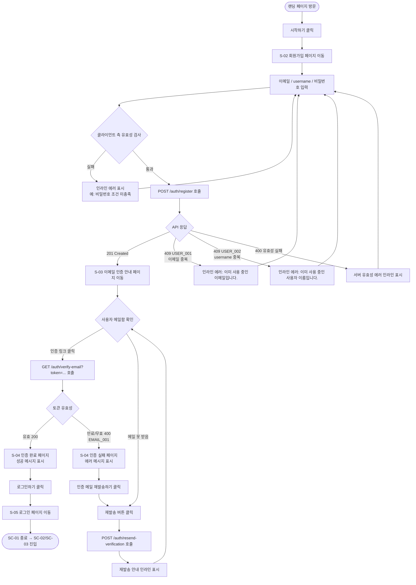
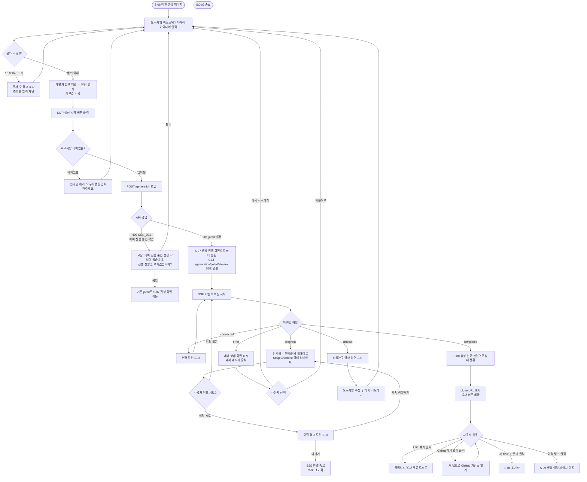
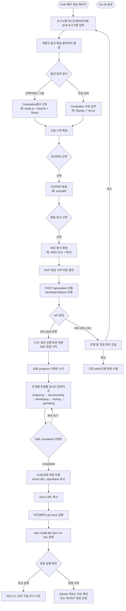
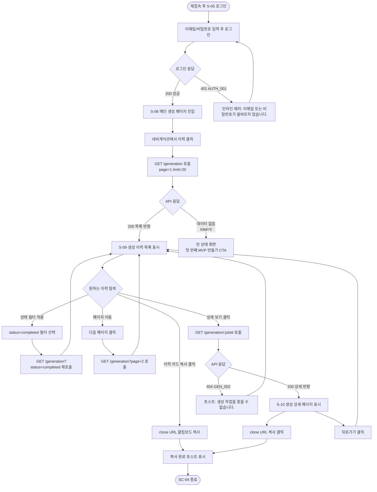
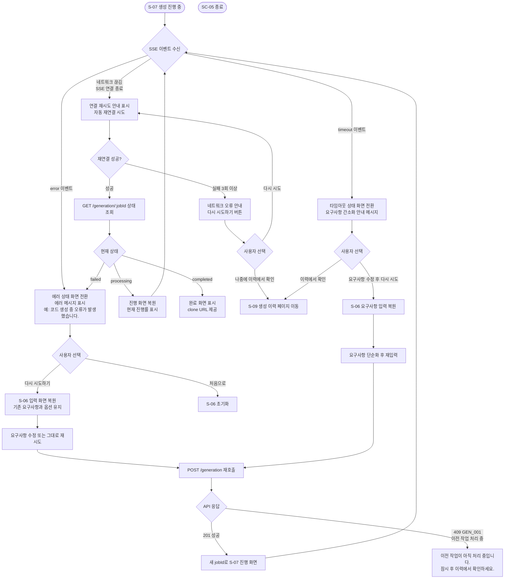
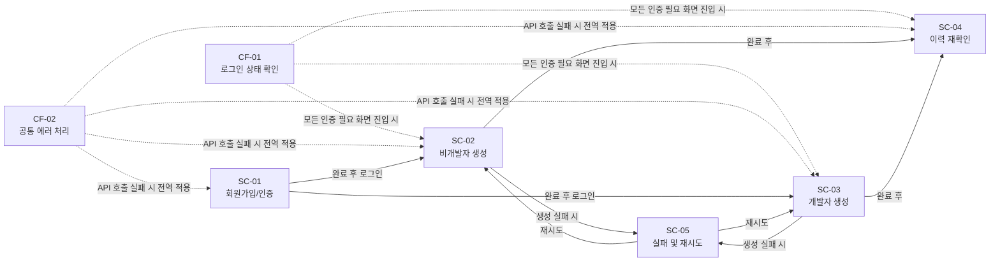

# 사용자 플로우 다이어그램
# mvp-builder

> 작성일: 2026-03-17
> 작성자: UX/Product Design Agent (4단계)
> 기반 문서: `docs/PRD.md`, `docs/MVP-scope.md`, `docs/user-persona.md`, `docs/api-spec.md`, `docs/wireframe.md`
> MVP In-scope 기능(F-01~F-08)만 다룬다.

---

## 1. 시나리오 목록

| 번호 | 제목 | 대상 페르소나 | 핵심 기능 |
|------|------|------------|----------|
| SC-01 | 회원가입 및 이메일 인증 | 전체 (신규 사용자) | F-06 |
| SC-02 | 비개발자의 첫 번째 MVP 생성 | 페르소나 1 — 박지수 | F-01, F-02, F-03, F-04, F-05 |
| SC-03 | 개발자의 기술 스택 지정 후 MVP 생성 | 페르소나 2 — 이태양 / 페르소나 3 — 김현우 | F-01, F-02, F-03, F-04, F-05, F-08 |
| SC-04 | 생성 이력에서 clone URL 재확인 | 페르소나 1 — 박지수 (시나리오 2) | F-07 |
| SC-05 | 생성 실패 및 재시도 | 전체 | F-02, F-03 |

---

## 2. 공통 플로우

### CF-01 로그인 상태 확인 및 인증 필요 처리

인증이 필요한 모든 화면에 진입 전 공통으로 수행되는 흐름이다.

```mermaid
flowchart TD
    A([페이지 접근]) --> B{메모리(Zustand store)에\nAccess Token 존재?}
    B -->|없음| C[로그인 페이지로 리다이렉트]
    B -->|있음| D{Access Token\n유효성 확인}
    D -->|유효| E([정상 진입])
    D -->|만료 401| F[POST /auth/refresh 호출]
    F --> G{Refresh Token\n유효?}
    G -->|유효| H[새 Access Token 발급\n원래 요청 재시도]
    H --> E
    G -->|만료/무효 401| I[Zustand store Access Token 초기화]
    I --> C
```

---

### CF-02 공통 에러 처리

네트워크 오류, 서버 에러(5xx) 등 전역에서 처리되는 흐름이다.


---

## 3. 시나리오별 상세 플로우

### SC-01 회원가입 및 이메일 인증

**대상 페르소나**: 전체 신규 사용자
**트리거**: 랜딩 페이지에서 "시작하기" 또는 "무료로 시작하기" 클릭
**종료점**: 로그인 완료 후 메인 생성 페이지 진입



---

### SC-02 비개발자의 첫 번째 MVP 생성

**대상 페르소나**: 페르소나 1 — 박지수 (기술 친숙도: 하)
**트리거**: 로그인 후 메인 페이지 진입
**종료점**: clone URL 수령 및 공유



---

### SC-03 개발자의 기술 스택 지정 후 MVP 생성

**대상 페르소나**: 페르소나 2 — 이태양 / 페르소나 3 — 김현우 (기술 친숙도: 상)
**트리거**: 로그인 후 메인 페이지 진입
**종료점**: clone URL로 저장소 clone 및 실행 확인



> 가정: SC-03의 V~Z 단계(로컬 실행)는 서비스 외부 동작이다. UX 흐름상 완료 화면에서 시작 가이드를 제공하는 것으로 서비스 책임이 종료된다.

> [이슈 9-1] 페르소나 3 — 김현우의 핵심 시나리오 중 "파일 구조와 모듈 분리 방식을 확인"하는 시나리오는 현재 MVP에서 별도 플로우로 지원하지 않는다. 파일 트리 미리보기(F-10)는 Out-of-scope(v1.1 구현 예정)이므로, 현재 MVP에서는 clone 후 로컬에서 직접 확인하는 방식으로 안내한다. 완료 화면(S-08)의 시작 가이드가 이 안내를 대체한다.

---

### SC-04 생성 이력에서 clone URL 재확인

**대상 페르소나**: 페르소나 1 — 박지수 (시나리오 2: 미팅 1주일 후 재접속)
**트리거**: 재로그인 후 이력 페이지 진입
**종료점**: clone URL 복사 완료



---

### SC-05 생성 실패 및 재시도

**대상 페르소나**: 전체
**트리거**: SC-02 또는 SC-03 진행 중 에러/타임아웃 이벤트 수신
**종료점**: 재시도 후 성공 또는 사용자 포기



---

## 4. 플로우 간 관계 요약



---

## 5. 엣지 케이스 정리

| 케이스 | 발생 시점 | 처리 방식 |
|--------|----------|----------|
| 회원가입 도중 동일 이메일 재가입 시도 | SC-01 / `POST /auth/register` | `409 USER_001` → 인라인 에러: "이미 사용 중인 이메일입니다." |
| 만료된 이메일 인증 링크 클릭 | SC-01 / `GET /auth/verify-email` | `400 EMAIL_001` → S-04 실패 화면 → 재발송 유도 |
| 이메일 미인증 상태로 로그인 시도 | SC-01, SC-02 / `POST /auth/login` | `403 AUTH_002` → 인라인 에러 + "인증 메일 재발송" 링크 제공 |
| 생성 진행 중 브라우저 탭 닫기/새로고침 | SC-02, SC-03 / S-07 | `beforeunload` 이벤트로 경고 모달 표시 (C-UX-12) |
| 생성 진행 중 네트워크 끊김 (SSE 연결 해제) | SC-02, SC-03, SC-05 | 자동 재연결 시도 → 실패 시 수동 재시도 안내 |
| 이미 진행 중인 생성 작업 있을 때 새 생성 요청 | SC-02, SC-03 / `POST /generation` | `409 GEN_001` → 기존 작업 확인 모달 표시 |
| Access Token 만료 중 SSE 연결 시도 | SC-02, SC-03 / `GET /generation/:jobId/stream` | Query Parameter `?token=<accessToken>` 만료 시 CF-01 Refresh 흐름 후 재연결 |
| 생성 완료 후 바로 이력 페이지 진입 시 | SC-04 / `GET /generation` | 최신 완료 항목이 목록 상단에 표시됨 |
| 이력 페이지에서 진행 중인 항목 클릭 | SC-04 / S-09 | S-07 생성 진행 화면으로 이동하여 현재 진행률 표시 |
| 10,000자 초과 요구사항 입력 | SC-02, SC-03 | 클라이언트: 글자 수 초과 시 입력 차단 + 경고 표시 / 서버: `400 GEN_003` |
| 생성 타임아웃 | SC-02, SC-03, SC-05 / SSE `timeout` | 타임아웃 화면 전환 + "요구사항을 간소화해주세요" 안내 |
| 빈 생성 이력 목록 | SC-04 / `GET /generation` | 빈 상태(empty state) 화면 + "첫 번째 MVP 만들기" CTA |
| 다른 사용자의 jobId로 직접 URL 접근 | SC-04 / `GET /generation/:jobId` | `403 Forbidden` → 이력 페이지로 리다이렉트 + 에러 토스트 |
