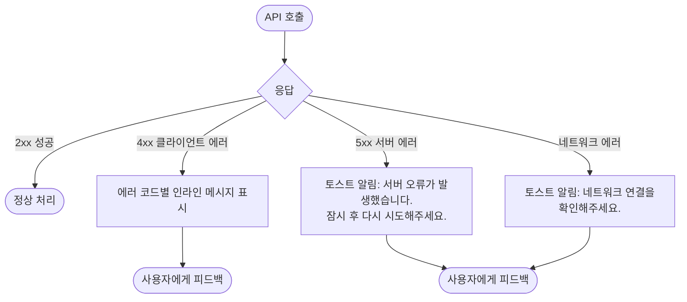
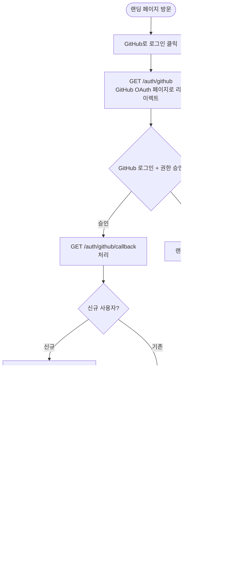
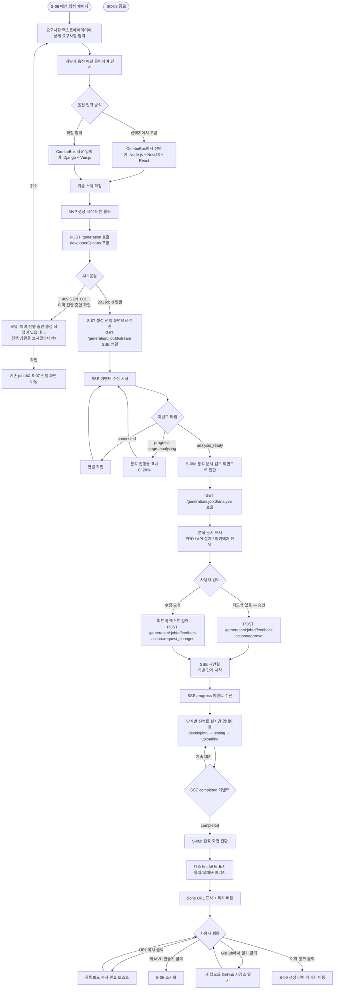
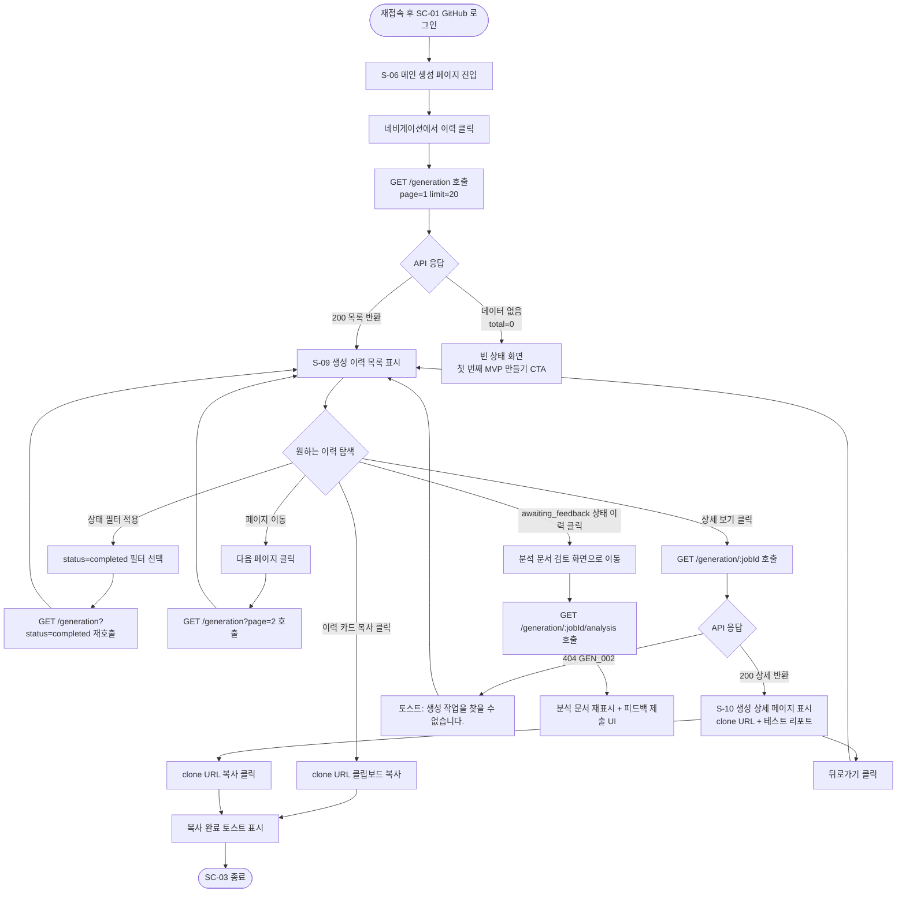
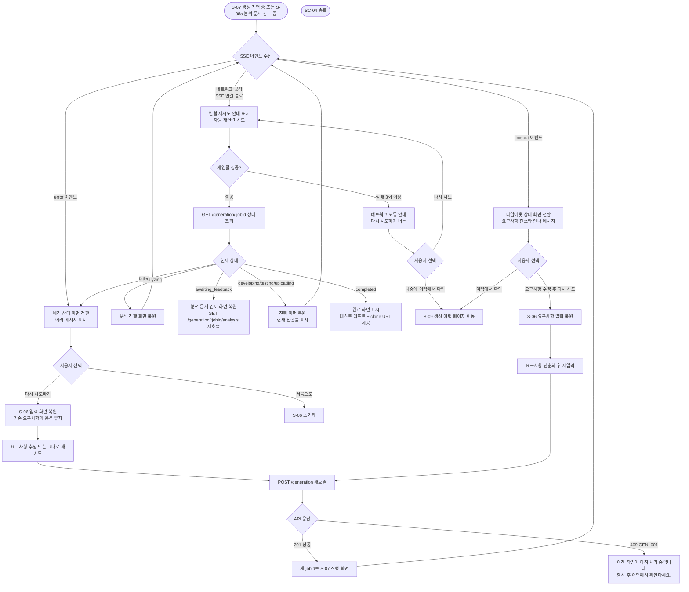
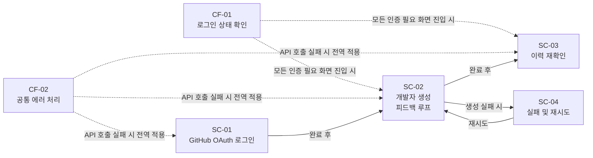

# 사용자 플로우 다이어그램
# mvp-builder

> 작성일: 2026-03-17 (수정: 2026-03-26)
> 작성자: UX/Product Design Agent (4단계)
> 기반 문서: `docs/PRD.md`, `docs/MVP-scope.md`, `docs/user-persona.md`, `docs/api-spec.md`, `docs/wireframe.md`
> MVP In-scope 기능(F-01~F-08, F-02a~F-02c)만 다룬다.

---

## 1. 시나리오 목록

| 번호 | 제목 | 대상 페르소나 | 핵심 기능 |
|------|------|------------|----------|
| SC-01 | GitHub OAuth 로그인 | 전체 (신규/기존 사용자) | F-06 |
| SC-02 | 개발자의 기술 스택 지정 후 MVP 생성 (피드백 루프 포함) | 페르소나 1 — 이태양 / 페르소나 2 — 김현우 | F-01, F-02, F-02a, F-02b, F-02c, F-03, F-04, F-05, F-08 |
| SC-03 | 생성 이력에서 clone URL 재확인 | 페르소나 1 — 이태양 (시나리오 3) | F-07 |
| SC-04 | 생성 실패 및 재시도 | 전체 | F-02, F-03 |

---

## 2. 공통 플로우

### CF-01 로그인 상태 확인 및 인증 필요 처리

인증이 필요한 모든 화면에 진입 전 공통으로 수행되는 흐름이다.

```mermaid
flowchart TD
    A([페이지 접근]) --> B{메모리(Zustand store)에\nAccess Token 존재?}
    B -->|없음| C[로그인 페이지로 리다이렉트]
    B -->|있음| D{Access Token\n유효성 확인}
    D -->|유효| E([정상 진입])
    D -->|만료 401| F[GET /auth/github 재인증 유도]
    F --> C
```

---

### CF-02 공통 에러 처리

네트워크 오류, 서버 에러(5xx) 등 전역에서 처리되는 흐름이다.



---

## 3. 시나리오별 상세 플로우

### SC-01 GitHub OAuth 로그인

**대상 페르소나**: 전체 신규/기존 사용자
**트리거**: 랜딩 페이지에서 "GitHub로 로그인" 클릭
**종료점**: 로그인 완료 후 메인 생성 페이지 진입



---

### SC-02 개발자의 기술 스택 지정 후 MVP 생성

**대상 페르소나**: 페르소나 1 — 이태양 / 페르소나 2 — 김현우
**트리거**: 로그인 후 메인 페이지 진입
**종료점**: 테스트 리포트 + clone URL 수령 및 저장소 활용



---

### SC-03 생성 이력에서 clone URL 재확인

**대상 페르소나**: 페르소나 1 — 이태양 (시나리오 3: 이전 프로젝트 재확인)
**트리거**: 재로그인 후 이력 페이지 진입
**종료점**: clone URL 복사 완료



---

### SC-04 생성 실패 및 재시도

**대상 페르소나**: 전체
**트리거**: SC-02 진행 중 에러/타임아웃 이벤트 수신
**종료점**: 재시도 후 성공 또는 사용자 포기



---

## 4. 플로우 간 관계 요약



---

## 5. 엣지 케이스 정리

| 케이스 | 발생 시점 | 처리 방식 |
|--------|----------|----------|
| 생성 진행 중 브라우저 탭 닫기/새로고침 | SC-02 / S-07 | `beforeunload` 이벤트로 경고 모달 표시 (C-UX-12) |
| awaiting_feedback 상태에서 탭 닫기 후 재접속 | SC-02 / S-08a | 이력 페이지 또는 직접 URL 접근 시 분석 문서 검토 화면 복원 |
| 피드백 제출 후 개발 중 연결 끊김 | SC-02, SC-04 / S-07 | 자동 재연결 → GET /generation/:jobId로 상태 확인 → 진행 화면 복원 |
| 생성 진행 중 네트워크 끊김 (SSE 연결 해제) | SC-02, SC-04 | 자동 재연결 시도 → 실패 시 수동 재시도 안내 |
| 이미 진행 중인 생성 작업 있을 때 새 생성 요청 | SC-02 / `POST /generation` | `409 GEN_001` → 기존 작업 확인 모달 표시 |
| Access Token 만료 중 SSE 연결 시도 | SC-02 / `GET /generation/:jobId/stream` | Query Parameter `?token=<accessToken>` 만료 시 CF-01 → GitHub 재인증 |
| awaiting_feedback에서 피드백 미제출 24시간 경과 | SC-02 / 자동 처리 | BullMQ cron이 status를 `timeout`으로 업데이트. 이력 페이지에서 타임아웃 상태 표시. |
| 생성 완료 후 바로 이력 페이지 진입 시 | SC-03 / `GET /generation` | 최신 완료 항목이 목록 상단에 표시됨 |
| 이력 페이지에서 awaiting_feedback 항목 클릭 | SC-03 / S-09 | 분석 문서 검토 화면으로 이동하여 피드백 제출 가능 |
| 10,000자 초과 요구사항 입력 | SC-02 | 클라이언트: 글자 수 초과 시 입력 차단 + 경고 표시 / 서버: `400 GEN_003` |
| 생성 타임아웃 (생성 중) | SC-02, SC-04 / SSE `timeout` | 타임아웃 화면 전환 + "요구사항을 간소화해주세요" 안내 |
| 빈 생성 이력 목록 | SC-03 / `GET /generation` | 빈 상태(empty state) 화면 + "첫 번째 MVP 만들기" CTA |
| 다른 사용자의 jobId로 직접 URL 접근 | SC-03 / `GET /generation/:jobId` | `403 Forbidden` → 이력 페이지로 리다이렉트 + 에러 토스트 |
