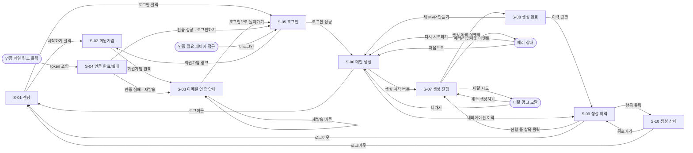

# 와이어프레임 및 화면 목록
# mvp-builder

> 작성일: 2026-03-17
> 작성자: UX/Product Design Agent (4단계)
> 기반 문서: `docs/PRD.md`, `docs/MVP-scope.md`, `docs/user-persona.md`, `docs/api-spec.md`
> MVP In-scope 기능(F-01~F-08)만 다룬다.

---

## 1. 화면 목록 (전체 인벤토리)

| ID | 화면명 | 진입 경로 | 주요 목적 |
|----|--------|----------|----------|
| S-01 | 랜딩 페이지 | 최초 접속 (`/`) | 서비스 소개 및 회원가입/로그인 유도 |
| S-02 | 회원가입 페이지 | S-01 "시작하기" 클릭 (`/register`) | 이메일+비밀번호+username 입력 후 인증 메일 발송 |
| S-03 | 이메일 인증 안내 페이지 | S-02 회원가입 완료 후 (`/register/verify`) | 인증 메일 확인 유도, 재발송 버튼 제공 |
| S-04 | 이메일 인증 완료 페이지 | 인증 메일 링크 클릭 (`/auth/verify-email?token=...`) | 인증 성공/실패 결과 표시, 로그인 유도 |
| S-05 | 로그인 페이지 | S-01 "로그인" 클릭 또는 인증 필요 시 리다이렉트 (`/login`) | 이메일+비밀번호 입력 후 인증 |
| S-06 | 메인 생성 페이지 | 로그인 후 (`/`) | 요구사항 입력 + 개발자 옵션 + 생성 시작 (핵심 화면) |
| S-07 | 생성 진행 화면 | S-06 생성 버튼 클릭 후 (동일 페이지 내 상태 전환) | SSE 실시간 진행률 표시 |
| S-08 | 생성 완료 화면 | S-07 생성 완료 이벤트 수신 후 (동일 페이지 내 상태 전환) | clone URL 표시 및 복사 |
| S-09 | 생성 이력 페이지 | 네비게이션 "이력" 클릭 (`/history`) | 과거 생성 목록 조회 및 clone URL 재확인 |
| S-10 | 생성 상세 페이지 | S-09 목록 항목 클릭 (`/history/:jobId`) | 특정 생성 작업 상세 정보 및 clone URL 확인 |

> 가정: S-06, S-07, S-08은 동일한 URL(`/`)에서 상태(state)에 따라 화면이 전환된다. 페이지 이동 없이 단일 화면 흐름으로 구성한다. (C-UX-02 — 핵심 흐름은 단일 페이지 완결)

---

## 2. 화면별 와이어프레임

### S-01 랜딩 페이지

```
┌─────────────────────────────────────────────────────────┐
│  [로고] mvp-builder                    [로그인] [시작하기] │
├─────────────────────────────────────────────────────────┤
│                                                         │
│         자연어 한 문장으로                               │
│         즉시 실행 가능한 MVP를 만드세요                   │
│                                                         │
│    ┌──────────────────────────────────────────────┐    │
│    │  아이디어를 입력해보세요...                    │    │
│    │  (예: 동네 소상공인을 위한 예약 관리 서비스)   │    │
│    └──────────────────────────────────────────────┘    │
│                   [무료로 시작하기 →]                    │
│                                                         │
├─────────────────────────────────────────────────────────┤
│  [특징 1: 자연어 입력]  [특징 2: 실시간 진행]  [특징 3: GitHub 자동 연동] │
├─────────────────────────────────────────────────────────┤
│  © 2026 mvp-builder                                     │
└─────────────────────────────────────────────────────────┘
```

---

### S-02 회원가입 페이지

```
┌─────────────────────────────────────────────────────────┐
│  [로고] mvp-builder                                      │
├─────────────────────────────────────────────────────────┤
│                                                         │
│              시작하기                                    │
│                                                         │
│    이메일 *                                             │
│    ┌──────────────────────────────────────────────┐    │
│    │  user@example.com                            │    │
│    └──────────────────────────────────────────────┘    │
│                                                         │
│    사용자 이름 *  (3~30자, 영문/숫자/하이픈)             │
│    ┌──────────────────────────────────────────────┐    │
│    │  john-doe                                    │    │
│    └──────────────────────────────────────────────┘    │
│                                                         │
│    비밀번호 *  (8자 이상, 대/소문자+숫자+특수문자 포함)  │
│    ┌──────────────────────────────────────────────┐    │
│    │  ••••••••                           [표시 ◎] │    │
│    └──────────────────────────────────────────────┘    │
│    [비밀번호 강도 표시바: ░░░░░░░░░░]                   │
│                                                         │
│    ┌──────────────────────────────────────────────┐    │
│    │              회원가입                         │    │
│    └──────────────────────────────────────────────┘    │
│                                                         │
│    이미 계정이 있으신가요?  [로그인]                     │
│                                                         │
└─────────────────────────────────────────────────────────┘
```

**인라인 에러 상태:**
```
│    이메일 *                                             │
│    ┌──────────────────────────────────────────────┐    │
│    │  user@example.com                            │    │
│    └──────────────────────────────────────────────┘    │
│    ⚠ 이미 사용 중인 이메일입니다.                       │
```

---

### S-03 이메일 인증 안내 페이지

```
┌─────────────────────────────────────────────────────────┐
│  [로고] mvp-builder                                      │
├─────────────────────────────────────────────────────────┤
│                                                         │
│              ✉ 이메일을 확인해주세요                    │
│                                                         │
│    user@example.com 으로 인증 메일을 발송했습니다.       │
│    메일함을 확인하고 인증 링크를 클릭해주세요.           │
│                                                         │
│    ┌──────────────────────────────────────────────┐    │
│    │        메일을 못 받으셨나요? 재발송하기        │    │
│    └──────────────────────────────────────────────┘    │
│                                                         │
│    [재발송 후] 인증 메일을 재발송했습니다. (인라인 알림) │
│                                                         │
│    [← 로그인 페이지로 돌아가기]                          │
│                                                         │
└─────────────────────────────────────────────────────────┘
```

---

### S-04 이메일 인증 완료 페이지

**성공 상태:**
```
┌─────────────────────────────────────────────────────────┐
│  [로고] mvp-builder                                      │
├─────────────────────────────────────────────────────────┤
│                                                         │
│              ✓ 이메일 인증 완료                          │
│                                                         │
│    이메일 인증이 완료되었습니다.                         │
│    이제 로그인하고 MVP를 만들어보세요.                   │
│                                                         │
│    ┌──────────────────────────────────────────────┐    │
│    │              로그인하기                       │    │
│    └──────────────────────────────────────────────┘    │
│                                                         │
└─────────────────────────────────────────────────────────┘
```

**실패 상태:**
```
│              ✗ 인증 링크가 유효하지 않습니다            │
│                                                         │
│    인증 링크가 만료되었거나 이미 사용된 링크입니다.      │
│                                                         │
│    ┌──────────────────────────────────────────────┐    │
│    │           인증 메일 재발송하기                │    │
│    └──────────────────────────────────────────────┘    │
```

---

### S-05 로그인 페이지

```
┌─────────────────────────────────────────────────────────┐
│  [로고] mvp-builder                                      │
├─────────────────────────────────────────────────────────┤
│                                                         │
│              다시 오셨군요                               │
│                                                         │
│    이메일 *                                             │
│    ┌──────────────────────────────────────────────┐    │
│    │  user@example.com                            │    │
│    └──────────────────────────────────────────────┘    │
│                                                         │
│    비밀번호 *                                           │
│    ┌──────────────────────────────────────────────┐    │
│    │  ••••••••                           [표시 ◎] │    │
│    └──────────────────────────────────────────────┘    │
│                                                         │
│    [로그인 에러 시] ⚠ 이메일 또는 비밀번호가 올바르지 않습니다. │
│    [미인증 시]    ⚠ 이메일 인증이 필요합니다. [인증 메일 재발송] │
│                                                         │
│    ┌──────────────────────────────────────────────┐    │
│    │                 로그인                        │    │
│    └──────────────────────────────────────────────┘    │
│                                                         │
│    계정이 없으신가요?  [회원가입]                        │
│                                                         │
└─────────────────────────────────────────────────────────┘
```

---

### S-06 메인 생성 페이지 (입력 상태)

> 가정: 로그인 후 메인 페이지(`/`)는 직접 요구사항 입력 화면으로 시작한다. 랜딩은 비로그인 사용자에게만 표시된다.

```
┌─────────────────────────────────────────────────────────┐
│  [로고] mvp-builder          [이력]  [john-doe ▾] [로그아웃] │
├─────────────────────────────────────────────────────────┤
│                                                         │
│    어떤 서비스를 만들고 싶으신가요?                       │
│                                                         │
│    ┌────────────────────────────────────────────────┐  │
│    │                                                │  │
│    │  만들고 싶은 서비스를 자유롭게 설명해주세요.    │  │
│    │  (예: 동네 소상공인을 위한 예약 관리 서비스.    │  │
│    │  가게 정보, 예약 시간 설정, 고객 예약 확인이   │  │
│    │  가능해야 합니다.)                              │  │
│    │                                                │  │
│    │                                                │  │
│    │                             0 / 10,000자       │  │
│    └────────────────────────────────────────────────┘  │
│                                                         │
│    ┌──────────────────────────────────────────────┐    │
│    │  ▶ 개발자 옵션 (선택)                         │    │
│    └──────────────────────────────────────────────┘    │
│    [접힘 상태 — 클릭 시 펼침]                            │
│                                                         │
│    ┌──────────────────────────────────────────────┐    │
│    │             MVP 생성 시작  →                  │    │
│    └──────────────────────────────────────────────┘    │
│                                                         │
└─────────────────────────────────────────────────────────┘
```

**개발자 옵션 패널 (펼침 상태):**

```
│    ┌──────────────────────────────────────────────┐    │
│    │  ▼ 개발자 옵션 (선택)                         │    │
│    ├──────────────────────────────────────────────┤    │
│    │                                              │    │
│    │  기술 스택                                   │    │
│    │  ┌────────────────────────────────────────┐  │    │
│    │  │ Node.js + NestJS + React    ▾ 또는 직접 입력 │  │    │
│    │  └────────────────────────────────────────┘  │    │
│    │  [선택지: Next.js / NestJS+React / FastAPI+React / 직접 입력] │    │
│    │                                              │    │
│    │  아키텍처                                    │    │
│    │  ┌────────────────────────────────────────┐  │    │
│    │  │ monolith                      ▾         │  │    │
│    │  └────────────────────────────────────────┘  │    │
│    │  [선택지: monolith / microservices / 직접 입력] │    │
│    │                                              │    │
│    │  배포 방식                                   │    │
│    │  ┌────────────────────────────────────────┐  │    │
│    │  │ AWS (EC2 + RDS)               ▾         │  │    │
│    │  └────────────────────────────────────────┘  │    │
│    │  [선택지: AWS / Vercel / Railway / 직접 입력] │    │
│    │                                              │    │
│    └──────────────────────────────────────────────┘    │
```

---

### S-07 생성 진행 화면 (동일 페이지, 진행 상태)

```
┌─────────────────────────────────────────────────────────┐
│  [로고] mvp-builder          [이력]  [john-doe ▾] [로그아웃] │
├─────────────────────────────────────────────────────────┤
│                                                         │
│    MVP를 생성하고 있습니다...                             │
│                                                         │
│    ┌────────────────────────────────────────────────┐  │
│    │  요구사항 요약: 동네 소상공인을 위한 예약 관리  │  │
│    │  서비스. 가게 정보, 예약 시간 설정, 고객 예약...│  │
│    └────────────────────────────────────────────────┘  │
│                                                         │
│    현재 단계: 코드 생성 중                               │
│                                                         │
│    ████████████████████░░░░░░░░░░░░░  65%             │
│                                                         │
│    ┌──────────────────────────────────────────────┐    │
│    │  ✓ 요구사항 분석 완료                         │    │
│    │  ✓ 프로젝트 구조 설계 완료                    │    │
│    │  → 코드 파일 생성 중...                       │    │
│    │  ○ 테스트 코드 생성                           │    │
│    │  ○ GitHub 업로드                              │    │
│    └──────────────────────────────────────────────┘    │
│                                                         │
│    평균 3~5분 소요됩니다. 페이지를 닫으면 진행이 중단됩니다. │
│                                                         │
└─────────────────────────────────────────────────────────┘
```

> 가정: 페이지 이탈(뒤로가기, 탭 닫기 등) 시도 시 경고 다이얼로그를 표시한다. (C-UX-12)

**이탈 경고 모달:**
```
┌──────────────────────────────────────┐
│  페이지를 나가면 생성이 중단됩니다   │
│                                      │
│  진행 중인 MVP 생성을 중단할까요?    │
│                                      │
│  [계속 생성하기]      [나가기]        │
└──────────────────────────────────────┘
```

**에러 상태:**
```
│    ✗ 생성 중 오류가 발생했습니다                        │
│                                                         │
│    코드 생성 단계에서 오류가 발생했습니다.               │
│    요구사항을 간소화하거나 다시 시도해보세요.            │
│                                                         │
│    ┌──────────────────┐  ┌──────────────────────────┐  │
│    │    처음으로       │  │       다시 시도하기        │  │
│    └──────────────────┘  └──────────────────────────┘  │
```

**타임아웃 상태:**
```
│    ⏱ 생성 시간이 초과되었습니다                         │
│                                                         │
│    요구사항이 너무 복잡하거나 서버가 혼잡합니다.          │
│    요구사항을 간소화한 후 재시도해주세요.               │
│                                                         │
│    ┌──────────────────────────────────────────────┐    │
│    │       요구사항 수정 후 다시 시도하기           │    │
│    └──────────────────────────────────────────────┘    │
```

---

### S-08 생성 완료 화면 (동일 페이지, 완료 상태)

```
┌─────────────────────────────────────────────────────────┐
│  [로고] mvp-builder          [이력]  [john-doe ▾] [로그아웃] │
├─────────────────────────────────────────────────────────┤
│                                                         │
│              ✓ MVP 생성이 완료되었습니다!               │
│                                                         │
│    ████████████████████████████████  100%             │
│                                                         │
│    저장소 이름                                          │
│    mvp-reservation-john-doe                             │
│                                                         │
│    Clone URL                                            │
│    ┌────────────────────────────────────────────────┐  │
│    │  https://github.com/mvp-builder/mvp-reservati  │  │
│    │  on-john-doe                            [복사]  │  │
│    └────────────────────────────────────────────────┘  │
│                                                         │
│    시작 방법:                                           │
│    ┌────────────────────────────────────────────────┐  │
│    │  git clone https://github.com/...              │  │
│    │  cd mvp-reservation-john-doe                   │  │
│    │  npm install                                   │  │
│    │  npm run dev                                   │  │
│    └────────────────────────────────────────────────┘  │
│                                                         │
│    [GitHub에서 열기 ↗]                                  │
│                                                         │
│    ┌──────────────────────────────────────────────┐    │
│    │          새 MVP 만들기                        │    │
│    └──────────────────────────────────────────────┘    │
│                                                         │
└─────────────────────────────────────────────────────────┘
```

---

### S-09 생성 이력 페이지

```
┌─────────────────────────────────────────────────────────┐
│  [로고] mvp-builder          [이력]  [john-doe ▾] [로그아웃] │
├─────────────────────────────────────────────────────────┤
│                                                         │
│    생성 이력                                             │
│                                                         │
│    [전체 ▾]  (상태 필터: 전체 / 완료 / 진행 중 / 실패)   │
│                                                         │
│    ┌──────────────────────────────────────────────────┐ │
│    │  ● 완료                          2026-03-17      │ │
│    │  동네 소상공인을 위한 예약 관리 서비스...          │ │
│    │  mvp-reservation-john-doe                        │ │
│    │  ┌──────────────────────────────────────┐        │ │
│    │  │ https://github.com/mvp-builder/...   │ [복사] │ │
│    │  └──────────────────────────────────────┘        │ │
│    │                              [상세 보기 →]        │ │
│    └──────────────────────────────────────────────────┘ │
│                                                         │
│    ┌──────────────────────────────────────────────────┐ │
│    │  ✗ 실패                          2026-03-15      │ │
│    │  온라인 예약 시스템 (레스토랑, 미용실 등)...      │ │
│    │  —                                               │ │
│    │                              [상세 보기 →]        │ │
│    └──────────────────────────────────────────────────┘ │
│                                                         │
│    ┌──────────────────────────────────────────────────┐ │
│    │  → 진행 중                       2026-03-17      │ │
│    │  소규모 커뮤니티 게시판...                         │ │
│    │  [진행률 바: ████████░░░░░░  65%]                │ │
│    │                              [진행 상황 보기 →]   │ │
│    └──────────────────────────────────────────────────┘ │
│                                                         │
│    < 1 2 3 >  (페이지네이션)                            │
│                                                         │
└─────────────────────────────────────────────────────────┘
```

> 가정: 이력이 없는 경우 빈 상태(empty state) 화면을 표시한다.

**빈 상태:**
```
│              아직 생성 이력이 없습니다.                 │
│                                                         │
│    ┌──────────────────────────────────────────────┐    │
│    │           첫 번째 MVP 만들기  →               │    │
│    └──────────────────────────────────────────────┘    │
```

---

### S-10 생성 상세 페이지

```
┌─────────────────────────────────────────────────────────┐
│  [로고] mvp-builder          [이력]  [john-doe ▾] [로그아웃] │
├─────────────────────────────────────────────────────────┤
│                                                         │
│  [← 이력으로 돌아가기]                                   │
│                                                         │
│    생성 상세 정보                         ● 완료        │
│                                                         │
│    요구사항                                             │
│    ┌────────────────────────────────────────────────┐  │
│    │  동네 소상공인을 위한 예약 관리 서비스. 가게 정 │  │
│    │  보, 예약 시간 설정, 고객 예약 확인이 가능해야  │  │
│    │  합니다.                                        │  │
│    └────────────────────────────────────────────────┘  │
│                                                         │
│    개발자 옵션                                          │
│    기술 스택: Node.js + NestJS + React                  │
│    아키텍처: monolith                                   │
│    배포 방식: AWS (EC2 + RDS)                           │
│                                                         │
│    Clone URL                                            │
│    ┌────────────────────────────────────────────────┐  │
│    │  https://github.com/mvp-builder/mvp-reservati  │  │
│    │  on-john-doe                            [복사]  │  │
│    └────────────────────────────────────────────────┘  │
│                                                         │
│    [GitHub에서 열기 ↗]                                  │
│                                                         │
│    생성 시간: 2026-03-17 12:00   완료 시간: 12:03:30    │
│                                                         │
└─────────────────────────────────────────────────────────┘
```

---

## 3. 화면 간 이동 관계



---

## 4. 컴포넌트 목록

재사용되는 주요 UI 컴포넌트를 정리한다.

### 4.1 레이아웃 컴포넌트

| 컴포넌트명 | 사용 화면 | 설명 |
|-----------|----------|------|
| `AppHeader` | S-06~S-10 | 로고, 네비게이션(이력), 사용자 메뉴(username + 로그아웃) |
| `AuthLayout` | S-02~S-05 | 중앙 정렬 카드 레이아웃 (인증 관련 화면 공통) |
| `MainLayout` | S-06~S-10 | AppHeader + 본문 영역 |

### 4.2 인증 관련 컴포넌트

| 컴포넌트명 | 사용 화면 | 설명 |
|-----------|----------|------|
| `EmailInput` | S-02, S-05 | 이메일 입력 + 유효성 표시 |
| `PasswordInput` | S-02, S-05 | 비밀번호 입력 + 표시/숨김 토글 |
| `PasswordStrengthBar` | S-02 | 비밀번호 강도 시각화 바 |
| `InlineError` | S-02, S-05 | 아이콘 + 에러 메시지 인라인 표시 |

### 4.3 생성 관련 컴포넌트

| 컴포넌트명 | 사용 화면 | 설명 |
|-----------|----------|------|
| `RequirementsTextarea` | S-06 | 요구사항 입력 텍스트에어리어 + 글자 수 카운터 |
| `DeveloperOptionsPanel` | S-06 | Progressive Disclosure 패널 (접힘/펼침) |
| `ComboboxInput` | S-06 | 선택지 + 자유 입력 혼합 combobox (기술 스택, 아키텍처, 배포 방식) |
| `ProgressBar` | S-07, S-08, S-09 | 진행률 바 (퍼센트 표시) |
| `StageChecklist` | S-07 | 단계별 체크리스트 (완료/진행 중/대기 상태) |
| `CloneUrlBox` | S-08, S-10 | URL 표시 + 복사 버튼 + GitHub 링크 |
| `StartGuide` | S-08 | clone/install/run 명령어 표시 박스 |

### 4.4 이력 관련 컴포넌트

| 컴포넌트명 | 사용 화면 | 설명 |
|-----------|----------|------|
| `GenerationHistoryCard` | S-09 | 생성 이력 카드 (상태 배지 + 요약 + URL + 상세 링크) |
| `StatusBadge` | S-09, S-10 | 상태 표시 배지 (완료/진행 중/실패/대기) |
| `StatusFilter` | S-09 | 상태별 필터 드롭다운 |
| `Pagination` | S-09 | 페이지네이션 컴포넌트 |
| `EmptyState` | S-09 | 빈 상태 일러스트 + 안내 텍스트 + CTA 버튼 |

### 4.5 공통 컴포넌트

| 컴포넌트명 | 사용 화면 | 설명 |
|-----------|----------|------|
| `Modal` | S-07 (이탈 경고) | 기본 모달 (제목 + 내용 + 액션 버튼) |
| `Button` | 전체 | Primary / Secondary / Danger 변형 |
| `CopyButton` | S-08, S-09, S-10 | 텍스트 복사 + 완료 피드백 토스트 |
| `ToastNotification` | 전체 | 성공/에러/정보 알림 토스트 |
| `LoadingSpinner` | 전체 | 비동기 처리 로딩 인디케이터 |
